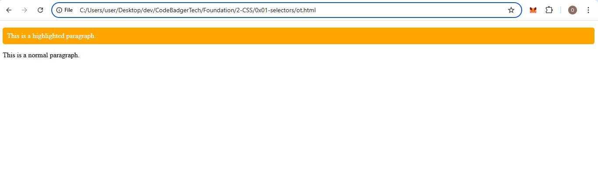
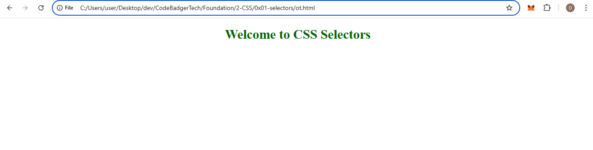
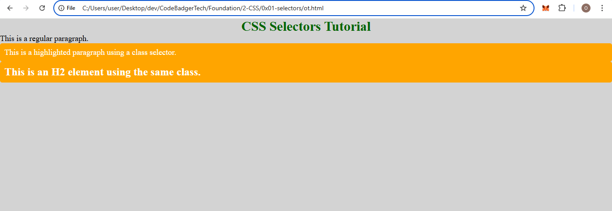

# **CSS Tutorial: Selectors**  

## Note, All styles should be applied in the head tag for this section
```html
<!DOCTYPE html>
<html lang="en">
<head>
    <meta charset="UTF-8">
    <meta name="viewport" content="width=device-width, initial-scale=1.0">
    <title>CSS Selectors Example</title>
   <style> 
        h1 {
          color: green;
        }
   </style>
</head>
```

CSS selectors are used to target HTML elements and apply styles to them. Selectors help define which elements a style rule should be applied to.  

## **Structure of a CSS Rule**  

A CSS rule consists of two main parts:  

1. **Selector** – Specifies which HTML element(s) the styles will apply to.  
2. **Declaration Block** – Contains one or more declarations that define the styles of the selected element(s).  

Each declaration includes a **property** (what you want to change) and a **value** (how you want to change it), separated by a colon (`:`). Declarations are enclosed within curly braces `{}` and separated by semicolons `;`.  

### **Example:**
```css
p {
  color: red;
  text-align: center;
}
```
### **Explanation:**
- `p` is the **selector** (it targets all `<p>` elements in the HTML document).  
- `color` is a **property**, and `red` is the **value** (it sets the text color to red).  
- `text-align` is a **property**, and `center` is the **value** (it centers the text inside the `<p>` elements).  

---

# **Types of CSS Selectors**  

CSS provides various types of selectors that allow developers to target elements efficiently:  

## **1. Universal Selector (`*`)**  
The universal selector applies styles to **all** elements in the HTML document.  
```css
* {
  margin: 0;
  padding: 0;
  background-color: lightgray;
}
```
### **Use Case:**  
This is useful when you want to apply global styles, such as removing default margins and paddings from all elements.

---

## **2. Element Selector (Tag Selector)**  
This selector targets all occurrences of a specific HTML element.  
```css
h1 {
  font-size: 24px;
  color: blue;
}
```
### **Use Case:**  
The above example applies a font size of 24 pixels and a blue color to all `<h1>` elements.

---

## **3. Class Selector (`.`)**  
A class selector targets one or more elements that have the same class name. Class names are defined in HTML using the `class` attribute.  

### **CSS Code:**
```css
.highlight {
  color: white;
  background-color: orange;
  padding: 10px;
  border-radius: 5px;
}
```

### **HTML Code:**
```html
<p class="highlight">This is a highlighted paragraph.</p>
<p>This is a normal paragraph.</p>
```

### output


### **Explanation:**
- `.highlight` is the **class selector**.
- Any element with the class `highlight` gets a **white text color**, an **orange background**, and **rounded corners**.

---

## **4. ID Selector (`#`)**  
An ID selector targets a **single, unique** element. An ID must be unique within the document.  

### **CSS Code:**
```css
#main-heading {
  color: darkgreen;
  text-align: center;
  font-size: 30px;
}
```
### **HTML Code:**
```html
<h1 id="main-heading">Welcome to CSS Selectors</h1>
```

### outPut


### **Explanation:**
- `#main-heading` is the **ID selector**.
- It applies the defined styles **only to the element with `id="main-heading"`**.

---

# **Full Example: CSS Selectors in Action**
This example demonstrates **Universal, Element, Class, and ID selectors** in a complete HTML file with external CSS.

### **HTML File (`index.html`):**
```html
<!DOCTYPE html>
<html lang="en">
<head>
    <meta charset="UTF-8">
    <meta name="viewport" content="width=device-width, initial-scale=1.0">
    <title>CSS Selectors Example</title>
    <style> 
                /* Universal Selector: Applies to all elements */
        * {
            margin: 0;
            padding: 0;
            background-color: lightgray;
        }

        /* Element Selector: Applies to all <p> elements */
        p {
            font-size: 18px;
            color: black;
        }

        /* ID Selector: Targets only the element with ID "main-heading" */
        #main-heading {
            color: darkgreen;
            text-align: center;
            font-size: 30px;
        }

        /* Class Selector: Applies to elements with class "highlight" */
        .highlight {
            color: white;
            background-color: orange;
            padding: 10px;
            border-radius: 5px;
        }
    </style>
</head>
<body>

    <h1 id="main-heading">CSS Selectors Tutorial</h1>

    <p>This is a regular paragraph.</p>

    <p class="highlight">This is a highlighted paragraph using a class selector.</p>

    <h2 class="highlight">This is an H2 element using the same class.</h2>

</body>
</html>
```

### output

---

# **Explanation of Output**
- The **Universal Selector** applies a **light gray background** to all elements.
- The **Element Selector** makes all `<p>` elements **black and size 18px**.
- The **ID Selector** styles **only the `<h1>`** with `id="main-heading"`, making it **dark green, centered, and size 30px**.
- The **Class Selector** styles all elements with `class="highlight"`:
  - Changes **text color to white**.
  - Sets **background color to orange**.
  - Adds **padding and rounded corners**.
  - This style applies **to both the paragraph and the `<h2>` element**.

---

# **Conclusion**
- **Use Element Selectors** when styling **all** occurrences of a tag.
- **Use Class Selectors** when styling **multiple elements** with the same style.
- **Use ID Selectors** when styling **only one unique element**.
- **Use the Universal Selector** for global styles.