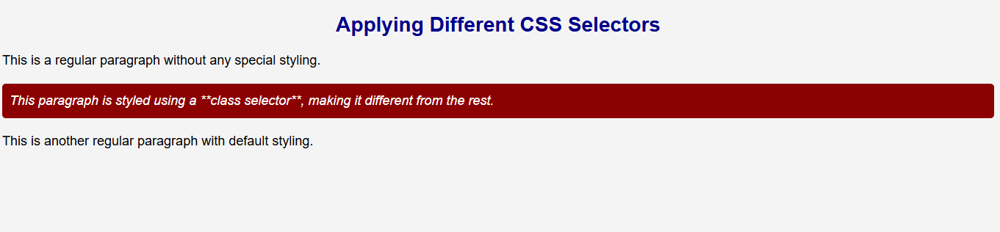

## **Assignment 1: Applying Different Selectors to Text**  
### **Objective:**  
Use **universal, element, class, and ID selectors** to style different types of text.  

### **Instructions:**  
1. Create an `index.html` file with:  
   - A **main heading** (`<h1>`) with an ID.  
   - Three paragraphs (`
`) with different texts.  
   - One paragraph with a class.  
   - One paragraph without a class.  

2. Create a `styles.css` file and apply styles using:  
   - A **universal selector** to set a background color.  
   - An **element selector** to style all paragraphs.  
   - A **class selector** to make one paragraph look different.  
   - An **ID selector** to style the main heading separately.  

---

### expected outPut
