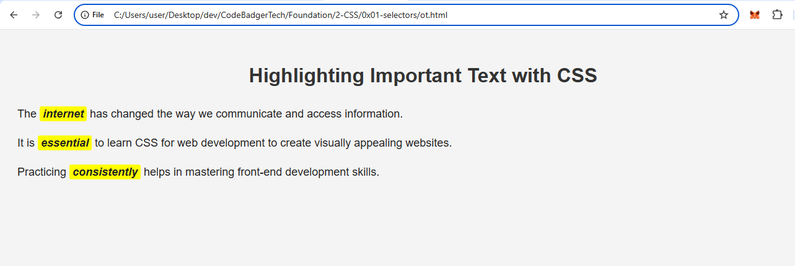

## **Assignment 3: Highlighting Important Text**  
### **Objective:**  
Use **class selectors** to highlight specific words or sentences.  

### **Instructions:**  
1. Create an `index.html` file with:  
   - A heading (`<h1>`) for the topic.  
   - Three paragraphs (`
`) with at least one important word in each.  
   - Apply a **class** to these words or sentences.  

2. Create a `styles.css` file and:  
   - Change the **background color** of the highlighted text.  
   - Use **bold** and **italic styles** for emphasis.  
   - Experiment with **different font styles**.  

---

Hint: Search How `` tag works 

### expected output
