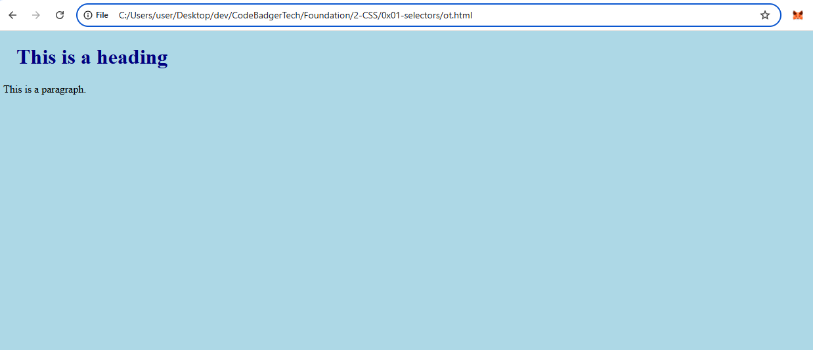
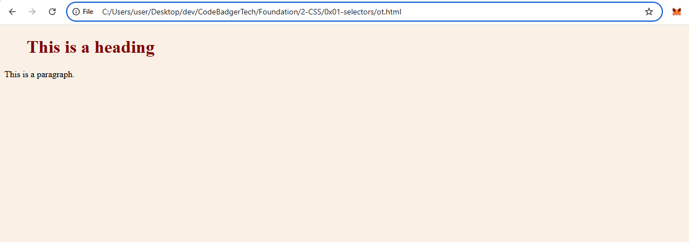
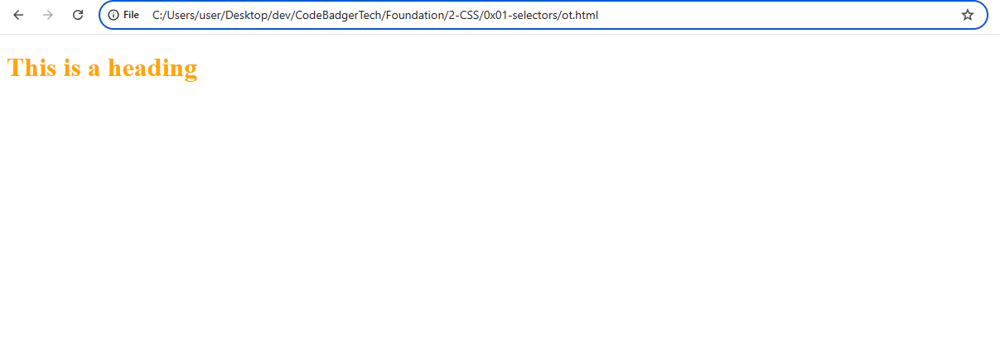

# How to Add CSS

When a browser loads a webpage, it applies styles based on the CSS rules provided. These styles help control the look and feel of the page.

## Three Ways to Add CSS
There are three main ways to apply CSS to an HTML document:

1. **External CSS** - A separate CSS file that styles multiple pages.
2. **Internal CSS** - Styles defined inside the `<style>` tag within an HTML document.
3. **Inline CSS** - Styles applied directly to an individual element using the `style` attribute.

---

## External CSS
An external style sheet is a separate file that contains CSS rules. This is useful when you want to apply the same styles across multiple pages.

To use an external style sheet, include a `<link>` element inside the `<head>` section of your HTML file:

### Example:
```html
<!DOCTYPE html>
<html>
<head>
    <link rel="stylesheet" href="mystyle.css">
</head>
<body>
    <h1>This is a heading</h1>
    <p>This is a paragraph.</p>
</body>
</html>
```

The external CSS file (`mystyle.css`) should not contain any HTML, only CSS rules:

### `mystyle.css`:
```css
body {
    background-color: lightblue;
}

h1 {
    color: navy;
    margin-left: 20px;
}
```

### output


**Important:**
- CSS properties should be written correctly, without spaces between values and units.
  - ✅ Correct: `margin-left: 20px;`
  - ❌ Incorrect: `margin-left: 20 px;`

---

## Internal CSS
An internal style sheet is used when you want to define styles within a single HTML page. These styles are placed inside the `<style>` tag in the `<head>` section.

### Example:
```html
<!DOCTYPE html>
<html>
<head>
    <style>
        body {
            background-color: linen;
        }
        h1 {
            color: maroon;
            margin-left: 40px;
        }
    </style>
</head>
<body>
    <h1>This is a heading</h1>
    <p>This is a paragraph.</p>
</body>
</html>
```

## output



---

## Inline CSS
Inline CSS applies styles directly to a specific HTML element using the `style` attribute. This method is useful for quick styling but should be used sparingly, as it mixes content with styling.

### Example:
```html
<!DOCTYPE html>
<html>
<body>
    <h1 style="color:blue; text-align:center;">This is a heading</h1>
    <p style="color:red;">This is a paragraph.</p>
</body>
</html>
```

**Tip:** Avoid excessive use of inline styles, as they make it harder to manage your CSS.

---

# Multiple Style Sheets and Cascading Order

When multiple styles apply to the same element, CSS follows a specific priority order:

1. **Inline styles** (highest priority)
2. **Internal styles**
3. **External styles**
4. **Browser default styles** (lowest priority)

The last rule read by the browser takes precedence when styles conflict.

## Example: Internal Style After External Style

```html
<!DOCTYPE html>
<html>
<head>
    <link rel="stylesheet" href="mystyle.css">
    <style>
        h1 {
            color: orange;
        }
    </style>
</head>
<body>
    <h1>This is a heading</h1>
</body>
</html>
```

### output


### Explanation:
- The browser first loads `mystyle.css`, which may have a different color for `h1`.
- The internal `<style>` tag appears **after** the external stylesheet, so it **overrides** any conflicting styles.
- The final `h1` color will be **orange**.

## Example: Internal Style Before External Style

```html
<!DOCTYPE html>
<html>
<head>
    <style>
        h1 {
            color: orange;
        }
    </style>
    <link rel="stylesheet" href="mystyle.css">
</head>
<body>
    <h1>This is a heading</h1>
</body>
</html>
```

### Explanation:
- The internal `<style>` block is read **first**.
- The external `mystyle.css` is read **after**, so it **overrides** the internal style.
- The final `h1` color will be **as defined in `mystyle.css`** (e.g., navy if `mystyle.css` sets `h1 { color: navy; }`).

## Summary
- CSS follows a cascading order where the **last rule read** takes precedence.
- Inline styles always have the highest priority.
- External styles override internal styles **only if they are loaded later**.
- Understanding this order helps control how styles are applied effectively.
