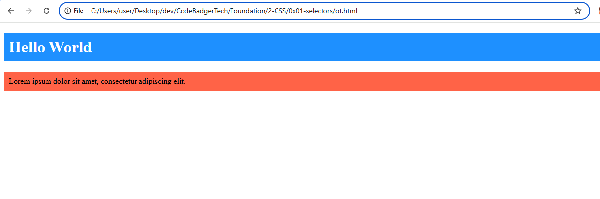
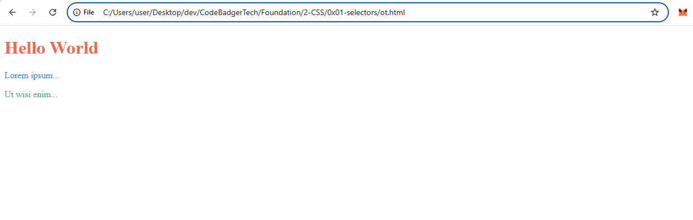
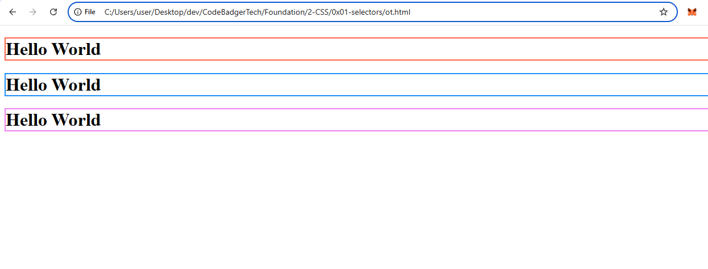

# CSS Colors

CSS allows you to specify colors using predefined color names, RGB, HEX, HSL, RGBA, and HSLA values.

## 1. CSS Color Names
CSS supports **140 standard color names** such as:
- Tomato
- Orange
- DodgerBlue
- MediumSeaGreen
- Gray
- SlateBlue
- Violet
- LightGray

## 2. CSS Background Color
The `background-color` property sets the background color of an element.

### Example:
**HTML (`index.html`)**
```html
<!DOCTYPE html>
<html lang="en">
<head>
    <meta charset="UTF-8">
    <meta name="viewport" content="width=device-width, initial-scale=1.0">
    <title>CSS Colors</title>
    <link rel="stylesheet" href="styles.css">
</head>
<body>
    <h1 class="bg-example">Hello World</h1>
    <p class="bg-text">Lorem ipsum dolor sit amet, consectetur adipiscing elit.</p>
</body>
</html>
```

**CSS (`styles.css`)**
```css
/* Background Colors */
.bg-example {
    background-color: DodgerBlue;
    color: white;
    padding: 10px;
}

.bg-text {
    background-color: Tomato;
    padding: 10px;
}
```

## output


## 3. CSS Text Color
The `color` property changes the text color.

### Example:
**HTML (`index.html`)**
```html
<h1 class="text-tomato">Hello World</h1>
<p class="text-blue">Lorem ipsum...</p>
<p class="text-green">Ut wisi enim...</p>
```

**CSS (`styles.css`)**
```css
/* Text Colors */
.text-tomato {
    color: Tomato;
}

.text-blue {
    color: DodgerBlue;
}

.text-green {
    color: MediumSeaGreen;
}
```
### outPut


## 4. CSS Border Color
The `border` property allows you to set border colors.

### Example:
**HTML (`index.html`)**
```html
<h1 class="border-tomato">Hello World</h1>
<h1 class="border-blue">Hello World</h1>
<h1 class="border-violet">Hello World</h1>
```

**CSS (`styles.css`)**
```css
/* Border Colors */
.border-tomato {
    border: 2px solid Tomato;
}

.border-blue {
    border: 2px solid DodgerBlue;
}

.border-violet {
    border: 2px solid Violet;
}
```

### outPut


## 5. CSS Color Values
Colors can be defined in different formats:
- **RGB**: `rgb(255, 99, 71)`
- **HEX**: `#ff6347`
- **HSL**: `hsl(9, 100%, 64%)`
- **RGBA** (with transparency): `rgba(255, 99, 71, 0.5)`
- **HSLA** (with transparency): `hsla(9, 100%, 64%, 0.5)`

### Example:
**HTML (`index.html`)**
```html
<h1 class="rgb">RGB Color</h1>
<h1 class="hex">HEX Color</h1>
<h1 class="hsl">HSL Color</h1>
<h1 class="rgba">RGBA Color</h1>
<h1 class="hsla">HSLA Color</h1>
```

**CSS (`styles.css`)**
```css
/* Different Color Values */
.rgb {
    background-color: rgb(255, 99, 71);
}

.hex {
    background-color: #ff6347;
}

.hsl {
    background-color: hsl(9, 100%, 64%);
}

.rgba {
    background-color: rgba(255, 99, 71, 0.5);
}

.hsla {
    background-color: hsla(9, 100%, 64%, 0.5);
}
```

### output


## Summary
- Use **named colors** for simplicity.
- Use **RGB, HEX, or HSL** for precise control.
- Use **RGBA or HSLA** for transparency effects.
- Always link an external CSS file (`styles.css`) for better code organization.