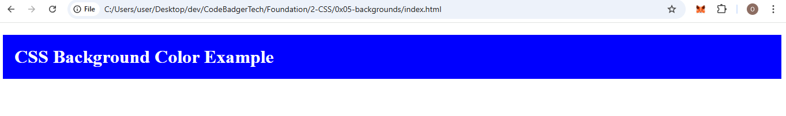
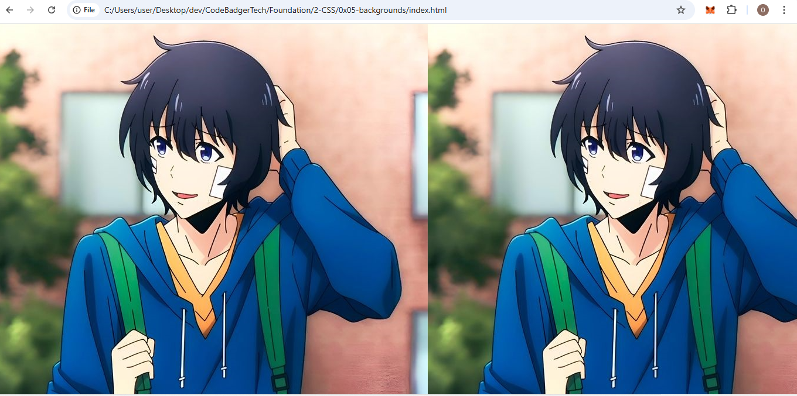

# CSS Background Tutorial

## Introduction
The CSS background property allows you to control the area behind an element’s content. You can apply colors, images, or both to an element’s background. This tutorial covers all essential background properties in CSS, including background color, image, position, repetition, and more.

---

## CSS Background Property
The `background` property is a shorthand for multiple background-related properties:

|Here’s a table that lists each background-related property along with its possible values and their functions:  

| **Property**              | **Values**                                     | **Description** |
|---------------------------|-----------------------------------------------|----------------|
| **`background-color`**    | `color-name`, `#hex`, `rgb()`, `rgba()`      | Sets the background color of an element. |
| **`background-image`**    | `url('image.jpg')`, `none`                   | Specifies one or more background images. |
| **`background-repeat`**   | `repeat`, `no-repeat`, `repeat-x`, `repeat-y` | Defines how the background image repeats. |
| **`background-attachment`** | `scroll`, `fixed`, `local`                  | Determines if the background image scrolls with the content. |
| **`background-position`** | `top left`, `center`      | Sets the initial position of the background image. |
| **`background-size`**     | `auto`, `cover`, `contain`, ` | Defines the size of the background image. |
| **`background-origin`**   | `border-box`, `padding-box`, `content-box`    | Specifies where the background image starts relative to the element. |
| **`background-clip`**     | `border-box`, `padding-box`, `content-box`    | Defines how far the background extends within an element. |
| **`background-blend-mode`** | `normal`, `multiply`, `screen`, `overlay`  | Specifies how a background image blends with the background color. |  

---

## Background Color Property
The `background-color` property sets the background color of an element.

### Syntax:
```css
.target-element {
    background-color: color-name; /* e.g., blue, green */
}
```

### Example:
**HTML File:**
```html
<!DOCTYPE html>
<html lang="en">
<head>
    <meta charset="UTF-8">
    <meta name="viewport" content="width=device-width, initial-scale=1.0">
    <title>Background Color</title>
    <link rel="stylesheet" href="styles.css">
</head>
<body>
    <h1>CSS Background Color Example</h1>
</body>
</html>
```

**CSS File (styles.css):**
```css
h1 {
    background-color: blue;
    color: white;
    padding: 20px;
}
```
### OUTPUT

---

## Background Image Property
The `background-image` property sets an image as the background of an element.

### Syntax:
```css
.target-element {
    background-image: url('image-link');
}
```

### Example:
**CSS File:**
```css
body {
    background-image: url("./image/levelUp.jpg");
}
```
### OUTPUT 

---

## Background Repeat Property
The `background-repeat` property controls how a background image repeats. By default, it repeats both horizontally and vertically because the browser tiles the image to fully cover the element's background area. If the image is smaller than the element, it will automatically be duplicated to fill the available space.  

### Why Does This Happen?  
When a background image is applied to an element, the browser treats it as a texture that needs to cover the entire background area. If the image's dimensions are smaller than the element's width or height, the browser repeats it in both directions to avoid empty spaces.  

### How to Prevent Repeating  
To stop the image from repeating, you can use `background-repeat: no-repeat;`. This ensures the image appears only once, without being tiled. If needed, you can also control repetition along a single axis:  
- `repeat-x` – Repeats only horizontally.  
- `repeat-y` – Repeats only vertically.  
- `no-repeat` – Prevents the image from repeating at all.  

#### Example: Prevent Background Repeating  
```css
body {
    background-image: url("./image/levelUp.jpg");
    background-repeat: no-repeat; /* Prevents repeating */
}
```
This keeps the image from duplicating and ensures it stays in one place.
### OUTPUT


### Example 2

#### CSS (`styles.css`)
```css
body {
    background-image: url("./image/levelUp.jpg");
    background-repeat: repeat-x; /* Repeats only horizontally */
}
```

---
## Background Attachment Property
The `background-attachment` property determines whether the background image moves with the content when scrolling.

### Example

#### CSS (`styles.css`)
```css
body {
    background-image: url("./imagePath.png");
    background-attachment: fixed; /* Keeps the background image in place. {practice with scroll} */ 
}
```

---
## Background Position Property
The `background-position` property allows precise control over the placement of the background image within an element.

### Example

#### CSS (`styles.css`)
```css
body {
    background-image: url("https://media.geeksforgeeks.org/wp-content/cdn-uploads/20190417124305/250.png");
    background-repeat: no-repeat;
    background-position: center; /* Centers the background image */
}
```

---
### Summary
- Use `background-color` for solid backgrounds.
- Use `background-image` to set a background picture.
- Use `background-repeat` to control image repetition.
- Use `background-attachment` to fix the image in place or allow it to scroll.
- Use `background-position` to position the image precisely.

By combining these properties, you can create visually appealing backgrounds in your web designs!

