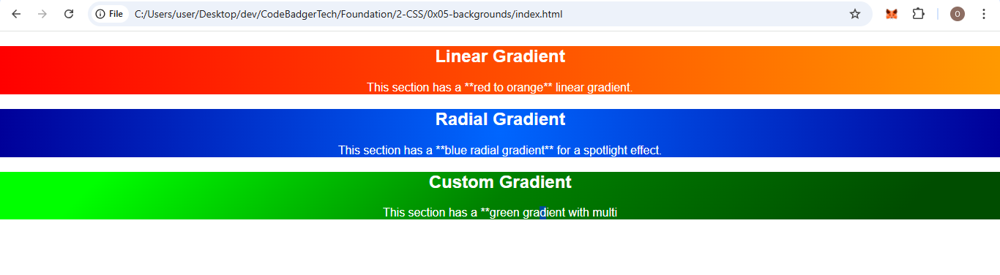

### **Assignment 4: Background Gradients**  
**Objective:** Implement CSS gradients as backgrounds (You don't know what this is? SEARCH! SEARCh! SEARCH! ability to search is what makes you a good programmer).  
**Task:**  
- Create a webpage where at least one section has a **linear gradient** background.  (SEARCH what linear gradient is.) 
- Apply a **radial gradient** to another section. (SEARCH THIS TOO)
- Experiment with different gradient directions and color stops.  

---
### EXPECTED OUTPUT
. note you can use any color u like

