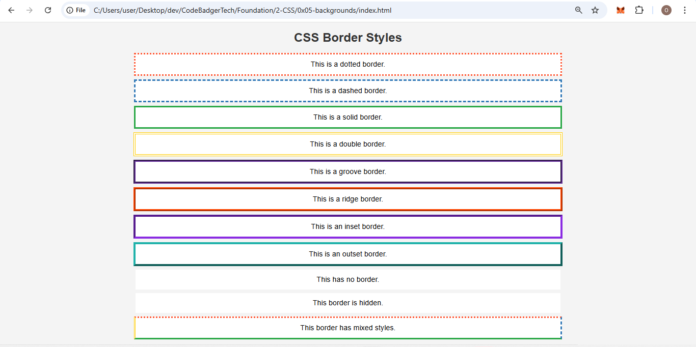

### 📜 **CSS Borders**

Borders in CSS are used to create **visual boundaries** around elements. The `border-style` property determines **how the border looks**.  

#### **📌 Available Border Styles:**
| **Value**   | **Description** |
|------------|---------------|
| `dotted`   | Creates a **dotted** border. |
| `dashed`   | Creates a **dashed** border. |
| `solid`    | Creates a **solid** border. |
| `double`   | Creates a **double-line** border. |
| `groove`   | Creates a **3D grooved** effect (depends on `border-color`). |
| `ridge`    | Creates a **3D ridged** effect (depends on `border-color`). |
| `inset`    | Creates a **3D inset** effect (depends on `border-color`). |
| `outset`   | Creates a **3D outset** effect (depends on `border-color`). |
| `none`     | No border is displayed. |
| `hidden`   | Similar to `none`, but can be used in table layouts. |
| **Multiple Values** | You can specify **different styles** for each side (e.g., `border-style: dotted dashed solid double;`). |

---

### **CSS Border Style Syntax**  

The `border-style` property is used to define the appearance of an element's border.  

#### **🔹 Basic Syntax:**  
```css
selector {
    border-style: style;
}
```
- `style` → Defines the type of border (e.g., `solid`, `dashed`, `dotted`).  

#### **🔹 Full Border Syntax:**  
You can specify all border properties in one line:  
```css
selector {
    border: width style color;
}
```
- `width` → Defines the thickness (e.g., `2px`, `5px`).  
- `style` → Defines the border type (e.g., `solid`, `double`).  
- `color` → Specifies the border color (e.g., `red`, `#ff5733`).  

#### **🔹 Border for Each Side:**  
You can apply different styles to each side:  
```css
selector {
    border-top: 3px dashed blue;
    border-right: 2px solid red;
    border-bottom: 5px double green;
    border-left: 4px dotted black;
}
```
This sets **different** border styles, widths, and colors for **each side** of the element.  


## 📂 **File 1: `index.html`**
```html
<!DOCTYPE html>
<html lang="en">
<head>
    <meta charset="UTF-8">
    <meta name="viewport" content="width=device-width, initial-scale=1.0">
    <title>CSS Border Styles</title>
    <link rel="stylesheet" href="styles.css">
</head>
<body>

    <h1>CSS Border Styles</h1>
    <p class="dotted">This is a dotted border.</p>
    <p class="dashed">This is a dashed border.</p>
    <p class="solid">This is a solid border.</p>
    <p class="double">This is a double border.</p>
    <p class="groove">This is a groove border.</p>
    <p class="ridge">This is a ridge border.</p>
    <p class="inset">This is an inset border.</p>
    <p class="outset">This is an outset border.</p>
    <p class="none">This has no border.</p>
    <p class="hidden">This border is hidden.</p>
    <p class="mix">This border has mixed styles.</p>

</body>
</html>
```

---

## 📂 **File 2: `styles.css`**
```css
body {
    font-family: Arial, sans-serif;
    background-color: #f4f4f4;
    text-align: center;
}

h1 {
    color: #333;
}

/*
    The p styles contain some new properties, your instructor will explain why we needed to add them,
    do not worry if you do not understand most of them, we will get there soon, just focus on understanding the border
*/
p {
    width: 60%; /** confused about this? do not worry we will get there*/
    margin: 10px auto; /** confused about this? do not worry we will get there*/
    padding: 15px; /** confused about this? do not worry we will get there*/
    background-color: white;
}

/* Different Border Styles */
.dotted {
    border: 4px dotted #ff5733;
}

.dashed {
    border: 4px dashed #337ab7;
}

.solid {
    border: 4px solid #28a745;
}

.double {
    border: 6px double #ffcc00;
}

.groove {
    border: 6px groove #663399;
}

.ridge {
    border: 6px ridge #ff4500;
}

.inset {
    border: 6px inset #8a2be2;
}

.outset {
    border: 6px outset #20b2aa;
}

.none {
    border: none;
}

.hidden {
    border: hidden;
}

.mix {
    border-style: dotted dashed solid double;
    border-width: 4px;
    border-color: #ff5733 #337ab7 #28a745 #ffcc00;
}
```

---


