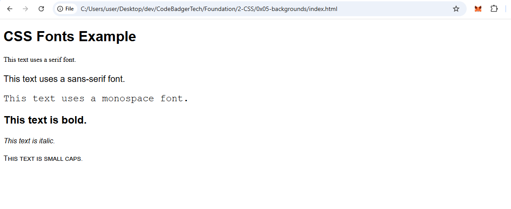

# **CSS Fonts – Beginner-Friendly Detailed Notes**  

Fonts in CSS control the appearance of text on a webpage. With CSS, you can change the font family, size, weight, style, and other text properties to improve readability and aesthetics.  

---

## **1️⃣ Font Properties in CSS**  

The most commonly used font-related properties in CSS are:  

| **Property**         | **Description** |
|----------------------|---------------|
| `font-family`       | Defines the font type (e.g., Arial, Times New Roman). |
| `font-size`         | Controls the size of the text (e.g., 16px, 1.2em). |
| `font-weight`       | Sets how bold the text is (e.g., normal, bold, 600). |
| `font-style`        | Specifies italic or normal text. |
| `font-variant`      | Allows small caps text. |
| `line-height`       | Controls spacing between lines. |

---

## **2️⃣ Font-Family Property**  

The `font-family` property defines the typeface used for text. You can specify multiple fonts as a **fallback list** in case a user's browser doesn’t support the first font.  

### **🔹 Syntax:**  
```css
selector {
    font-family: "Arial", "Helvetica", sans-serif;
}
```
- `"Arial"` → First choice.  
- `"Helvetica"` → Second choice (backup).  
- `sans-serif` → Generic fallback if others aren’t available.  

### **🔹 Font Categories:**  
CSS fonts are divided into five **generic families**:  
| **Generic Family** | **Description** |
|-------------------|----------------|
| **Serif**         | Fonts with small decorative strokes (e.g., Times New Roman, Georgia). |
| **Sans-serif**    | Clean and modern fonts without strokes (e.g., Arial, Helvetica). |
| **Monospace**     | All characters have the same width (e.g., Courier New, Consolas). |
| **Cursive**       | Handwritten-style fonts (e.g., Brush Script, Comic Sans MS). |
| **Fantasy**       | Decorative and playful fonts (e.g., Papyrus, Jokerman). |

---

## **3️⃣ Font-Size Property**  

The `font-size` property controls the size of the text.  

### **🔹 Syntax:**  
```css
selector {
    font-size: 16px;  /* Size in pixels */
}
```
### **🔹 Ways to Define Font Size:**  
| **Unit**    | **Example**  | **Description** |
|------------|------------|----------------|
| Pixels (`px`) | `font-size: 16px;` | Fixed size (recommended for precise design). |
| Em (`em`) | `font-size: 1.2em;` | Relative to the parent element. |
| Rem (`rem`) | `font-size: 1.5rem;` | Relative to the root `<html>` font size. |
| Percentage (`%`) | `font-size: 120%;` | Relative to the parent element. |
| Viewport (`vw`, `vh`) | `font-size: 5vw;` | Scales based on screen size. |

📌 **Best Practice:**  
- Use `rem` or `%` for better responsiveness.  
- `px` can be used when you need fixed text sizes.  

---

## **4️⃣ Font-Weight Property**  

The `font-weight` property controls the **thickness (boldness)** of the text.  

### **🔹 Syntax:**  
```css
selector {
    font-weight: bold; /* OR font-weight: 700; */
}
```
### **🔹 Possible Values:**  
| **Value**   | **Description** |
|------------|----------------|
| `normal`   | Default weight (400). |
| `bold`     | Bold text (700). |
| `lighter`  | Lighter than normal. |
| `bolder`   | Bolder than normal. |
| `100 - 900` | Numeric values (higher = bolder). |

---

## **5️⃣ Font-Style Property**  

The `font-style` property defines if text should be **italicized** or not.  

### **🔹 Syntax:**  
```css
selector {
    font-style: italic; /* OR normal, oblique */
}
```
### **🔹 Possible Values:**  
| **Value**  | **Description** |
|-----------|----------------|
| `normal`  | Default (not italic). |
| `italic`  | Slanted text. |
| `oblique` | Similar to italic but depends on the font. |

---

## **6️⃣ Font-Variant Property**  

The `font-variant` property is used to enable **small-caps** text formatting.  

### **🔹 Syntax:**  
```css
selector {
    font-variant: small-caps;
}
```
🔹 **Example:**  
- **Normal text:** `Hello World`  
- **Small caps text:** `HELLO WORLD` (but lowercase letters are smaller)  

---

## **7️⃣ Line-Height Property**  

The `line-height` property controls **the space between lines of text**.  

### **🔹 Syntax:**  
```css
selector {
    line-height: 1.5;
}
```
📌 **Best Practice:**  
- `line-height: 1.5;` (Recommended for readability).  
- `line-height: normal;` (Default setting).  
- Avoid setting a fixed height like `px`, use **relative units (em, rem)**.  

---

## **8️⃣ Shorthand Font Property**  

Instead of writing multiple font properties separately, you can use the **shorthand** `font` property.  

### **🔹 Syntax:**  
```css
selector {
    font: italic small-caps bold 16px/1.5 "Arial", sans-serif;
}
```
### **🔹 Order of Values:**  
1. `font-style` (optional)  
2. `font-variant` (optional)  
3. `font-weight` (optional)  
4. `font-size` (required)  
5. `line-height` (optional)  
6. `font-family` (required)  

---


## **9️⃣ Example: Complete CSS Font Styling**  

### **🔹 HTML (`index.html`)**  
```html
<!DOCTYPE html>
<html lang="en">
<head>
    <meta charset="UTF-8">
    <meta name="viewport" content="width=device-width, initial-scale=1.0">
    <title>CSS Font Styling</title>
    <link rel="stylesheet" href="styles.css">
</head>
<body>
    <h1>CSS Fonts Example</h1>
    <p class="serif">This text uses a serif font.</p>
    <p class="sans-serif">This text uses a sans-serif font.</p>
    <p class="monospace">This text uses a monospace font.</p>
    <p class="bold">This text is bold.</p>
    <p class="italic">This text is italic.</p>
    <p class="small-caps">This text is small caps.</p>
</body>
</html>
```

### **🔹 CSS (`styles.css`)**  
```css
/* General Styles */
body {
    font-family: "Arial", sans-serif;
    font-size: 16px; /* Base font size in px */
}

/* Different Font Families */
.serif {
    font-family: "Times New Roman", serif;
}
.sans-serif {
    font-family: "Helvetica", sans-serif;
}
.monospace {
    font-family: "Courier New", monospace;
}

/* Font Weight & Style */
.bold {
    font-weight: bold;
}
.italic {
    font-style: italic;
}
.small-caps {
    font-variant: small-caps;
}

/* Line Height */
p {
    line-height: 24px; /* Fixed spacing */
}
```

### OUTPUT


---

## **🔟 Conclusion**  
- **Always use `px`** for font sizes when exact control is needed.  
- **Choose appropriate font families** for readability.  
- **Use font-weight and font-style** to emphasize text.  
- **Use line-height in `px`** for proper text spacing.  
- **Shorthand `font` property** simplifies styling.  