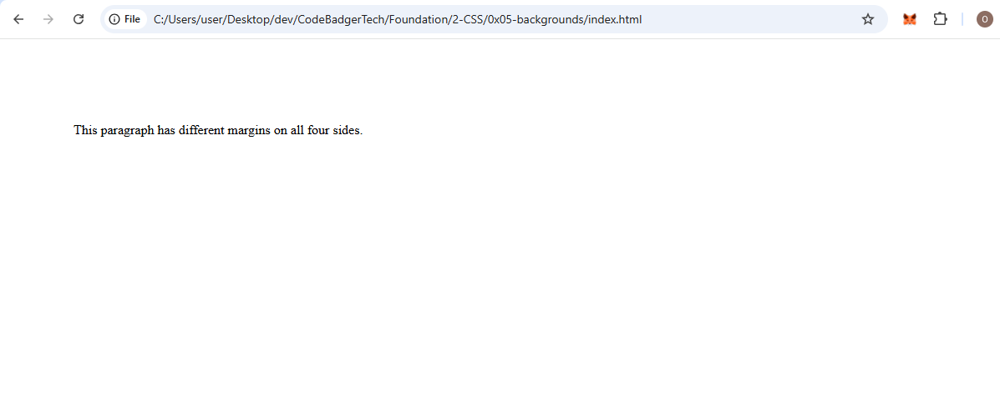
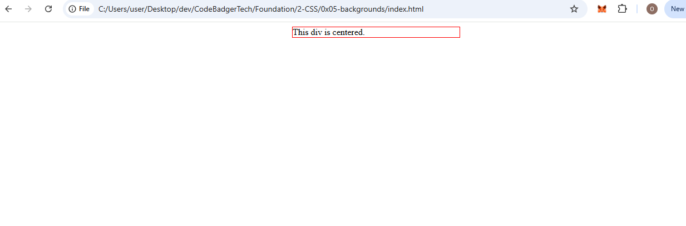

# CSS Margins - A Beginner's Guide

## What are CSS Margins?
Margins in CSS are used to create space around elements, outside of their defined borders. Margins help in spacing elements properly in a webpage layout.

## How to Use CSS Margins
CSS provides full control over margins using properties that set space for each side of an element:  
- `margin-top` (top side)
- `margin-right` (right side)
- `margin-bottom` (bottom side)
- `margin-left` (left side)

### Margin Values
Margins can be set using the following values:
- `auto` – The browser automatically calculates the margin.
- `length` – Defined in units like `px`, `em`, `cm`, etc.
- `%` – A percentage of the containing element’s width.
- `inherit` – The margin value is inherited from the parent element.
- *Tip:* Negative margin values are allowed.

---

## Individual Margin Properties Example
This example sets different margins for each side of a `<p>` element.

### HTML (index.html)
```html
<!DOCTYPE html>
<html lang="en">
<head>
    <meta charset="UTF-8">
    <meta name="viewport" content="width=device-width, initial-scale=1.0">
    <title>CSS Margins Example</title>
    <link rel="stylesheet" href="styles.css">
</head>
<body>
    <p>This paragraph has different margins on all four sides.</p>
</body>
</html>
```

### CSS (styles.css)
```css
p {
    margin-top: 100px;
    margin-right: 150px;
    margin-bottom: 100px;
    margin-left: 80px;
}
```

### OUTPUT


---

## Shorthand Margin Property
Instead of specifying margins separately, you can use the shorthand `margin` property.

### Understanding Shorthand Syntax:
| Syntax | Meaning |
|--------|---------|
| `margin: 25px;` | All four sides have a 25px margin. |
| `margin: 25px 50px;` | Top & bottom = 25px, Left & right = 50px. |
| `margin: 25px 50px 75px;` | Top = 25px, Left & right = 50px, Bottom = 75px. |
| `margin: 25px 50px 75px 100px;` | Top = 25px, Right = 50px, Bottom = 75px, Left = 100px. |

### Example Using Shorthand Property

### HTML (index.html)
```html
<!DOCTYPE html>
<html lang="en">
<head>
    <meta charset="UTF-8">
    <meta name="viewport" content="width=device-width, initial-scale=1.0">
    <title>Shorthand Margin Example</title>
    <link rel="stylesheet" href="styles.css">
</head>
<body>
    <p>This paragraph uses the margin shorthand property.</p>
</body>
</html>
```

### CSS (styles.css)
```css
p {
    margin: 25px 50px 75px 100px;
}
```

---

## Centering Elements with `margin: auto`
Using `margin: auto` allows an element to be centered horizontally when a specific width is set.

### Example of Centering an Element

### HTML (index.html)
```html
<!DOCTYPE html>
<html lang="en">
<head>
    <meta charset="UTF-8">
    <meta name="viewport" content="width=device-width, initial-scale=1.0">
    <title>Margin Auto Example</title>
    <link rel="stylesheet" href="styles.css">
</head>
<body>
    <div class="center-box">This div is centered.</div>
</body>
</html>
```

### CSS (styles.css)
```css
div.center-box {
    width: 300px;
    margin: auto;
    border: 1px solid red
}
```
### OUTPUT 


---

## Using `inherit` for Margins
The `inherit` value makes an element take the margin value from its parent element.

### Example of `inherit`

### HTML (index.html)
```html
<!DOCTYPE html>
<html lang="en">
<head>
    <meta charset="UTF-8">
    <meta name="viewport" content="width=device-width, initial-scale=1.0">
    <title>Inherit Margin Example</title>
    <link rel="stylesheet" href="styles.css">
</head>
<body>
    <div>
        <p class="inherited">This paragraph inherits its left margin from the div.</p>
    </div>
</body>
</html>
```

### CSS (styles.css)
```css
div {
    border: 1px solid red;
    margin-left: 100px;
}

p.inherited {
    margin-left: inherit;
}
```

### OUTPUT


---

## Summary
- Margins create space outside an element’s border.
- They can be set individually (`margin-top`, `margin-right`, etc.) or using shorthand.
- `auto` can be used to center elements horizontally.
- `inherit` makes an element take the margin of its parent.
- Negative margins are allowed.

By mastering margins, you can effectively control spacing and layout in CSS!
