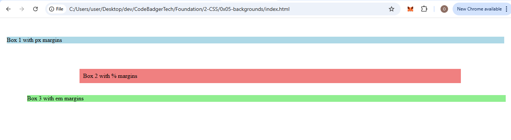
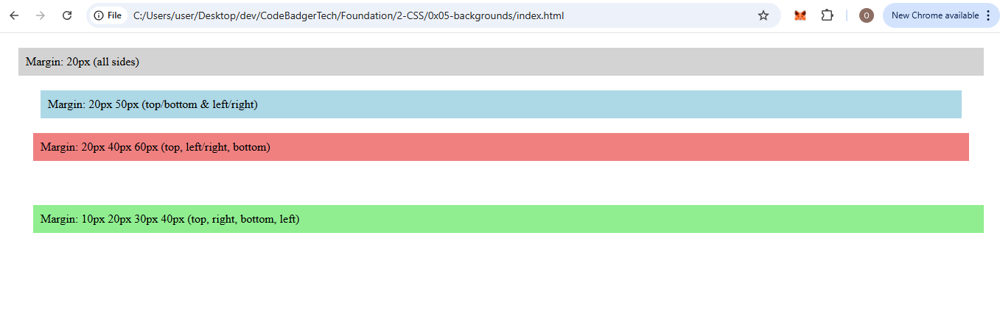
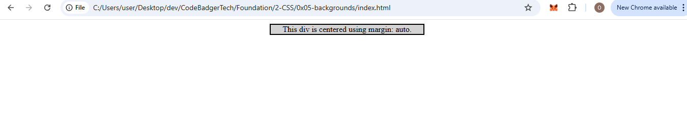

### **Assignment 1: Understanding Individual Margins**  
**Objective:** Learn how to set margins for each side of an element individually.  

**Task:**  
1. Create an HTML page with three `
` elements, each containing some text.  
2. Apply different margin values for `margin-top`, `margin-right`, `margin-bottom`, and `margin-left` for each `
`.  
3. Use different margin units (`px`, `%`, `em`).  
4. add a backgroud color to each too

**Example:**  
- First `
`: `margin-top: 50px; margin-right: 20px; margin-bottom: 30px; margin-left: 10px;`  
- Second `
`: `margin-top: 5%; margin-right: 10%; margin-bottom: 2%; margin-left: 15%;`  
- Third `
`: `margin-top: 2em; margin-right: 1em; margin-bottom: 3em; margin-left: 4em;`  

### expected output

---

### **Assignment 2: Using Margin Shorthand**  
**Objective:** Learn to apply margins using shorthand notation.  

**Task:**  
1. Create an HTML page with four `
` elements, each containing a short paragraph.  
2. Use the `margin` shorthand property to apply different margin styles:  
   - One value (e.g., `margin: 20px;`)  
   - Two values (e.g., `margin: 20px 50px;`)  
   - Three values (e.g., `margin: 20px 40px 60px;`)  
   - Four values (e.g., `margin: 10px 20px 30px 40px;`)  

**Challenge:** Explain how each shorthand notation affects the layout. 

### OUTPUT

---

### **Assignment 3: Centering an Element with `margin: auto`**  
**Objective:** Understand how to center a block element horizontally using `margin: auto`.  

**Task:**  
1. Create a `
` with a specific width (e.g., `300px`).  
2. Center the `
` horizontally within the page using `margin: auto`.  
3. Add a border and background color to make the `
` visible.  

#### EXPECTED OUTPUT
  

---

### **Assignment 4: Negative Margins**  
**Objective:** Explore the effect of using negative margin values.  

**Task:**  
1. Create three `
` elements stacked vertically.  
2. Apply different negative margin values to see how elements overlap or shift:  
   - `margin-top: -20px;`  
   - `margin-left: -30px;`  
   - `margin-right: -15px;`  
3. Observe and document the behavior of negative margins.  

**Challenge:** Describe how negative margins differ from positive margins in positioning elements.  

---