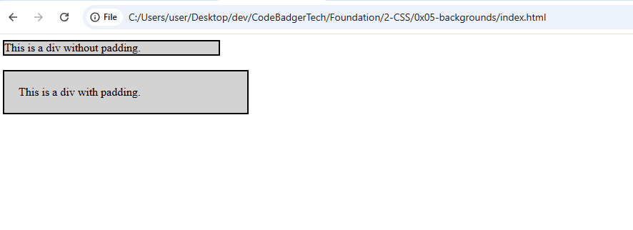

**CSS Padding**

### **What is Padding?**
Padding is used to create space around an element's content, inside of any defined borders. Unlike margins, which create space outside the borders, padding ensures spacing inside the element itself.

### **CSS Padding Properties**
The CSS padding properties allow you to control the spacing between an element’s content and its border. You can set padding for each side individually or use shorthand properties.

### **Padding for Individual Sides**
CSS provides properties for specifying padding on each side of an element:
- `padding-top` – Sets padding on the top
- `padding-right` – Sets padding on the right
- `padding-bottom` – Sets padding on the bottom
- `padding-left` – Sets padding on the left

#### **Example: Setting Padding for Each Side**
```css
 div {
   padding-top: 50px;
   padding-right: 30px;
   padding-bottom: 50px;
   padding-left: 80px;
 }
```

### **Padding - Shorthand Property**
To simplify code, you can use the `padding` shorthand property to set padding for all four sides in a single declaration.

#### **How the Shorthand Works:**
- **Four values:** `padding: 25px 50px 75px 100px;`
  - `25px` (top)
  - `50px` (right)
  - `75px` (bottom)
  - `100px` (left)
- **Three values:** `padding: 25px 50px 75px;`
  - `25px` (top)
  - `50px` (right & left)
  - `75px` (bottom)
- **Two values:** `padding: 25px 50px;`
  - `25px` (top & bottom)
  - `50px` (left & right)
- **One value:** `padding: 25px;`
  - Applies `25px` padding to all sides

#### **Example: Using the Shorthand Property**
```css
 div {
   padding: 25px 50px 75px 100px;
 }
```

### **Padding and Element Width**
The `width` property in CSS specifies the content width of an element. However, padding increases the total width of the element. 

#### **Example: Element's Actual Width**
```css
 div {
   width: 300px;
   padding: 25px;
 }
```
*In this case, the actual width of the `<div>` will be 350px (300px + 25px left padding + 25px right padding).*

### **Using `box-sizing` to Maintain Width**
If you want the element to maintain a fixed width regardless of padding, use the `box-sizing: border-box;` property.

#### **Example: Keeping a Fixed Width**
```css
 div {
   width: 300px;
   padding: 25px;
   box-sizing: border-box;
 }
```
This ensures that padding is included within the specified width, keeping the total width at **300px** instead of expanding it.

### **Examples: Padding vs. No Padding**
#### **Example 1: A `<div>` Without Padding and padding**
**HTML (index.html)**
```html
<!DOCTYPE html>
<html lang="en">
<head>
    <meta charset="UTF-8">
    <meta name="viewport" content="width=device-width, initial-scale=1.0">
    <title>Without Padding</title>
    <link rel="stylesheet" href="style.css">
</head>
<body>
    <div class="no-padding">This is a div without padding.</div>
     <div class="with-padding">This is a div with padding.</div>
</body>
</html>
```

**CSS (style.css)**
```css
.no-padding {
    width: 300px;
    background-color: lightgray;
    border: 2px solid black;
}

.with-padding {
    width: 300px;
    background-color: lightgray;
    border: 2px solid black;
    padding: 20px;
    margin-top: 20px;
}
```
### OUTPUT


### **Summary**
- Padding adds space inside an element, between content and its border.
- You can set padding individually for each side or use shorthand notation.
- Padding affects the element’s total width unless `box-sizing: border-box;` is used.

By mastering CSS padding, you can effectively control element spacing and layout design! 🚀

