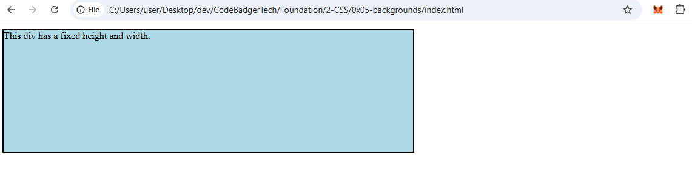

**CSS Height, Width, and Max-width**

### **What are Height, Width, and Max-width?**
The `height` and `width` properties define the dimensions of an element. The `max-width` property sets the maximum width an element can have.

### **CSS Height and Width Properties**
The `height` and `width` properties allow control over the size of an element. They do not include padding, borders, or margins—only the content area.

### **Height and Width Values**
- `auto` - Default. The browser calculates the height and width.
- `%` - Defines the size as a percentage of the containing element.
- `initial` - Resets the value to the default.

### **Example 1: Setting Height and Width**
**HTML (index.html)**
```html
<!DOCTYPE html>
<html lang="en">
<head>
    <meta charset="UTF-8">
    <meta name="viewport" content="width=device-width, initial-scale=1.0">
    <title>Height and Width</title>
    <link rel="stylesheet" href="style.css">
</head>
<body>
    <div class="size-box">This div has a fixed height and width.</div>
</body>
</html>
```

**CSS (style.css)**
```css
.size-box {
    height: 200px;
    width: 50%;
    background-color: lightblue;
    border: 2px solid black;
}
```

### **Example 2: Fixed Height and Width**
**HTML (index.html)**
```html
<!DOCTYPE html>
<html lang="en">
<head>
    <meta charset="UTF-8">
    <meta name="viewport" content="width=device-width, initial-scale=1.0">
    <title>Fixed Height & Width</title>
    <link rel="stylesheet" href="style.css">
</head>
<body>
    <div class="fixed-box">This div has a height of 100px and width of 500px.</div>
</body>
</html>
```

**CSS (style.css)**
```css
.fixed-box {
    height: 100px;
    width: 500px;
    background-color: powderblue;
    border: 2px solid black;
}
```

### OUTPUT


### **CSS Max-width Property**
The `max-width` property ensures that an element does not exceed a specified width, helping with responsive designs.

### **Example 3: Using Max-width**
**HTML (index.html)**
```html
<!DOCTYPE html>
<html lang="en">
<head>
    <meta charset="UTF-8">
    <meta name="viewport" content="width=device-width, initial-scale=1.0">
    <title>Max-width</title>
    <link rel="stylesheet" href="style.css">
</head>
<body>
    <div class="max-width-box">This div has a max-width of 500px.</div>
</body>
</html>
```

**CSS (style.css)**
```css
.max-width-box {
    max-width: 500px;
    height: 100px;
    background-color: powderblue;
    border: 2px solid black;
}
```

### **Key Takeaways**
- `height` and `width` set the element’s dimensions.
- `max-width` prevents an element from exceeding a certain width.
- Use `%` for responsive layouts.
- Padding, margins, and borders are not included in `width` and `height` calculations.

By mastering these properties, you can create flexible, responsive designs! 🚀

