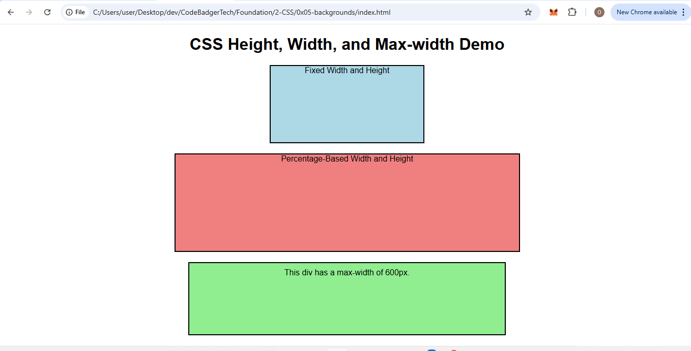

### **Assignment: Mastering CSS Height, Width, and Max-width**  

#### **Objective:**  
Create a responsive web page that demonstrates the use of `height`, `width`, and `max-width` properties in CSS.  

#### **Tasks:**  

1. **Create an HTML page** with three `
` elements, each demonstrating a different width property:
   - One with a **fixed width and height**.
   - One with a **percentage-based width and height**.
   - One with a **max-width setting**.

2. **Apply CSS styling** to these elements to clearly distinguish them using background colors, borders, and text descriptions.

3. **Ensure responsiveness**:
   - Use `max-width` to prevent horizontal scrolling.
   - Test the page by resizing the browser window.

#### **Requirements:**  

1. **Fixed Width and Height Section**
   - Create a `
` with a `width` of `300px` and a `height` of `150px`.  
   - Apply a border and background color.  

2. **Percentage-Based Width and Height Section**
   - Create a `
` that takes `50%` of the viewport width and `30%` of the viewport height.  
   - Apply different styling to make it distinguishable.  

3. **Max-width Example**
   - Create a `
` with a `max-width` of `600px`, a fixed height of `120px`, and some padding.  
   - Set text inside to explain how `max-width` works.  

---

### **Sample Solution**  
