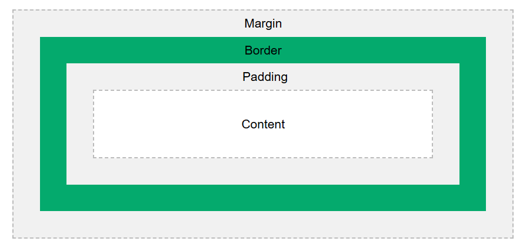
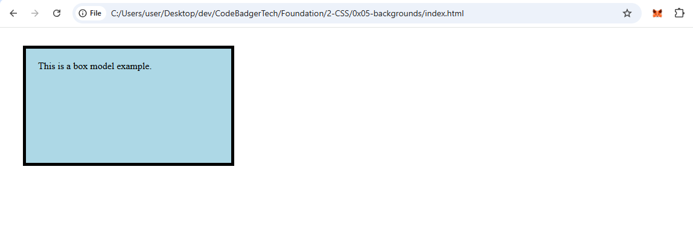

**CSS Box Model**

### **What is the CSS Box Model?**
The **CSS Box Model** is a fundamental concept in web design and layout. It describes how elements are structured and spaced on a webpage. Every HTML element is considered a rectangular box, consisting of **content, padding, border, and margin**.

### **Components of the Box Model**
1. **Content** - The actual content of the element (text, images, etc.).
2. **Padding** - The space between the content and the border.
3. **Border** - A boundary surrounding the padding and content.
4. **Margin** - The outermost space that separates the element from other elements.

### **Visual Representation of the Box Model**


### **CSS Box Model Properties**
- `width` and `height`: Define the size of the content area.
- `padding`: Adds space around the content inside the border.
- `border`: Defines the boundary of the element.
- `margin`: Creates space outside the border.

### **Example: Understanding the Box Model**
**HTML (index.html)**
```html
<!DOCTYPE html>
<html lang="en">
<head>
    <meta charset="UTF-8">
    <meta name="viewport" content="width=device-width, initial-scale=1.0">
    <title>CSS Box Model</title>
    <link rel="stylesheet" href="style.css">
</head>
<body>
    <div class="box">This is a box model example.</div>
</body>
</html>
```

**CSS (style.css)**
```css
.box {
    width: 300px;
    height: 150px;
    padding: 20px;
    border: 5px solid black;
    margin: 30px;
    background-color: lightblue;
}
```
### OUTPUT


### **Box-Sizing Property**
By default, `width` and `height` only affect the **content** area. To include padding and borders in the total width/height, use:
```css
* {
    box-sizing: border-box;
}
```
This ensures the element does not exceed the specified width/height.

### **Key Takeaways**
- The **box model** determines an element’s total size.
- **Padding** increases space inside the border.
- **Border** defines the boundary of the element.
- **Margin** creates space between elements.
- Use `box-sizing: border-box;` for better control over element sizes.

Understanding the box model is crucial for precise web layout design! 🚀

