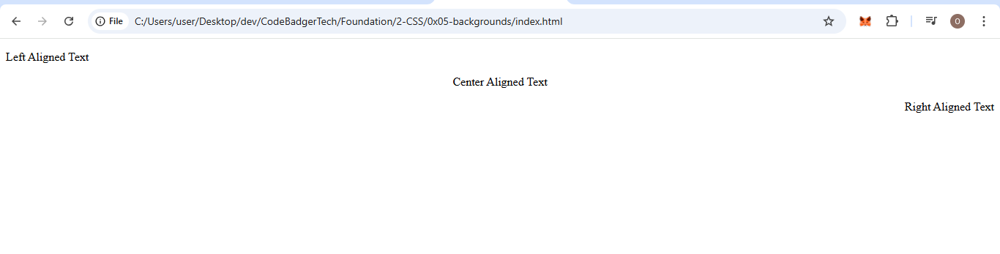
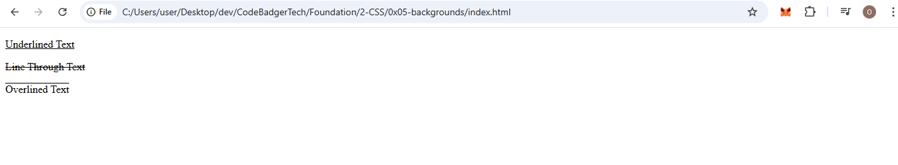
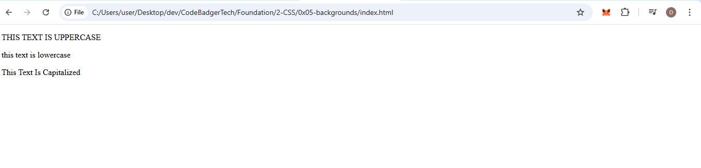
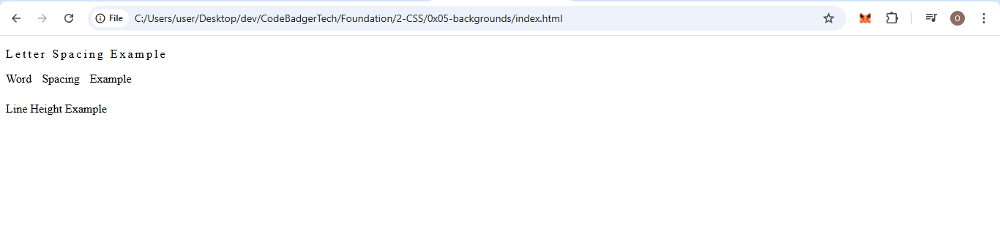
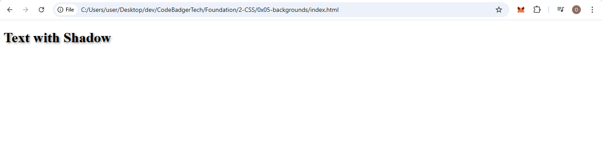

# CSS Text Styling Tutorial


## 1. Text Color
### we have talked about colors before but well, here we go again.
The `color` property in CSS is used to set the color of the text. You can define colors using different formats such as:
- **Named Colors** (e.g., `red`, `blue`, `green`)
- **HEX Codes** (e.g., `#ff0000` for red, `#0000ff` for blue)
- **RGB Values** (e.g., `rgb(255, 0, 0)` for red, `rgb(0, 0, 255)` for blue)
- **HSL Values** (e.g., `hsl(0, 100%, 50%)` for red, `hsl(240, 100%, 50%)` for blue)

Using the `color` property, we can change the appearance of text on a webpage.

**Example:**

### HTML (text-color.html)
```html
<!DOCTYPE html>
<html lang="en">
<head>
    <meta charset="UTF-8">
    <meta name="viewport" content="width=device-width, initial-scale=1.0">
    <title>Text Color</title>
    <link rel="stylesheet" href="text-color.css">
</head>
<body>
    <h1 class="red-text">Red Text</h1>
    <h1 class="blue-text">Blue Text</h1>
    <h1 class="green-text">Green Text</h1>
</body>
</html>
```

### CSS (text-color.css)
```css
.red-text {
    color: red;
}

.blue-text {
    color: blue;
}

.green-text {
    color: green;
}
```

---

## 2. Text Alignment
The `text-align` property is used to control the horizontal alignment of text within an element. The most common values are:
- **left**: Aligns text to the left.
- **center**: Centers text.
- **right**: Aligns text to the right.
- **justify**: Spreads text so that each line is fully justified within the container.

**Example:**

### HTML (text-alignment.html)
```html
<!DOCTYPE html>
<html lang="en">
<head>
    <meta charset="UTF-8">
    <meta name="viewport" content="width=device-width, initial-scale=1.0">
    <title>Text Alignment</title>
    <link rel="stylesheet" href="text-alignment.css">
</head>
<body>
    <p class="left">Left Aligned Text</p>
    <p class="center">Center Aligned Text</p>
    <p class="right">Right Aligned Text</p>
</body>
</html>
```

### CSS (text-alignment.css)
```css
.left {
    text-align: left;
}

.center {
    text-align: center;
}

.right {
    text-align: right;
}
```

### OUTPUT


---

## 3. Text Decoration
The `text-decoration` property allows us to modify the appearance of text by adding or removing decorations. Common values include:
- **underline**: Adds an underline below the text.
- **line-through**: Adds a strike-through line.
- **overline**: Adds a line above the text.
- **none**: Removes any existing decoration.

**Example:**

### HTML (text-decoration.html)
```html
<!DOCTYPE html>
<html lang="en">
<head>
    <meta charset="UTF-8">
    <meta name="viewport" content="width=device-width, initial-scale=1.0">
    <title>Text Decoration</title>
    <link rel="stylesheet" href="text-decoration.css">
</head>
<body>
    <p class="underline">Underlined Text</p>
    <p class="line-through">Line Through Text</p>
    <p class="overline">Overlined Text</p>
</body>
</html>
```

### CSS (text-decoration.css)
```css
.underline {
    text-decoration: underline;
}

.line-through {
    text-decoration: line-through;
}

.overline {
    text-decoration: overline;
}
```

### OUTPUT


---

## 4. Text Transformation
The `text-transform` property changes the capitalization style of text. Available values include:
- **uppercase**: Converts all letters to uppercase.
- **lowercase**: Converts all letters to lowercase.
- **capitalize**: Capitalizes the first letter of each word.

**Example:**

### HTML (text-transform.html)
```html
<!DOCTYPE html>
<html lang="en">
<head>
    <meta charset="UTF-8">
    <meta name="viewport" content="width=device-width, initial-scale=1.0">
    <title>Text Transform</title>
    <link rel="stylesheet" href="text-transform.css">
</head>
<body>
    <p class="uppercase">This text is uppercase</p>
    <p class="lowercase">THIS TEXT IS LOWERCASE</p>
    <p class="capitalize">this text is capitalized</p>
</body>
</html>
```

### CSS (text-transform.css)
```css
.uppercase {
    text-transform: uppercase;
}

.lowercase {
    text-transform: lowercase;
}

.capitalize {
    text-transform: capitalize;
}
```

### OUTPUT


---

## 5. Text Spacing
Text spacing includes several properties:
- **letter-spacing**: Adjusts the space between letters.
- **word-spacing**: Adjusts the space between words.
- **line-height**: Adjusts the height of text lines.

**Example:**

### HTML (text-spacing.html)
```html
<!DOCTYPE html>
<html lang="en">
<head>
    <meta charset="UTF-8">
    <meta name="viewport" content="width=device-width, initial-scale=1.0">
    <title>Text Spacing</title>
    <link rel="stylesheet" href="text-spacing.css">
</head>
<body>
    <p class="letter-spacing">Letter Spacing Example</p>
    <p class="word-spacing">Word Spacing Example</p>
    <p class="line-height">Line Height Example</p>
</body>
</html>
```

### CSS (text-spacing.css)
```css
.letter-spacing {
    letter-spacing: 3px;
}

.word-spacing {
    word-spacing: 10px;
}

.line-height {
    line-height: 2;
}
```
### OUTPUT

---

## 6. Text Shadow
The `text-shadow` property adds shadow effects to text.
- The syntax follows: `text-shadow: x-offset y-offset blur-radius color;`
- Example: `text-shadow: 2px 2px 5px gray;` creates a soft gray shadow.

**Example:**

### HTML (text-shadow.html)
```html
<!DOCTYPE html>
<html lang="en">
<head>
    <meta charset="UTF-8">
    <meta name="viewport" content="width=device-width, initial-scale=1.0">
    <title>Text Shadow</title>
    <link rel="stylesheet" href="text-shadow.css">
</head>
<body>
    <h1 class="shadow">Text with Shadow</h1>
</body>
</html>
```

### CSS (text-shadow.css)
```css
.shadow {
    text-shadow: 2px 2px 5px gray;
}
```
### OUTPUT


