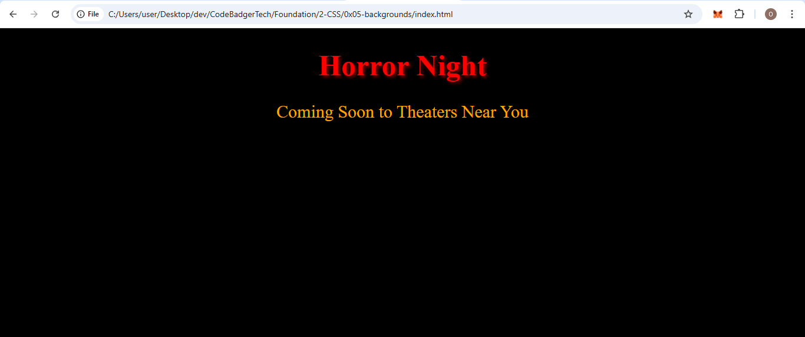

### **Assignment 1: Design a Themed Poster**
- Create an HTML page that mimics a movie poster or event announcement.
- Use different text colors creatively to match the theme (e.g., spooky colors for a horror movie, bright and playful colors for a kids' event).
- Include at least one heading and a paragraph with different color styles.
- Save your file as `themed-poster.html`.

### EXPECTED OUTPUT

