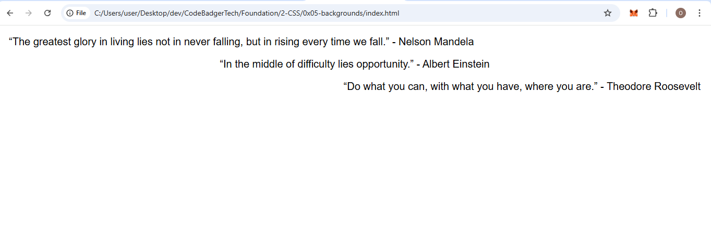

### **Assignment 2: Create a Fun Quote Page**
- Make a webpage featuring your favorite quotes from different authors or movies.
- Align some quotes to the left, some to the center, and some to the right.
- Use `justify` alignment for longer quotes to enhance readability.
- Save your file as `quote-page.html`.

### expected OutPut
