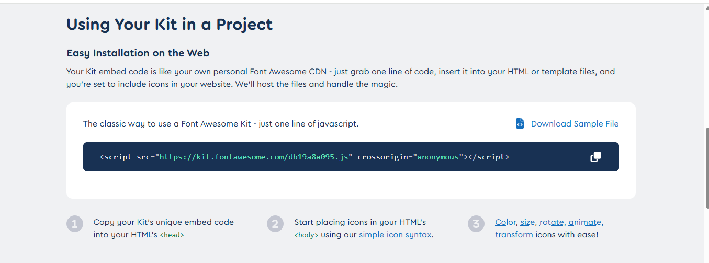
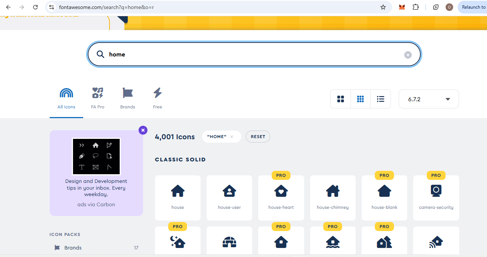
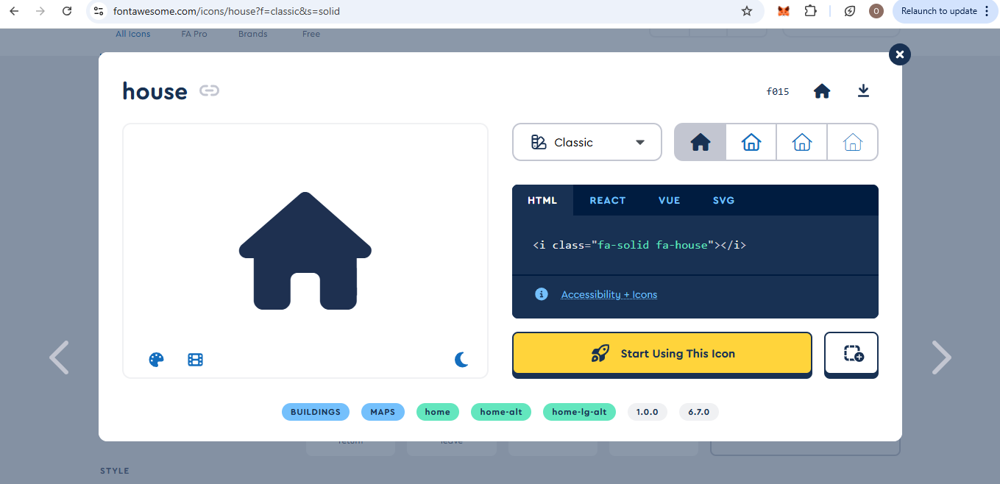

# Adding Icons in HTML with Font Awesome

## Introduction
Icons can enhance the visual appeal and usability of a webpage. The simplest way to add icons is by using an icon library like **Font Awesome**. This tutorial explains what Font Awesome is, how to integrate it, and how to customize icons in HTML and CSS.

## 1. What is Font Awesome?
Font Awesome is a popular icon library that provides scalable vector icons. These icons can be styled with CSS just like fonts, making them easy to customize.

## 2. What is a CDN?
A **Content Delivery Network (CDN)** is a network of servers that deliver web content efficiently. Font Awesome provides a CDN link, which allows you to use its icons without downloading any files.

## 3. How to Get Font Awesome
To use Font Awesome, follow these steps:
1. **Go to [fontawesome.com](https://fontawesome.com)**
2. **Sign up for a free account** (optional for Pro features)
3. **Get the CDN link** from the Font Awesome Kit

## scroll down and you will find



4. **copy and Include the CDN link** in the `<head>` section of your HTML file
5. **Navigate to the icons page and search any icon you want e.g home. Select your choice**

6. **copy the html code**


## 4. Adding Font Awesome to Your HTML Page
To use Font Awesome, include their CDN in the `<head>` section of your HTML file.

### Example (HTML):
```html
<!DOCTYPE html>
<html lang="en">
<head>
    <meta charset="UTF-8">
    <meta name="viewport" content="width=device-width, initial-scale=1.0">
    <title>Font Awesome Icons</title>
    <script src="https://kit.fontawesome.com/a076d05399.js" crossorigin="anonymous"></script> <!-- put urs here -->
    <link rel="stylesheet" href="styles.css">
</head>
<body>
    <h1>Using Font Awesome Icons</h1>
    <i class="fas fa-cloud"></i>
    <i class="fas fa-heart "></i>
    <i class="fas fa-car"></i>
    <i class="fas fa-file"></i>
    <i class="fas fa-bars"></i>
</body>
</html>
```

## 5. Styling Icons with CSS
Icons can be styled just like text elements using CSS properties such as size, color, and spacing.

### Example (CSS):
```css
i {
    font-size: 24px;
    color: #333;
    margin-right: 10px;
}
```

## OUTPUT


## 6. Different Icon Styles in Font Awesome
Font Awesome provides different styles for icons:
- **Solid Icons** (`fas`)
- **Regular Icons** (`far`)
- **Light Icons** (`fal` - Pro version)
- **Duotone Icons** (`fad` - Pro version)
- **Brand Icons** (`fab` for social media, e.g., Facebook, Twitter)

### Example:
```html
<i class="far fa-smile"></i> <!-- Regular icon -->
<i class="fab fa-twitter"></i> <!-- Brand icon -->
```

## 7. Changing Icon Size
You can use Font Awesome’s predefined size classes:
- `fa-xs`, `fa-sm`, `fa-lg`, `fa-2x`, `fa-3x`, `fa-4x`, `fa-5x` (up to `fa-10x`)

### Example:
```html
<i class="fas fa-camera fa-3x"></i>
```

## 8. Changing Icon Colors
You can change the icon color using CSS.

### Example:
```css
.fa-heart {
    color: red;
}
```

## 9. Adding Animations to Icons
Font Awesome also provides animated icons, such as spinning or pulsing effects.

### Example:
```html
<i class="fas fa-spinner fa-spin"></i>
<i class="fas fa-circle-notch fa-spin"></i>
```

Add the `fa-spin` and watch it spin
 
## Conclusion
Font Awesome makes it easy to add icons to your website without downloading images. To access more features, sign up at [fontawesome.com](https://fontawesome.com). By using different styles, sizes, and animations, you can customize icons to match your website’s design.

Happy coding!

