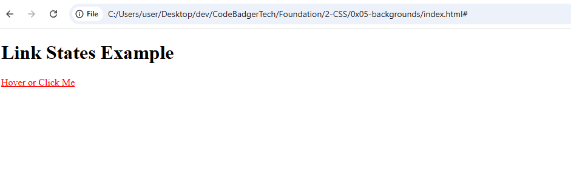
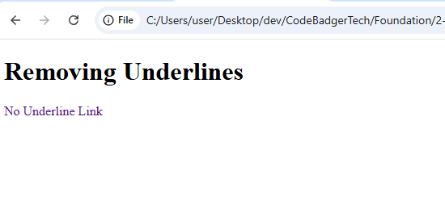
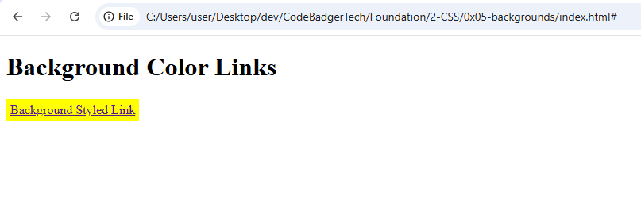
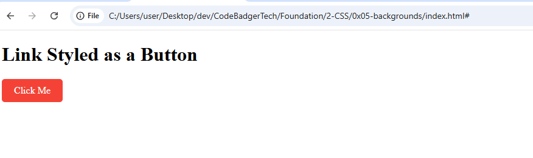
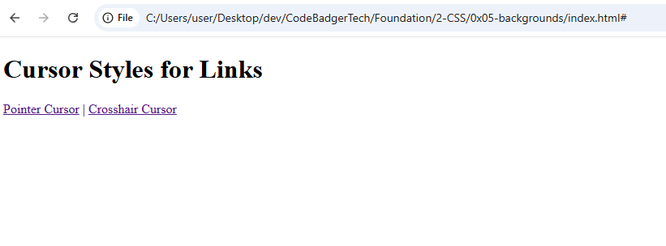

# **Styling Links in CSS**  

## **Introduction**  
Links are an essential part of any webpage, allowing users to navigate between different sections or websites. With CSS, you can style links to enhance their appearance and improve usability.  

---

## **1. Basic Link Styling**  
By default, links are underlined and blue. You can change their color using CSS.  

### **Example (HTML & CSS)**:  
```html
<!DOCTYPE html>
<html lang="en">
<head>
    <meta charset="UTF-8">
    <meta name="viewport" content="width=device-width, initial-scale=1.0">
    <title>Basic Link Styling</title>
    <link rel="stylesheet" href="styles.css">
</head>
<body>
    <h1>Basic Link Styling</h1>
    <a href="#">This is a basic link</a>
</body>
</html>
```
```css
/* styles.css */
a {
    color: hotpink;
}
```

---

## **2. Link States in CSS**  
Links have four states that can be styled differently:  
1. `a:link` - Default state of a link  
2. `a:visited` - When a user has visited the link  
3. `a:hover` - When the user hovers over the link  
4. `a:active` - When the link is clicked  

### **Example (HTML & CSS)**:  
```html
<!DOCTYPE html>
<html lang="en">
<head>
    <meta charset="UTF-8">
    <meta name="viewport" content="width=device-width, initial-scale=1.0">
    <title>Link States</title>
    <link rel="stylesheet" href="styles.css">
</head>
<body>
    <h1>Link States Example</h1>
    <a href="#">Hover or Click Me</a>
</body>
</html>
```
```css
/* styles.css */
a {
    color: red;
}

a:hover {
    color: hotpink;
}
```
### OUTPUT


put your cursor on the link and see what happens

---

## **3. Removing Underlines from Links**  
By default, links are underlined. You can remove this with `text-decoration: none;`  

### **Example (HTML & CSS)**:  
```html
<!DOCTYPE html>
<html lang="en">
<head>
    <meta charset="UTF-8">
    <meta name="viewport" content="width=device-width, initial-scale=1.0">
    <title>Removing Underlines</title>
    <link rel="stylesheet" href="styles.css">
</head>
<body>
    <h1>Removing Underlines</h1>
    <a href="#" class="no-underline">No Underline Link</a>
</body>
</html>
```
```css
/* styles.css */
.no-underline {
    text-decoration: none;
}
```
### OUTPUT


---

## **4. Changing Link Background Colors**  
You can use `background-color` to highlight links when hovered or clicked.  

### **Example (HTML & CSS)**:  
```html
<!DOCTYPE html>
<html lang="en">
<head>
    <meta charset="UTF-8">
    <meta name="viewport" content="width=device-width, initial-scale=1.0">
    <title>Background Colors</title>
    <link rel="stylesheet" href="styles.css">
</head>
<body>
    <h1>Background Color Links</h1>
    <a href="#" class="bg-link">Background Styled Link</a>
</body>
</html>
```
```css
/* styles.css */
.bg-link {
    background-color: yellow;
    padding: 5px;
    display: inline-block;
}

.bg-link:hover {
    background-color: lightgreen;
}

.bg-link:active {
    background-color: hotpink;
}
```


put your cursor on the link to see the effect

---

## **5. Styling Links as Buttons**  
You can style links to look like buttons using padding, background color, and borders.  

### **Example (HTML & CSS)**:  
```html
<!DOCTYPE html>
<html lang="en">
<head>
    <meta charset="UTF-8">
    <meta name="viewport" content="width=device-width, initial-scale=1.0">
    <title>Link Buttons</title>
    <link rel="stylesheet" href="styles.css">
</head>
<body>
    <h1>Link Styled as a Button</h1>
    <a href="#" class="button-link">Click Me</a>
</body>
</html>
```
```css
/* styles.css */
.button-link {
    background-color: #f44336;
    color: white;
    padding: 10px 20px;
    text-align: center;
    text-decoration: none;
    display: inline-block;
    border-radius: 5px;
}

.button-link:hover {
    background-color: red;
}
```
### OUTPUT


#### E fine abi...??? 😊

---

## **6. Different Link Effects**  
You can customize links in various ways.  

### **Example (HTML & CSS)**:  
```html
<!DOCTYPE html>
<html lang="en">
<head>
    <meta charset="UTF-8">
    <meta name="viewport" content="width=device-width, initial-scale=1.0">
    <title>Custom Link Effects</title>
    <link rel="stylesheet" href="styles.css">
</head>
<body>
    <h1>Custom Link Effects</h1>
    <a href="#" class="one">Example One</a> |
    <a href="#" class="two">Example Two</a> |
    <a href="#" class="three">Example Three</a> |
    <a href="#" class="four">Example Four</a> |
    <a href="#" class="five">Example Five</a>
</body>
</html>
```
```css
/* styles.css */
.one:hover { color: orange; }
.two:hover { font-size: 150%; }
.three:hover { background: #66ff66; }
.four:hover { font-family: monospace; }
.five:link, .five:visited { text-decoration: none; }
.five:hover { text-decoration: underline; }
```

### OUTPUT


---

## **7. Changing Cursor Styles on Links**  
You can change the cursor when hovering over a link.  

### **Example (HTML & CSS)**:  
```html
<!DOCTYPE html>
<html lang="en">
<head>
    <meta charset="UTF-8">
    <meta name="viewport" content="width=device-width, initial-scale=1.0">
    <title>Cursor Styles</title>
    <link rel="stylesheet" href="styles.css">
</head>
<body>
    <h1>Cursor Styles for Links</h1>
    <a href="#" class="pointer">Pointer Cursor</a> |
    <a href="#" class="crosshair">Crosshair Cursor</a>
</body>
</html>
```
```css
/* styles.css */
.pointer { cursor: pointer; }
.crosshair { cursor: crosshair; }
```
### OUTPUT


place ur cursor on a link and tell me what you see.

---

## **Conclusion**  
Styling links with CSS enhances user experience and improves website aesthetics. You can:  
✔ Change link colors and backgrounds  
✔ Remove underlines  
✔ Make links look like buttons  
✔ Add hover effects and animations  


**Happy coding!** 🚀