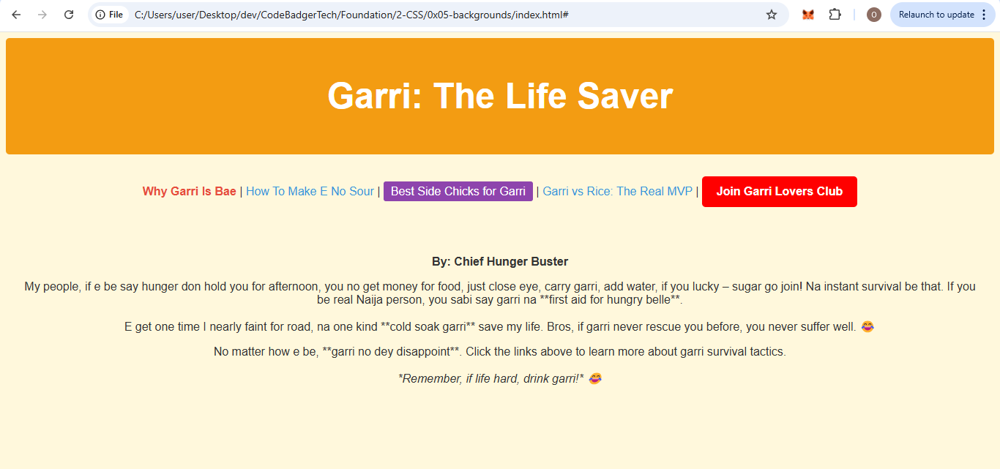

### **📢 Assignment: Build a Basic News Website**  

#### **Title:** *Garri: The Life Saver*  

👨‍💻 **Objective:**  
You will create a simple **news webpage** using **HTML and CSS**, focusing on **styling links** as we practiced. The goal is to style links in different ways to make the page interactive and visually appealing.  

---

### **📌 Task:**  
Create a webpage about how **garri** is a lifesaver, using a mix of **Pigin English and English**. Your page should include:  
✅ A **headline** (big, bold, colorful, and centered)  
✅ A **funny news article** about garri  
✅ **Navigation links at the top** (styled in different ways)  
✅ **Multiple links** styled in different ways (hover effects, button-like links, background colors, etc.)  

---

### **🎯 Requirements:**  
🔹 **Use at least 5 different types of styled links**  
🔹 **Make one link look like a button**  
🔹 **Use hover effects on some links**  
🔹 **Customize the cursor for at least one link**  
🔹 **No linking pages – all links should point to `#` (dummy links)**  

---

### EXPECTED OUTPUT

---

**Have fun coding!** 😁🔥