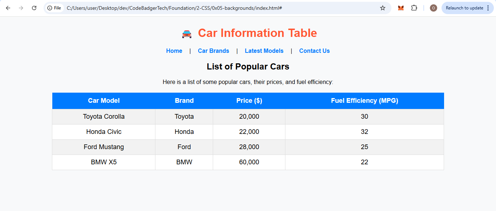

## **🚗 Guided Assignment: Styling Tables with CSS (Car Information)**  

### **Objective:**  
In this assignment, you will **create a webpage** with a **styled table** that displays information about different cars. You will use **CSS to style the table** and ensure it looks professional.  

---

### **📌 Instructions**  
1. **Create an HTML file (`index.html`)**  
2. **Create a CSS file (`styles.css`)**  
3. **Add a heading and links at the top**  
4. **Create a table that displays car details**  
5. **Style the table using CSS**  

---
### Expected OUTPUT

🚀 **Once done, preview your webpage in a browser!**