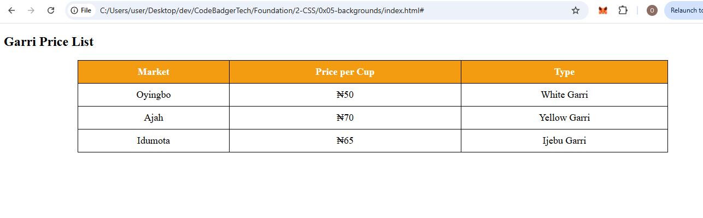
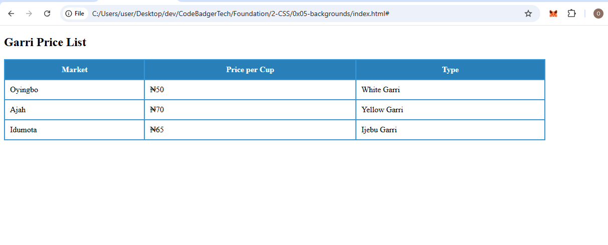
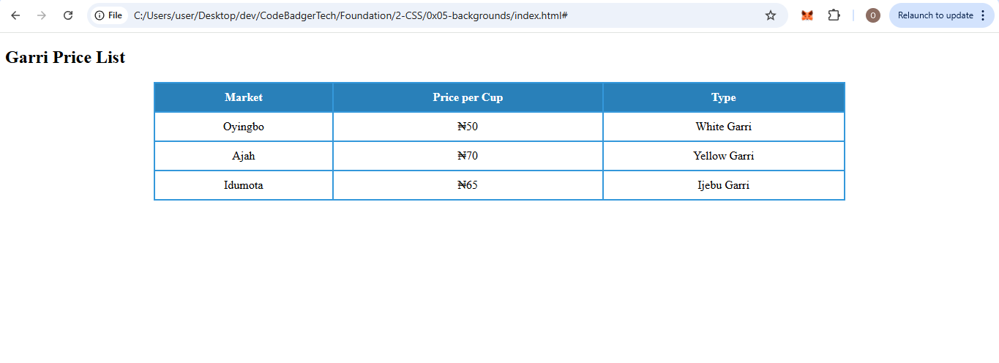
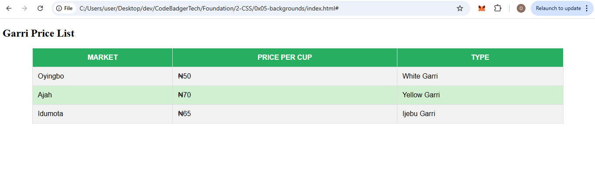

## **Tables in HTML & CSS**  

Tables help organize data in rows and columns, but plain tables look boring! With CSS, we can style tables beautifully. In this tutorial, we’ll cover:  

✅ **Basic Tables**  
✅ **Table Borders**  
✅ **Table Alignment**  
✅ **Table Styling**  

---

## **1. Basic Tables in HTML**  
A basic HTML table consists of `<table>`, `<tr>` (table row), `<th>` (table header), and `<td>` (table data).  

### **Example: Basic Table**  
```html
<!DOCTYPE html>
<html lang="en">
<head>
    <meta charset="UTF-8">
    <meta name="viewport" content="width=device-width, initial-scale=1.0">
    <title>Basic Table</title>
    <link rel="stylesheet" href="styles.css">
</head>
<body>

    <h2>Garri Price List</h2>

    <table>
        <tr>
            <th>Market</th>
            <th>Price per Cup</th>
            <th>Type</th>
        </tr>
        <tr>
            <td>Oyingbo</td>
            <td>₦50</td>
            <td>White Garri</td>
        </tr>
        <tr>
            <td>Ajah</td>
            <td>₦70</td>
            <td>Yellow Garri</td>
        </tr>
        <tr>
            <td>Idumota</td>
            <td>₦65</td>
            <td>Ijebu Garri</td>
        </tr>
    </table>

</body>
</html>
```  

### **CSS (styles.css)**
```css
table {
    width: 80%;
    margin: 20px auto;
    border-collapse: collapse;
    font-size: 18px;
}
th, td {
    padding: 10px;
    border: 1px solid black;
}
th {
    background-color: #f39c12;
    color: white;
}
td {
    text-align: center;
}
```
#### **🔹 What’s Happening?** 
 
✔ **Table has borders**  
✔ **Text is centered**  
✔ **Header row has a background color**  

---

## **2. Table Borders**  
We can use CSS to control **border width, style, and color**.  

### **Example: Adding Borders & Styling**
```css
table {
    border-collapse: collapse;
    width: 80%;
}
th, td {
    border: 2px solid #3498db;
    padding: 10px;
}
th {
    background-color: #2980b9;
    color: white;
}
```
### OUTPUT

### **📝 Explanation**
✅ **border-collapse: collapse;** → Removes double borders  
✅ **border: 2px solid #3498db;** → Blue border around table  
✅ **Background color** → Makes headers pop  

---

## **3. Table Alignment**
Tables & text can be aligned using **CSS properties like text-align and margin**.  

### **Example: Centering a Table**
```css
table {
    margin: auto;
    width: 70%;
    text-align: center;
     border-collapse: collapse;
}

th, td {
    border: 2px solid #3498db;
    padding: 10px;
}
th {
    background-color: #2980b9;
    color: white;
}
```
### OUTPUT

✅ **margin: auto;** → Centers table on the page  
✅ **text-align: center;** → Centers text inside cells  

---

## **4. Advanced Table Styling**
We can create beautiful tables using different colors, spacing, and hover effects.  

### **Example: Stylish Table with Hover Effect**
```css
table {
    width: 90%;
    margin: auto;
    border-collapse: collapse;
    font-family: Arial, sans-serif;
}
th, td {
    padding: 12px;
    border: 1px solid #ddd;
}
th {
    background-color: #27ae60;
    color: white;
    text-transform: uppercase;
}
tr:nth-child(even) {
    background-color: #f2f2f2;
}
tr:hover {
    background-color: #d1f0d1;
}
```

#### **🔹 What’s Happening?**  
✅ **Striped rows (zebra effect)** → `nth-child(even)`  
✅ **Hover effect** → `tr:hover` changes row color  
✅ **Text uppercase in headers**  

---

Happy coding! 🚀🔥