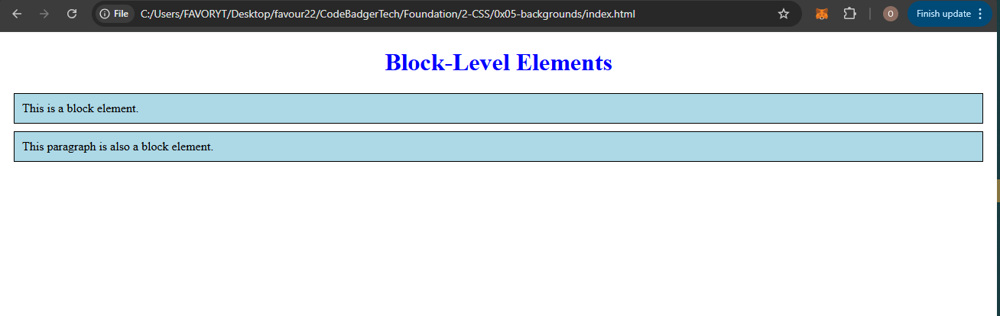
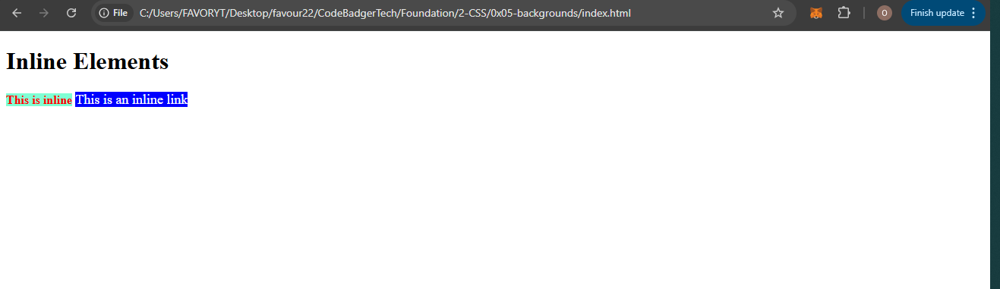
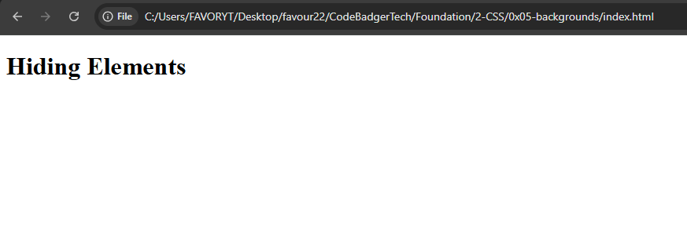
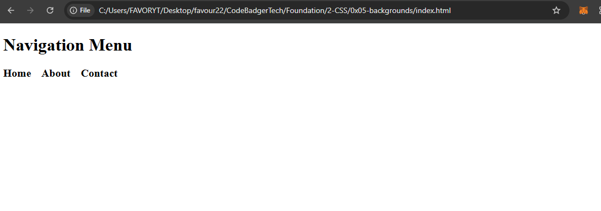

## **CSS Layout - The `display` Property**

### **Introduction**
The `display` property is one of the most important CSS properties for **controlling layout** on a webpage. It determines how an element is rendered—whether it appears **inline**, as a **block**, or follows other specific display rules.

---

## **1️⃣ The `display` Property**
Every HTML element has a **default display value**, which is either:  
✅ **Block-level** (takes up the full width of the page)  
✅ **Inline** (takes up only as much space as needed)  

The `display` property allows you to **change this behavior** to achieve different layouts.

---

## **2️⃣ Block-Level Elements**
A **block-level element** always **starts on a new line** and stretches to take up the full width of its container.

### **Examples of Block-Level Elements:**  
- `<div>`
- `<h1> - <h6>`
- `<p>`
- `<form>`
- `<header>`
- `<footer>`
- `<section>`

---

### **Example
#### **HTML (block.html)**
```html
<!DOCTYPE html>
<html lang="en">
<head>
    <meta charset="UTF-8">
    <meta name="viewport" content="width=device-width, initial-scale=1.0">
    <title>Block Elements</title>
    <link rel="stylesheet" href="styles.css">
</head>
<body>
    <h1>Block-Level Elements</h1>
    <div>This is a block element.</div>
    <p>This paragraph is also a block element.</p>
</body>
</html>
```

#### **CSS (styles.css)**
```css
h1 {
    text-align: center;
    color: blue;
}

div, p {
    background-color: lightblue;
    padding: 10px;
    margin: 10px;
    border: 1px solid black;
}
```
### OUTPUT


You can see that the full width of the page is taken by each element

✅ **Block elements always start on a new line!**

---

## **3️⃣ Inline Elements**
An inline element does NOT start on a new line. It only takes up as much width as necessary. Unlike block-level elements, inline elements behave differently in terms of width, height, margins, and padding.

Key Characteristics of Inline Elements
- Width and Height Cannot Be Set Directly

- Inline elements ignore width and height properties.

- The element’s width is determined by its content

### **Examples of Inline Elements:**  
- `<span>`
- `<a>`
- ``

---

### **Example**

#### **HTML (inline.html)**
```html
<!DOCTYPE html>
<html lang="en">
<head>
    <meta charset="UTF-8">
    <meta name="viewport" content="width=device-width, initial-scale=1.0">
    <title>Inline Elements</title>
    <link rel="stylesheet" href="styles.css">
</head>
<body>
    <h1>Inline Elements</h1>
    <span>This is inline</span>
    <a href="#">This is an inline link</a>
</body>
</html>
```

#### **CSS (styles.css)**
```css
span {
    color: red;
    font-weight: bold;
    background-color: aquamarine;
}

a {
    color:white;
    text-decoration: none;
    font-size: 18px;
    background-color: blue;
}
```
### OUTPUT


✅ **Inline elements do NOT break onto a new line!**

---

## **4️⃣ The `display` Property Values**  
The `display` property has many values, allowing us to **change** how elements behave.

### **Common `display` Values:**
| **Value**        | **Description** |
|-----------------|---------------|
| `block`         | Makes an element behave like a block element. |
| `inline`        | Makes an element behave like an inline element. |
| `inline-block`  | Inline element, but with the ability to set height & width. |
| `none`          | Hides the element completely (it doesn’t take up space). |
| `flex`          | Turns the element into a **flexbox container**. |
| `grid`          | Turns the element into a **grid container**. |

---

## **5️⃣ `display: none;` (Hiding Elements)**  
Sometimes, we need to **hide** elements without deleting them.

---

### **Example**

#### **HTML (hide.html)**
```html
<!DOCTYPE html>
<html lang="en">
<head>
    <meta charset="UTF-8">
    <meta name="viewport" content="width=device-width, initial-scale=1.0">
    <title>Hide Elements</title>
    <link rel="stylesheet" href="styles.css">
</head>
<body>
    <h1>Hiding Elements</h1>
    <p class="hidden">This paragraph is hidden.</p>
    <p class="hidden">OOPs I am Invincible hahaha!</p>
</body>
</html>
```

#### **CSS (styles.css)**
```css
.hidden {
    display: none;
}

button {
    margin: 10px;
    padding: 10px;
    background-color: blue;
    color: white;
    border: none;
    cursor: pointer;
}
```
### OUTPUT 

You can see that the paragraphs are not displaying.

---

## **6️⃣ Overriding the Default Display Value**  
We can change an element’s **default display value** to control layout.

### **Example: Making `<li>` Inline for a Menu**  
By default, `<li>` elements are block-level. We can change them to **inline** to create a horizontal menu.

---

#### **HTML (menu.html)**
```html
<!DOCTYPE html>
<html lang="en">
<head>
    <meta charset="UTF-8">
    <meta name="viewport" content="width=device-width, initial-scale=1.0">
    <title>Inline Menu</title>
    <link rel="stylesheet" href="styles.css">
</head>
<body>
    <h1>Navigation Menu</h1>
    <ul>
        <li>Home</li>
        <li>About</li>
        <li>Contact</li>
    </ul>
</body>
</html>
```

#### **CSS (styles.css)**
```css
ul {
    padding: 0;
}

li {
    display: inline;
    margin-right: 15px;
    font-size: 20px;
    font-weight: bold;
}
```
### OUTPUT


✅ **List items now appear in a row!**

---

## **7️⃣ Making `<a>` a Block Element**  
By default, links (`<a>`) are **inline**. We can make them **block** to look like buttons.

---

#### **HTML (block-link.html)**
```html
<!DOCTYPE html>
<html lang="en">
<head>
    <meta charset="UTF-8">
    <meta name="viewport" content="width=device-width, initial-scale=1.0">
    <title>Block Link</title>
    <link rel="stylesheet" href="styles.css">
</head>
<body>
    <h1>Block Links</h1>
    <a href="#">This is a block link</a>
</body>
</html>
```

#### **CSS (styles.css)**
```css
a {
    display: block;
    background: blue;
    color: white;
    padding: 10px;
    text-align: center;
    width: 200px;
    margin: 10px auto;
    text-decoration: none;
}
```

✅ **Now the link takes up a full block!**

---

## **Conclusion**  
- The `display` property is essential for **layout control** in CSS.  
- It allows us to **change an element’s default behavior** (inline, block, hidden, flex, grid).  
- We can use `display: none;` to **hide elements** dynamically.  
- Customizing `display` can improve **menus, buttons, and content layout**.

🚀 **Next Up: `position` Property!**