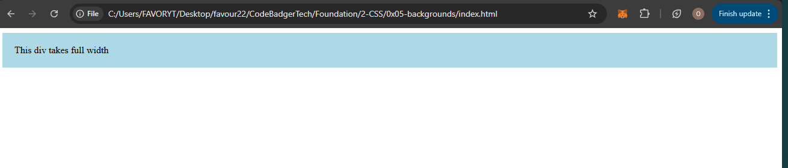
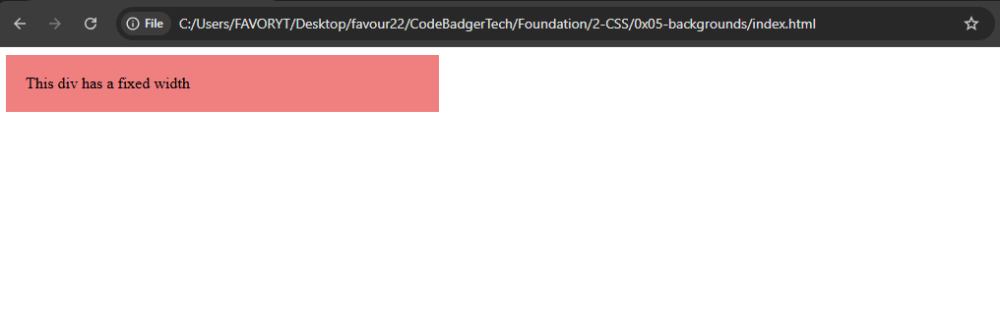
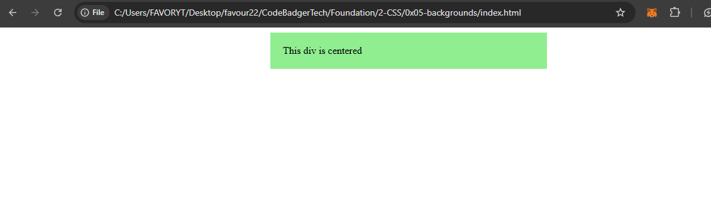
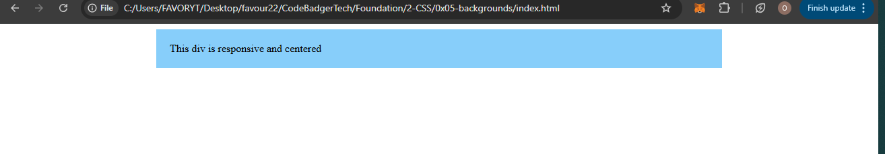

## **Using `width`, `max-width`, and `margin: auto` in CSS**  

In this section, we will cover how to control the width of block-level elements and how to center them using `margin: auto`.  

---

### **1. The Default Behavior of Block Elements**  
By default, block-level elements **take up the full width** of their parent container.  
This means they stretch from the left to the right as much as possible.  

#### **HTML (`block-default.html`)**
```html
<!DOCTYPE html>
<html lang="en">
<head>
    <meta charset="UTF-8">
    <meta name="viewport" content="width=device-width, initial-scale=1.0">
    <title>Block Element Default Width</title>
    <link rel="stylesheet" href="styles.css">
</head>
<body>
    <div class="default-box">This div takes full width</div>
</body>
</html>
```

#### **CSS (`styles.css`)**
```css
/* Default Block Element */
.default-box {
    background-color: lightblue;
    padding: 20px;
}
```
### OUTPUT

📌 **Notice:** The `<div>` stretches across the full width of the page.  

---

### **2. Using the `width` Property**  
You can set a specific `width` to **prevent** a block element from stretching across the entire container.  

#### **HTML (`fixed-width.html`)**
```html
<!DOCTYPE html>
<html lang="en">
<head>
    <meta charset="UTF-8">
    <meta name="viewport" content="width=device-width, initial-scale=1.0">
    <title>Fixed Width Example</title>
    <link rel="stylesheet" href="styles.css">
</head>
<body>
    <div class="fixed-width-box">This div has a fixed width</div>
</body>
</html>
```

#### **CSS (`styles.css`)**
```css
/* Fixed Width */
.fixed-width-box {
    width: 400px; /* Sets the width to 400px */
    background-color: lightcoral;
    padding: 20px;
}
```

📌 **Now, the `<div>` only takes up 400px instead of the full width.**  

---

### **3. Centering a Block Element Using `margin: auto`**  
Once the width is set, you can **center the element** by setting **`margin: auto;`**.  

#### **HTML (`centered-box.html`)**
```html
<!DOCTYPE html>
<html lang="en">
<head>
    <meta charset="UTF-8">
    <meta name="viewport" content="width=device-width, initial-scale=1.0">
    <title>Centered Box</title>
    <link rel="stylesheet" href="styles.css">
</head>
<body>
    <div class="centered-box">This div is centered</div>
</body>
</html>
```

#### **CSS (`styles.css`)**
```css
/* Centered Block Element */
.centered-box {
    width: 400px;
    margin: auto; /* Centers the div horizontally */
    background-color: lightgreen;
    padding: 20px;
}
```

📌 **How it works?**  
- `margin: auto;` automatically calculates equal left and right margins to center the element.  
- Works **only** when `width` is defined.  

---

### **4. The `max-width` Property**  
Instead of setting a fixed width, `max-width` allows an element to resize dynamically but never exceed a certain width.  

#### **Why Use `max-width` Instead of `width`?**  
- Makes the design **responsive** (better for smaller screens).  
- Allows elements to **shrink** when necessary.  

#### **HTML (`max-width.html`)**
```html
<!DOCTYPE html>
<html lang="en">
<head>
    <meta charset="UTF-8">
    <meta name="viewport" content="width=device-width, initial-scale=1.0">
    <title>Max-Width Example</title>
    <link rel="stylesheet" href="styles.css">
</head>
<body>
    <div class="max-width-box">Resize the browser to see how max-width behaves</div>
</body>
</html>
```

#### **CSS (`styles.css`)**
```css
/* Max-Width Example */
.max-width-box {
    max-width: 600px; /* Will not exceed 600px but can shrink */
    margin: auto;
    background-color: lightyellow;
    padding: 20px;
}
```
📌 **How `max-width` works?**  
- If the screen is **wider** than `600px`, the element remains `600px` wide.  
- If the screen is **narrower**, the element **shrinks** to fit the screen.  

---

### **5. Combining `width`, `max-width`, and `margin: auto`**  
You can use **both `max-width` and `margin: auto`** for better responsiveness while maintaining centering.  

#### **HTML (`responsive-centered.html`)**
```html
<!DOCTYPE html>
<html lang="en">
<head>
    <meta charset="UTF-8">
    <meta name="viewport" content="width=device-width, initial-scale=1.0">
    <title>Responsive Centered Div</title>
    <link rel="stylesheet" href="styles.css">
</head>
<body>
    <div class="responsive-box">This div is responsive and centered</div>
</body>
</html>
```

#### **CSS (`styles.css`)**
```css
/* Responsive Centered Div */
.responsive-box {
    width: 80%; /* Takes 80% of the screen width */
    max-width: 800px; /* Will not exceed 800px */
    margin: auto;
    background-color: lightskyblue;
    padding: 20px;
}
```

📌 **Now the element:**  
✔ Starts with **80% of screen width** (on small screens).  
✔ **Never exceeds 800px** (on large screens).  
✔ **Remains centered** on all screens.  

---

### **Summary**  
| Property | Behavior |
|----------|----------|
| `width` | Defines a **fixed width** (but not responsive). |
| `max-width` | Ensures the element **never exceeds** a certain width (good for responsiveness). |
| `margin: auto;` | Centers block elements **horizontally** when a width is set. |

---

### **Conclusion**  
- Use **`width`** if you want a fixed size.  
- Use **`max-width`** for a responsive design.  
- Use **`margin: auto`** to center block elements.  

🚀 **Next Step:** Try experimenting with different values and observe how the elements behave!