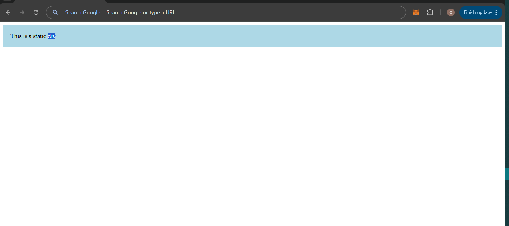
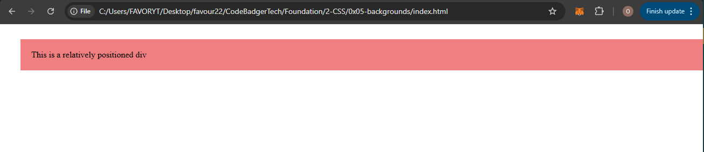
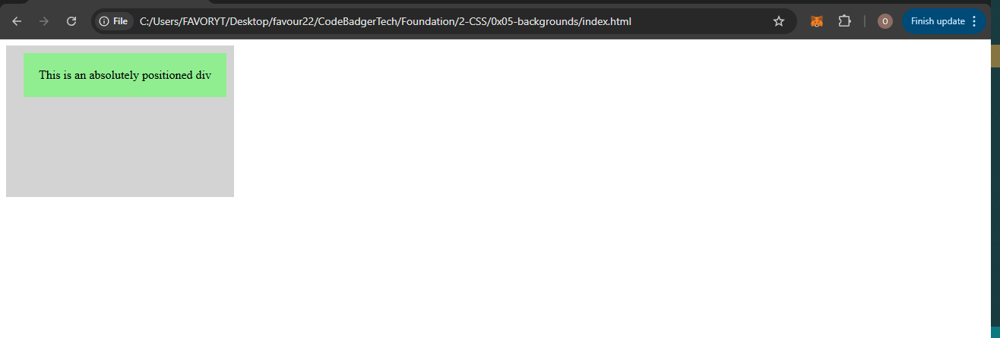
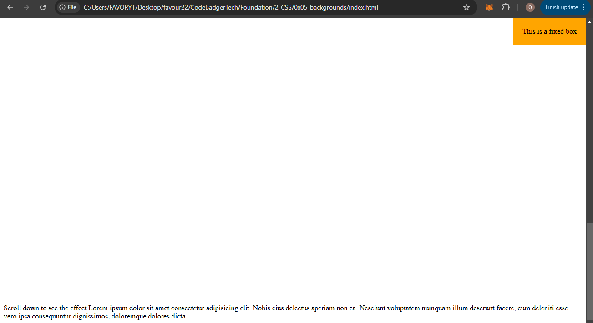
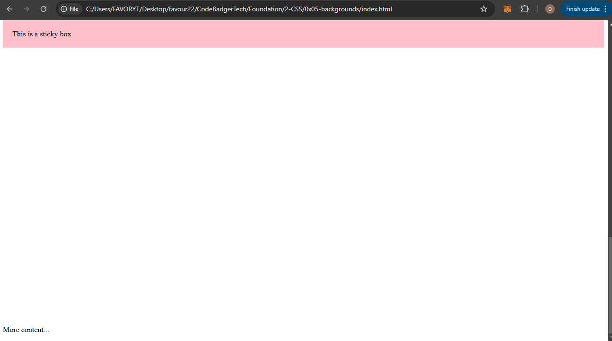

## **CSS Layout - The `position` Property**  

The `position` property defines how an element is placed in the document.  

It determines whether an element follows the normal document flow or is positioned in a specific way.  

### **1. Understanding the `position` Property**  

There are **five** different `position` values:  

| Position Value | Description |
|---------------|-------------|
| `static` | Default position. The element follows normal document flow. |
| `relative` | Positioned relative to its normal position. |
| `absolute` | Positioned relative to the nearest positioned ancestor. |
| `fixed` | Positioned relative to the viewport (stays in place when scrolling). |
| `sticky` | Switches between `relative` and `fixed` based on scrolling. |

📌 **Important:**  
- Positioning is controlled using **`top`**, **`bottom`**, **`left`**, and **`right`**.  
- These properties **only work if `position` is set**.  

---

### **2. The `static` Position (Default Behavior)**  

By default, elements have **`position: static;`**, which means they follow the normal document flow.  

📌 **Key points:**  
- The **`top`**, **`left`**, **`right`**, and **`bottom`** properties **do not work** with `static`.  
- The element stays in its natural position.  

#### **Example: `position: static;`**  
**HTML (`index.html`)**  
```html
<!DOCTYPE html>
<html lang="en">
<head>
    <meta charset="UTF-8">
    <meta name="viewport" content="width=device-width, initial-scale=1.0">
    <title>Static Position Example</title>
    <link rel="stylesheet" href="styles.css">
</head>
<body>
    <div class="box">This is a static div</div>
</body>
</html>
```
  
**CSS (`styles.css`)**  
```css
.box {
    position: static; /* Default behavior */
    background-color: lightblue;
    padding: 20px;
}
```

📌 **Notice:**  
- The div appears in its natural position.  
- Changing `top`, `left`, etc., **will have no effect**.  

---

### **3. The `relative` Position**  

`position: relative;` moves an element **relative to itself**.  

📌 **Key points:**  
- The element **still takes up space** in the normal document flow.  
- `top`, `bottom`, `left`, `right` **move the element from its normal position**.  

#### **Example: `position: relative;`**  
**HTML (`index.html`)**  
```html
<div class="box">This is a relatively positioned div</div>
```

**CSS (`styles.css`)**  
```css
.box {
    position: relative;
    top: 20px; /* Moves 20px down */
    left: 30px; /* Moves 30px to the right */
    background-color: lightcoral;
    padding: 20px;
}
```

📌 **Notice:**  
- The div **shifts** 20px down and 30px right.  
- It **still occupies** its original space.  

---

### **4. The `absolute` Position**  

`position: absolute;` moves an element **relative to the nearest positioned ancestor** (not relative to itself).  

📌 **Key points:**  
- If no positioned ancestor exists, the element is placed **relative to `<html>`**.  
- It is **removed from the normal document flow**.  

#### **Example: `position: absolute;`**  
**HTML (`index.html`)**  
```html
<div class="container">
    <div class="box">This is an absolutely positioned div</div>
</div>
```

**CSS (`styles.css`)**  
```css
.container {
    position: relative; /* Makes it the reference for absolute positioning */
    width: 300px;
    height: 200px;
    background-color: lightgray;
}

.box {
    position: absolute;
    top: 10px;
    right: 10px;
    background-color: lightgreen;
    padding: 20px;
}
```

📌 **Notice:**  
- The box **positions itself inside `.container`**, not the whole page.  
- It **does not take up space** in the normal flow.  

---

### **5. The `fixed` Position**  

`position: fixed;` makes an element **stay in the same place even when scrolling**.  

📌 **Key points:**  
- It is **relative to the viewport (browser window)**.  
- The element **never moves** even when scrolling.  

#### **Example: `position: fixed;`**  
**HTML (`index.html`)**  
```html
<div class="box">This is a fixed box</div>
<p>
    Scroll down to see the effect Lorem ipsum dolor sit amet consectetur adipisicing elit. Nobis eius delectus aperiam non ea. Nesciunt voluptatem numquam illum deserunt facere, cum deleniti esse vero ips
    a consequuntur dignissimos, doloremque dolores dicta.</p>
```

**CSS (`styles.css`)**  
```css
.box {
    position: fixed;
    top: 0;
    right: 0;
    background-color: orange;
    padding: 20px;
}

p {
    padding-top: 2000px;
}
```

📌 **Notice:**  
- The box **stays in the top-right corner** when you scroll.  

---

### **6. The `sticky` Position**  

`position: sticky;` **acts like `relative` normally**, but becomes `fixed` when scrolling past a point.  

📌 **Key points:**  
- The element starts as `relative`.  
- When it reaches a specified position (`top: 0;`), it **sticks** and behaves like `fixed`.  

#### **Example: `position: sticky;`**  
**HTML (`index.html`)**  
```html
<p>Scroll down to see the sticky effect.</p>
<div class="box">This is a sticky box</div>
<p>More content...</p>
```

**CSS (`styles.css`)**  
```css
.box {
    position: sticky;
    top: 0; /* Sticks when reaching the top */
    background-color: pink;
    padding: 20px;
}
p {
    padding-top: 1000px;
}
```

📌 **Notice:**  
- The box scrolls normally until it **reaches the top**.  
- Then, it **sticks in place** while the rest of the page scrolls.  

---

### **7. Summary Table**  

| Position | Behavior |
|----------|----------|
| `static` | Default. Follows normal document flow. |
| `relative` | Moves **relative to itself**, but keeps its space. |
| `absolute` | Moves **relative to nearest positioned ancestor**. |
| `fixed` | Moves **relative to the viewport** (stays in place when scrolling). |
| `sticky` | Starts as `relative`, but **sticks** when scrolled past a point. |

---

### **Conclusion**  

- `static`: Default behavior, no positioning.  
- `relative`: Moves **from its original place**, but keeps space.  
- `absolute`: Moves **inside the nearest positioned ancestor**.  
- `fixed`: Stays **in the same position on the screen**.  
- `sticky`: Moves **normally, but sticks when scrolling**.  

🚀 **Next Step:** Try applying these positions and see how they behave!  

---