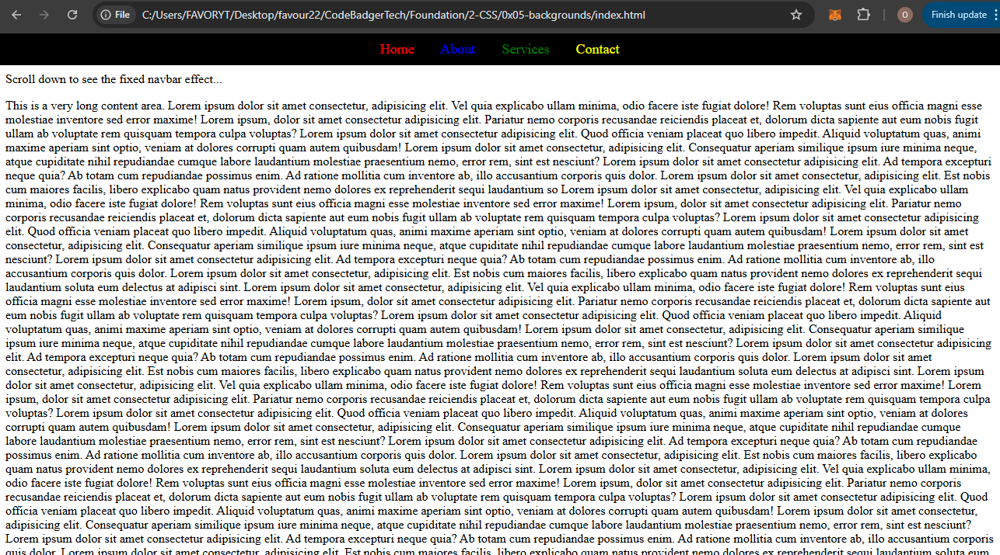

### **Assignment: Create a Fixed Navbar**  

#### **Objective:**  
- Create a **simple navbar** with links.  
- Use **`position: fixed;`** to make the navbar stay at the top.  
- Add **long content** to enable scrolling.  

---

### **Instructions:**  
1. **Create an HTML file** (`index.html`).  
   - Add a `<nav>` element with some links.  

2. **Create a CSS file** (`styles.css`).  
   - Style the navbar with **different link colors**.  
   - Use **`position: fixed;`** to keep the navbar at the top.  
   - Add **long content** could be jagorns(hsdydegdyfgdhgvakjsgfc)(increase pixel height if necessary).  

---

---

### **Expected Output:**  

✅ A **navbar with links in different colors**.  
✅ The **navbar stays at the top while scrolling**.  
✅ A **long page** to test scrolling.  

---