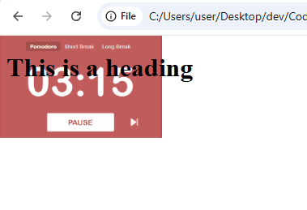
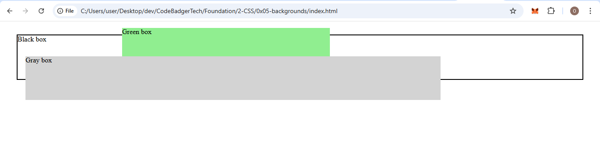
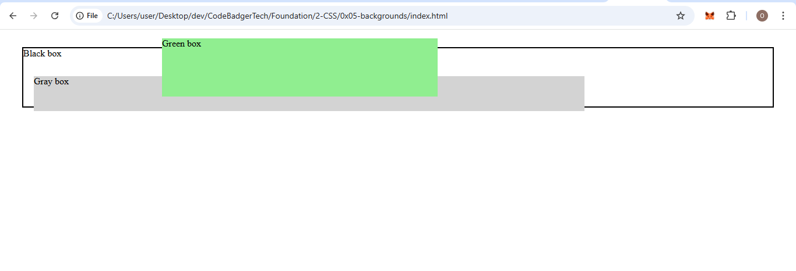

## **CSS Layout - The `z-index` Property**  

In this section, we will cover how to **control the stacking order of elements** using the `z-index` property.  

---

### **1. What is `z-index`?**  
When elements are **positioned**, they can **overlap** each other.  
The `z-index` property **controls which element appears in front or behind** others.  

✔ **Higher `z-index` values** = Element appears in front.  
✔ **Lower `z-index` values** = Element appears behind.  

---

### **2. Using `z-index` in CSS**  
To use `z-index`, an element must have one of the following `position` values:  
✅ `absolute`  
✅ `relative`  
✅ `fixed`  
✅ `sticky`  
✅ A **flex item** (`display: flex;` parent)  

---

### **3. Example: Placing an Element Behind Text**  

#### **Code:**
```html
<!DOCTYPE html>
<html lang="en">
<head>
    <meta charset="UTF-8">
    <meta name="viewport" content="width=device-width, initial-scale=1.0">
    <title>Z-Index Example</title>
    <link rel="stylesheet" href="styles.css">
</head>
<body>

    <h1>This is a heading</h1>
    

</body>
</html>
```

#### **`styles.css`**
```css
.background-image {
    position: absolute;
    top: 0;
    left: 0;
    width: 100%;
    z-index: -1; /* Moves image behind text */
}
```


📌 **Notice:** Because the image has `z-index: -1`, it moves **behind the heading**.  

---

### **4. Example: Controlling Stack Order**  

#### **Code:**
```html
<!DOCTYPE html>
<html lang="en">
<head>
    <meta charset="UTF-8">
    <meta name="viewport" content="width=device-width, initial-scale=1.0">
    <title>Z-Index Stack Order</title>
    <link rel="stylesheet" href="styles.css">
</head>
<body>

    <div class="container">
        <div class="black-box">Black box</div>
        <div class="gray-box">Gray box</div>
        <div class="green-box">Green box</div>
    </div>

</body>
</html>
```

#### **`styles.css`**
```css
.container {
    position: relative;
}

.black-box {
    position: relative;
    z-index: 1; /* Lowest */
    border: 2px solid black;
    height: 100px;
    margin: 30px;
}

.gray-box {
    position: absolute;
    z-index: 3; /* Highest */
    background: lightgray;
    height: 60px;
    width: 70%;
    left: 50px;
    top: 50px;
}

.green-box {
    position: absolute;
    z-index: 2; /* Middle */
    background: lightgreen;
    width: 35%;
    left: 270px;
    top: -15px;
    height: 100px;
}
```


📌 **How it works?**  
- The **gray box (`z-index: 3`)** appears **on top**.  
- The **green box (`z-index: 2`)** is **below the gray box but above the black box**.  
- The **black box (`z-index: 1`)** stays **at the bottom**.  

---

### **5. Example: No `z-index`**  

If no `z-index` is defined, the **element that appears later in the HTML** will be on top.  

#### **Code:**
```css
.container {
    position: relative;
}

.black-box {
    position: relative;
    border: 2px solid black;
    height: 100px;
    margin: 30px;
}

.gray-box {
    position: absolute;
    background: lightgray;
    height: 60px;
    width: 70%;
    left: 50px;
    top: 50px;
}

.green-box {
    position: absolute;
    background: lightgreen;
    width: 35%;
    left: 270px;
    top: -15px;
    height: 100px;
}
```


📌 **Without `z-index`, the last defined element (`green-box`) is on top!**  

---

### **6. Summary Table**  

| `z-index` Value | Effect |
|-----------------|--------|
| **Positive (e.g., `1, 2, 3`)** | Moves element **above** lower values |
| **Negative (e.g., `-1, -2`)** | Moves element **behind** others |
| **Higher value** | **Always appears in front** |
| **No `z-index`** | **Last defined element** appears on top |
---

### **Conclusion**  
- Use `z-index` to **control element stacking**.  
- Works **only** on **positioned elements** (`absolute`, `relative`, `fixed`, `sticky`).  
- **Higher values bring elements forward**, lower values send them back.  

🚀 **Next Step:** Try changing `z-index` values and see how elements stack!  

---
