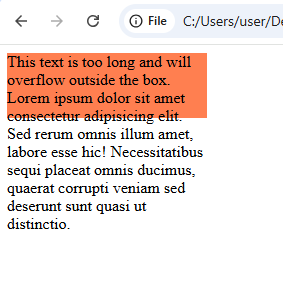
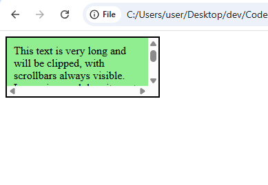
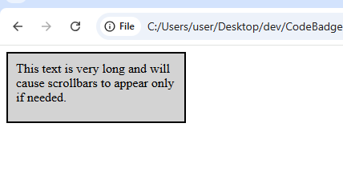
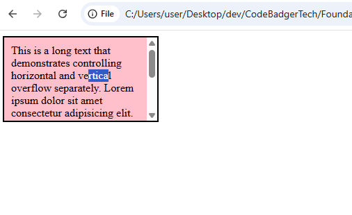

## **CSS Layout - The `overflow` Property**

In this section, we will learn how to control content that **overflows** its container using the `overflow` property. When an element’s content is too big to fit into its defined area, you can choose to show it, clip it, or add scrollbars.

---

### **1. What is `overflow`?**

Sometimes content **does not fit** inside an element’s box. The `overflow` property controls what happens when content is too large. You can:

- **Clip** the content so it is hidden.
- **Add scrollbars** so users can scroll to see the hidden content.

---

### **2. Available `overflow` Values**

| Property Value | Behavior |
|----------------|----------|
| **visible**    | Content **is not clipped** (default). It will overflow outside the box. |
| **hidden**     | Content **is clipped** (cut off). The extra content is invisible. |
| **scroll**     | Content **is clipped**, but **scrollbars appear** (always visible). |
| **auto**       | Similar to `scroll`, but **only shows scrollbars if needed**. |

---

### **3. Example: `overflow: visible` (Default Behavior)**

In this example, the overflowing text will simply spill outside the box because no clipping is applied.

#### **HTML File (`overflow-visible.html`)**
```html
<!DOCTYPE html>
<html lang="en">
<head>
  <meta charset="UTF-8">
  <meta name="viewport" content="width=device-width, initial-scale=1.0">
  <title>Overflow Visible</title>
  <link rel="stylesheet" href="styles.css">
</head>
<body>
  <div>This text is too long and will overflow outside the box.
        Lorem ipsum dolor sit amet consectetur adipisicing elit. Sed rerum omnis 
        illum amet, labore esse hic! Necessitatibus sequi placeat omnis ducimus, 
        quaerat corrupti veniam sed deserunt sunt quasi ut distinctio.
    </div>
</body>
</html>
```

#### **CSS File (`styles.css`)**
```css
/* Overflow Visible Example */
.overflow-visible {
  width: 200px;
  height: 65px;
  background-color: coral;
  overflow: visible; /* Default behavior: no clipping */
  border: 2px solid black;
  padding: 10px;
}
```

🔹 **Result:** No clipping occurs; extra text spills outside the box.



---

### **4. Example: `overflow: hidden` (Clips Content)**

In this example, the extra content that doesn’t fit is **clipped** (hidden).

#### **HTML File (`overflow-hidden.html`)**
```html
<!DOCTYPE html>
<html lang="en">
<head>
  <meta charset="UTF-8">
  <meta name="viewport" content="width=device-width, initial-scale=1.0">
  <title>Overflow Hidden</title>
  <link rel="stylesheet" href="styles.css">
</head>
<body>
  <div class="overflow-hidden">
    This text is very long and will be clipped, so the extra content will not be visible.
    Lorem ipsum dolor sit amet consectetur aipisicing elit. Mollitia doloremque 
    eligendi laborum natus officiis! Alias maxime obcaecati quo voluptatibus officiis natus, odio 
    ratione explicabo. Dolorum cum eos deleniti maxime sed.
  </div>
</body>
</html>
```

#### **CSS File (`styles.css`)**
```css
/* Overflow Hidden Example */
.overflow-hidden {
  width: 200px;
  height: 65px;
  background-color: lightblue;
  overflow: hidden; /* Extra content is clipped */
  border: 2px solid black;
  padding: 10px;
}
```

🔹 **Result:** Extra text is hidden, with no scrollbars.


---

### **5. Example: `overflow: scroll` (Always Shows Scrollbars)**

This example forces scrollbars to appear even if the content might fit.

#### **HTML File (`overflow-scroll.html`)**
```html
<!DOCTYPE html>
<html lang="en">
<head>
  <meta charset="UTF-8">
  <meta name="viewport" content="width=device-width, initial-scale=1.0">
  <title>Overflow Scroll</title>
  <link rel="stylesheet" href="styles.css">
</head>
<body>
  <div class="overflow-scroll">
    This text is very long and will be clipped, with scrollbars always visible.
  </div>
</body>
</html>
```

#### **CSS File (`styles.css`)**
```css
/* Overflow Scroll Example */
.overflow-scroll {
  width: 200px;
  height: 65px;
  background-color: lightgreen;
  overflow: scroll; /* Always shows horizontal and vertical scrollbars */
  border: 2px solid black;
  padding: 10px;
}
```

🔹 **Result:** Scrollbars appear even if not strictly necessary.



---

### **6. Example: `overflow: auto` (Scrollbars When Needed)**

Scrollbars appear only if the content overflows.

#### **HTML File (`overflow-auto.html`)**
```html
<!DOCTYPE html>
<html lang="en">
<head>
  <meta charset="UTF-8">
  <meta name="viewport" content="width=device-width, initial-scale=1.0">
  <title>Overflow Auto</title>
  <link rel="stylesheet" href="styles.css">
</head>
<body>
  <div class="overflow-auto">
    This text is very long and will cause scrollbars to appear only if needed.
  </div>
</body>
</html>
```

#### **CSS File (`styles.css`)**
```css
/* Overflow Auto Example */
.overflow-auto {
  width: 200px;
  height: 65px;
  background-color: lightgray;
  overflow: auto; /* Scrollbars appear only if necessary */
  border: 2px solid black;
  padding: 10px;
}
```

🔹 **Result:** Scrollbars are added only when the content exceeds the box dimensions. Increase the text to see the effect



---

### **7. Controlling Horizontal & Vertical Overflow Separately**

You can manage overflow in the horizontal and vertical directions separately with `overflow-x` and `overflow-y`.

#### **HTML File (`overflow-separate.html`)**
```html
<!DOCTYPE html>
<html lang="en">
<head>
  <meta charset="UTF-8">
  <meta name="viewport" content="width=device-width, initial-scale=1.0">
  <title>Overflow X & Y</title>
  <link rel="stylesheet" href="styles.css">
</head>
<body>
   <div class="overflow-separate">
    This is a long text that demonstrates controlling horizontal and vertical overflow separately.
    Lorem ipsum dolor sit amet consectetur adipisicing elit. Modi praesentium ab soluta cum, 
    provident delectus consequuntur natus maxime error repudiandae ea unde placeat quo obcaecati 
    impedit quos! Minus, omnis delectus.
  </div>
</body>
</html>
```

#### **CSS File (`styles.css`)**
```css
/* Overflow Separate Example */
.overflow-separate {
  width: 200px;
  height: 100px;
  background-color: pink;
  overflow-x: hidden; /* Hide horizontal overflow */
  overflow-y: scroll; /* Show vertical scrollbar */
  border: 2px solid black;
  padding: 10px;
}
```

🔹 **Result:** Horizontal overflow is hidden, while vertical overflow scrolls.



---

### **8. Summary Table**

| `overflow` Value | Behavior |
|------------------|----------|
| `visible`        | Content **is not clipped**; overflows outside the box. |
| `hidden`         | Content **is clipped**; extra content is invisible. |
| `scroll`         | Content **is clipped**, but **scrollbars always appear**. |
| `auto`           | Scrollbars appear **only when needed**. |
| `overflow-x`     | Controls **horizontal** overflow. |
| `overflow-y`     | Controls **vertical** overflow. |

---

### **9. Conclusion**

- Use **`overflow: hidden;`** to clip overflowing content.
- Use **`overflow: scroll;`** to force scrollbars.
- Use **`overflow: auto;`** for scrollbars that appear only if necessary.
- Use **`overflow-x` and `overflow-y`** for more precise control over horizontal and vertical overflow.

🚀 **Next Step:** Experiment with these values by adjusting the dimensions and content of your boxes to see how the scroll behavior changes!

---