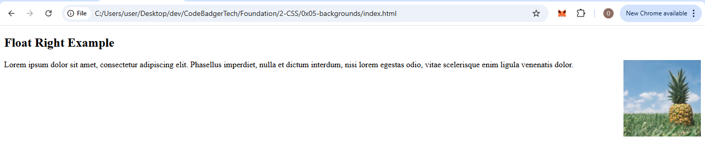
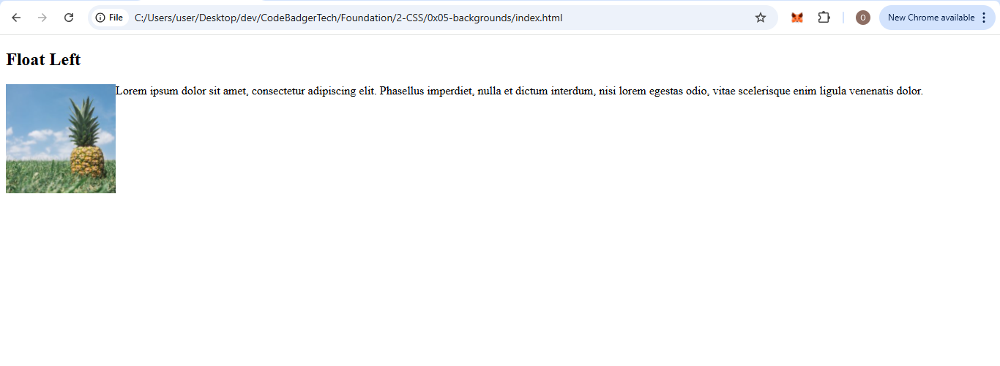
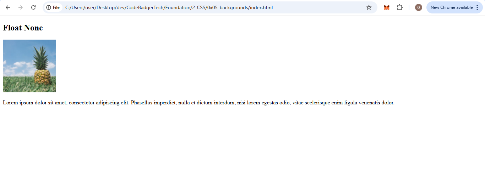
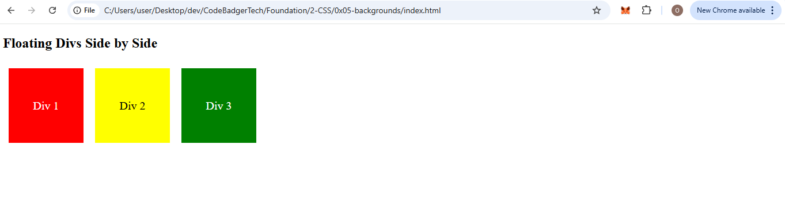
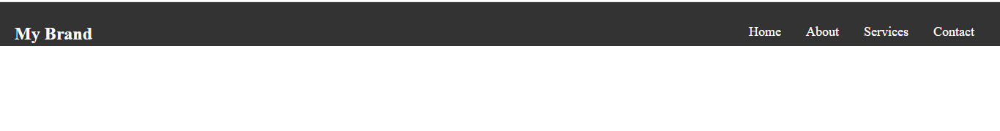

# **CSS Layout: Float and Clear**  

## **1. The `float` Property**  
The `float` property in CSS is used to position elements within a container, allowing text or other elements to wrap around them. It is commonly used to align images or div elements inside a webpage.

### **Syntax:**
```css
selector {
  float: value;
}
```
**Possible Values:**
- `left` – The element floats to the left of its container.
- `right` – The element floats to the right of its container.
- `none` – The element does not float (default).
- `inherit` – The element inherits the float value of its parent.

---

## **2. Floating an Image**
### **Example 1: Image Floating to the Right**
This example makes an image float to the right of a text block.

**HTML File (index.html):**
```html
<!DOCTYPE html>
<html lang="en">
<head>
    <meta charset="UTF-8">
    <meta name="viewport" content="width=device-width, initial-scale=1.0">
    <title>Float Right Example</title>
    <link rel="stylesheet" href="styles.css">
</head>
<body>
    <h2>Float Right Example</h2>
    
    <p>
        Lorem ipsum dolor sit amet, consectetur adipiscing elit. Phasellus imperdiet, nulla et dictum interdum, nisi lorem egestas odio, 
        vitae scelerisque enim ligula venenatis dolor.
    </p>
</body>
</html>
```

**CSS File (styles.css):**
```css
img {
    float: right;
    width: 150px;
    height: auto;
    margin-left: 15px;
}
```
### OUTPUT
;

---

### **Example 2: Image Floating to the Left**
This example makes an image float to the left.

**HTML File (index.html):**
```html
<!DOCTYPE html>
<html lang="en">
<head>
    <meta charset="UTF-8">
    <meta name="viewport" content="width=device-width, initial-scale=1.0">
    <title>Float Left Example</title>
    <link rel="stylesheet" href="styles.css">
</head>
<body>
    <h2>Float Left Example</h2>
    
    <p>
        Lorem ipsum dolor sit amet, consectetur adipiscing elit. Phasellus imperdiet, nulla et dictum interdum, nisi lorem egestas odio, 
        vitae scelerisque enim ligula venenatis dolor.
    </p>
</body>
</html>
```

**CSS File (styles.css):**
```css
img {
    float: left;
    width: 150px;
    height: auto;
    margin-right: 15px;
}
```
### OUTPUT

---

### **Example 3: No Floating**
This example keeps the image in its default position in the document flow.

**HTML File (index.html):**
```html
<!DOCTYPE html>
<html lang="en">
<head>
    <meta charset="UTF-8">
    <meta name="viewport" content="width=device-width, initial-scale=1.0">
    <title>No Float Example</title>
    <link rel="stylesheet" href="styles.css">
</head>
<body>
    <h2>No Float Example</h2>
    <p>Lorem ipsum dolor sit amet...</p>
    
    <p>Continues here...</p>
</body>
</html>
```

**CSS File (styles.css):**
```css
img {
    float: none;
    width: 150px;
    height: auto;
}
```
### OUTPUT


---

## **3. Floating Div Elements Next to Each Other**
By default, `div` elements appear stacked on top of each other. But using `float: left;` allows them to be positioned side by side.

### **Example 4: Floating Divs Side by Side**

**HTML File (index.html):**
```html
<!DOCTYPE html>
<html lang="en">
<head>
    <meta charset="UTF-8">
    <meta name="viewport" content="width=device-width, initial-scale=1.0">
    <title>Floating Divs</title>
    <link rel="stylesheet" href="styles.css">
</head>
<body>
    <h2>Floating Divs Side by Side</h2>
    <div class="div1">Div 1</div>
    <div class="div2">Div 2</div>
    <div class="div3">Div 3</div>
</body>
</html>
```

**CSS File (styles.css):**
```css
div {
    float: left;
    width: 100px;
    height: 100px;
    padding: 15px;
    margin: 10px;
    text-align: center;
    line-height: 100px;
    font-size: 20px;
    color: white;
}

.div1 {
    background: red;
}

.div2 {
    background: yellow;
    color: black;
}

.div3 {
    background: green;
}
```

### OUTPUT 


---

### **Creating a Navbar with Float**

Here’s a step-by-step guide on how we can achieve that:

---

### **HTML File (index.html):**
```html
<!DOCTYPE html>
<html lang="en">
<head>
    <meta charset="UTF-8">
    <meta name="viewport" content="width=device-width, initial-scale=1.0">
    <title>Float Navbar Example</title>
    <link rel="stylesheet" href="styles.css">
</head>
<body>

    <header>
        <!-- Brand name on the left -->
        <h1 class="brand">My Brand</h1>

        <!-- Navigation links on the right -->
        <nav>
            <a href="#home">Home</a>
            <a href="#about">About</a>
            <a href="#services">Services</a>
            <a href="#contact">Contact</a>
        </nav>
    </header>

</body>
</html>
```

---

### **CSS File (styles.css):**

```css
/* General Reset for padding and margin */
* {
    margin: 0;
    padding: 0;
    box-sizing: border-box;
}

/* Style the header */
header {
    background-color: #333;  /* Dark background for the navbar */
     padding: 30px 20px;      /* Some padding for spacing */
}

/* Style the brand name (left side) */
.brand {
    color: white;             /* White text for the brand */
    float: left;              /* Float to the left side of the header */
    font-size: 24px;          /* Larger text size for the brand name */
}

/* Style the navigation links (right side) */
nav {
    float: right;             /* Float to the right side of the header */
}

/* Style the individual links */
nav a {
    color: white;             /* White text for links */
    text-decoration: none;    /* Remove underline */
    padding: 10px 15px;       /* Space around the links */
    font-size: 18px;          /* Set font size for the links */
}

/* Style the links when hovered */
nav a:hover {
    background-color: #575757; /* Darker background on hover */
}
```

### OUTPUT


cool right? 😎😎😉

---

### **Step-by-Step Explanation:**

1. **HTML Structure:**
   - Inside the `<header>` tag, we have two main elements:
     - **Brand Name:** A `<h1>` with the class `.brand` is used to display the brand name. This is floated to the left.
     - **Navigation Links:** A `<nav>` element that contains the `<a>` links for navigation. These are floated to the right.

2. **CSS Styling:**
   - **Global Reset:** We use the `*` selector to apply a margin and padding reset for all elements, ensuring a clean layout with `box-sizing: border-box;` for easier control of element sizing.
   
   - **Header Styling:** 
     - The header has a dark background (`#333`), padding (`10px 20px`), and acts as the container for the brand and links.
   
   - **Brand Name Styling:**
     - The brand name is styled with the `.brand` class, where we set the font color to white, increased the font size, and floated it to the left using `float: left`.
   
   - **Navigation Styling:**
     - The `nav` element is floated to the right using `float: right`.
     - Each link inside the `nav` is styled to have white text, padding for spacing, and no underline (`text-decoration: none`).
   
   - **Hover Effect:** The `nav a:hover` selector changes the background color of the links when hovered over to give a nice interactive effect.

---

### **Result:**
- **Brand Name on the Left:** The brand name `My Brand` will appear on the left side of the header.
- **Links on the Right:** The navigation links `Home`, `About`, `Services`, and `Contact` will be aligned to the right side of the header.

---

### **Output (Visual Explanation):**
- The header background will be dark (`#333`).
- The brand name will float to the left, and the navigation links will float to the right.
- When you hover over any link, its background color will change to indicate interactivity.

This is a simple but effective way to use `float` for creating  navbar with the brand on the left and links on the right.
