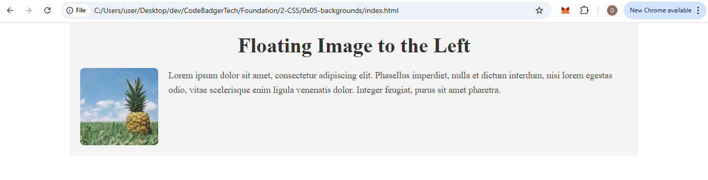

## **Assignment: CSS Layout with Float and Clear**

### **Objective:**
In this assignment, you will practice using the **float** property for positioning elements. You will also apply **padding**, **margins**, **colors**, and **font sizes** to enhance the layout and make it more visually appealing.

---

### **Task Instructions:**

#### **Task 1: Image and Text Layout with Left Float**

1. Create an HTML page with an image and a paragraph of text.
2. Float the image to the **left** of the text so that the text wraps around the image.
3. Style the image with a **width** of 150px and **height** of auto.
4. Add **margin** around the image to create space between the text and the image.

### OUTPUT

---
