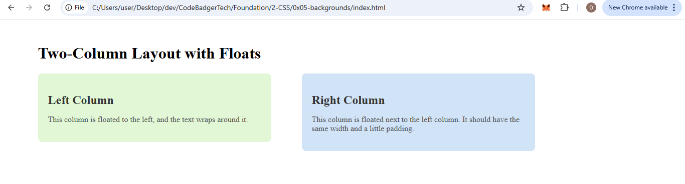

#### **Task 2: Two-Column Layout Using Floats**

1. Create a layout with two **div** elements positioned side by side.
2. Use **float: left** to position both columns next to each other.
3. Apply **margins** to create space between the columns, and **padding** for content inside the columns.
4. Add **background colors** to the columns for contrast, and ensure the content is easy to read.

### EXPECTED OUTPUT

---