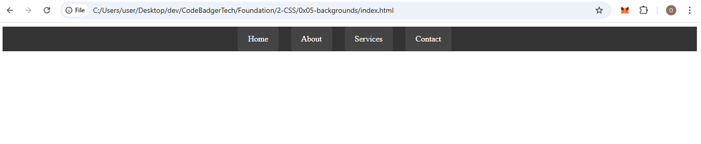

### Creating a Horizontal Navigation Bar with `display: inline-block`

In this tutorial, we will focus on creating a **horizontal navigation bar** with **`display: inline-block`**. We'll cover why we use list items (`<li>`) and how to style them effectively.

---

#### 1. Why Use `<li>` and `<a>` for Navigation Links?

When building navigation menus, it’s common to use the following elements:
- **`<ul>`** (unordered list) to contain the list items (`<li>`).
- **`<li>`** (list items) to define each menu option.
- **`<a>`** (anchor) to create the actual clickable links.

Here’s why we do it:
- **Semantic HTML**: Using `<ul>` and `<li>` gives structure to the page, making it easier for search engines and screen readers to understand that these are navigation links.
- **Accessibility**: Lists are natively recognized by browsers and assistive technologies, which improves navigation for users with disabilities.
- **Flexibility**: Using `<li>` elements gives us the flexibility to control the layout with CSS.

---

#### 2. The Problem Without `inline-block`

If you simply used block-level elements (e.g., `<div>` or `<p>`) for each link, each element would appear on a new line. This can break the layout when you want the navigation items to appear on the same horizontal line.

For example:

```html
<ul>
  <div><a href="#">Home</a></div>
  <div><a href="#">About</a></div>
  <div><a href="#">Services</a></div>
  <div><a href="#">Contact</a></div>
</ul>
```

Here, each `<div>` is block-level, and they will stack vertically. To make them horizontal, you would need to use `display: inline` or `display: inline-block` on these elements.

---

#### 3. Why Use `display: inline-block`?

When using `inline-block`:
- It allows each list item (`<li>`) to sit next to each other horizontally.
- You can still set width, height, margin, padding, and other properties like block-level elements.
- It respects the `margin` and `padding` you apply to the element, unlike `inline`, which doesn’t.

---

#### 4. Full HTML and CSS Example for a Horizontal Navigation Bar

Let’s create a complete example. We’ll use `display: inline-block` to make the navigation links appear horizontally.

##### HTML Code

```html
<!DOCTYPE html>
<html lang="en">
<head>
  <meta charset="UTF-8">
  <meta name="viewport" content="width=device-width, initial-scale=1.0">
  <title>Horizontal Navigation Bar</title>
  <link rel="stylesheet" href="styles.css">
</head>
<body>
  <!-- Navigation Bar -->
  <ul class="nav">
    <li><a href="#">Home</a></li>
    <li><a href="#">About</a></li>
    <li><a href="#">Services</a></li>
    <li><a href="#">Contact</a></li>
  </ul>
</body>
</html>
```

##### CSS Code (`styles.css`)

```css
/* Reset list styles */
.nav {
  list-style-type: none; /* Removes default bullet points */
  padding: 0;            /* Removes default padding */
  margin: 0;             /* Removes default margin */
  text-align: center;    /* Centers the navigation items */
  background-color: #333; /* Dark background for the nav bar */
}

/* Style for each list item */
.nav li {
  display: inline-block; /* Makes the list items display horizontally */
  margin-right: 20px;    /* Adds space between items */
}

/* Style for the links */
.nav li a {
  display: block;         /* Makes the link behave like a block element */
  padding: 15px 20px;     /* Adds padding inside the link */
  text-decoration: none;  /* Removes the underline */
  color: #fff;            /* White text color */
  background-color: #444; /* Slightly lighter background color */
  border-radius: 5px;     /* Rounded corners */
}

/* Hover effect for the links */
.nav li a:hover {
  background-color: #555; /* Darken the background on hover */
  transition: background-color 0.3s ease; /* Smooth transition */
}
```

### OUTPUT 


---

#### 5. Explanation of the Code

1. **HTML Structure**:
   - We start with a `<ul>` element (unordered list) to hold the list items. Each `<li>` represents a navigation option, and inside each `<li>`, we place an `<a>` tag that defines the link.
   
2. **CSS Styling**:
   - **`.nav`**: We remove the default bullet points and padding/margin to clean up the list's default styling. We also center the items horizontally with `text-align: center`, and give the background color a dark tone (`#333`).
   - **`.nav li`**: We set `display: inline-block` so that each list item appears horizontally. The `margin-right` property adds space between the navigation links.
   - **`.nav li a`**: The anchor tags (`<a>`) are styled to look like buttons. We make them `display: block` to apply padding and make them clickable over a larger area. The `background-color` and `color` properties style the text and background of the links. We also add some padding for a better visual appearance.
   - **`.nav li a:hover`**: The `hover` effect darkens the background color when the user hovers over the link. The transition property gives it a smooth animation effect.

---

#### 6. Final Notes

- Using `inline-block` for the list items (`<li>`) is a simple and effective way to lay out horizontal navigation links.
- The `display: block` on the `<a>` tag makes sure the link has padding and is easier to click.
- We use hover effects to make the navigation more interactive and visually appealing.

---

### Conclusion

By using `display: inline-block` on the `<li>` elements, we have successfully created a horizontal navigation bar. This layout is not only functional but also semantic, as we’re using `<ul>`, `<li>`, and `<a>` tags correctly to structure the navigation.