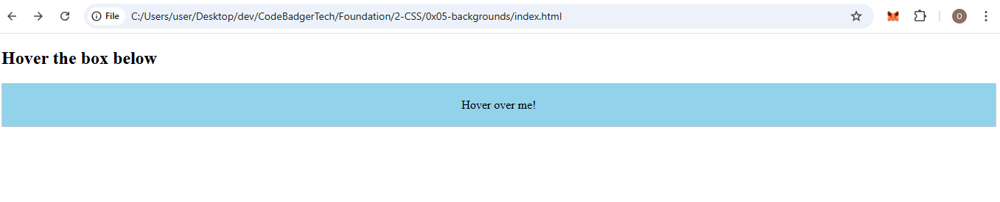
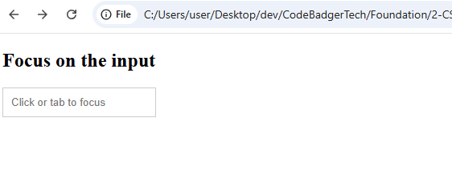
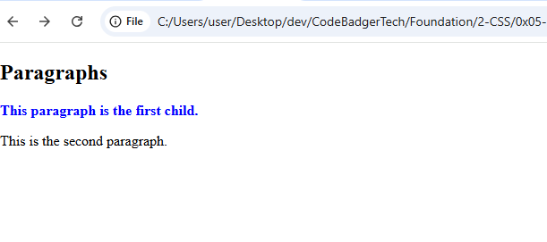

# 🎓 CSS Pseudo-classes Tutorial

---

## ✅ What is a CSS Pseudo-class?

A **CSS pseudo-class** is a keyword added to a selector that specifies a **special state** of the selected element.

> You can think of a pseudo-class as a *trigger* for styles based on interactions, positions, or conditions — without needing to add extra classes or JavaScript.

### 🧠 Why Use Pseudo-classes?

They allow you to:
- Add interactivity to your web pages using only CSS.
- Change the appearance of elements during specific user actions (like hovering or focusing).
- Target elements dynamically (like the first element in a list).
- Make your UI more accessible and user-friendly.

---

## 📌 Pseudo-class Syntax

```css
selector:pseudo-class {
  property: value;
}
```

### Example:

```css
button:hover {
  background-color: orange;
}
```

This means: *“When the user hovers over any `<button>`, change its background color to orange.”*

---

## 🔗 1. Anchor Pseudo-classes (Styling Links)

HTML links can have different states based on how the user interacts with them. CSS pseudo-classes allow us to style each of these states differently.

### 📚 Explanation

| Pseudo-class | Description |
|--------------|-------------|
| `:link` | Targets links that haven’t been clicked yet. |
| `:visited` | Targets links that the user has already clicked. |
| `:hover` | Applies styles when the mouse pointer is over the link. |
| `:active` | Applies styles when the link is being clicked (between mousedown and mouseup). |

These allow you to create a **visual experience** that helps users understand where they are clicking, what they’ve already visited, and what they’re currently interacting with.

### ✅ Full Working Example

#### 📄 index.html

```html
<!DOCTYPE html>
<html>
<head>
  <meta charset="UTF-8">
  <title>Anchor States</title>
  <link rel="stylesheet" href="style.css">
</head>
<body>

  <h1>Link Pseudo-class Demo</h1>
  <a href="https://example.com">Go to Example.com</a>

</body>
</html>
```

#### 🎨 style.css

```css
a:link {
  color: red; /* Unvisited link */
}

a:visited {
  color: green; /* Visited link */
}

a:hover {
  color: magenta; /* Mouse over */
  text-decoration: underline;
}

a:active {
  color: blue; /* During click */
}
```

> 💡 **Order matters!** Always write `:hover` after `:link` and `:visited`, and `:active` after `:hover`, or some styles may not apply correctly.

---

## 🖱️ 2. `:hover` – Mouse Interaction

### 📚 Explanation

The `:hover` pseudo-class is triggered **when a user moves their mouse pointer over an element**. It’s most commonly used for buttons, links, cards, tooltips, and menus.

You can use `:hover` on **any HTML element**, not just links.

### ✅ Example

#### 📄 index.html

```html
<!DOCTYPE html>
<html>
<head>
  <meta charset="UTF-8">
  <title>Hover Example</title>
  <link rel="stylesheet" href="style.css">
</head>
<body>

  <h2>Hover the box below</h2>
  <div class="hover-box">Hover over me!</div>

</body>
</html>
```

#### 🎨 style.css

```css
.hover-box {
  background-color: #eee;
  padding: 20px;
  text-align: center;
  transition: background-color 0.3s;
  border: 1px solid #ccc;
}

.hover-box:hover {
  background-color: #87ceeb;
  cursor: pointer;
}
```

### OUTPUT


> 🧠 Adding `transition` gives it a smooth effect when the color changes.

---

## 🧠 3. `:focus` – Input Focus Styling

### 📚 Explanation

The `:focus` pseudo-class applies styles to an element **when it gains focus**, usually through:
- Clicking on it
- Navigating to it with the keyboard (Tab key)

This is especially useful for styling **form inputs** to make them more user-friendly and accessible.

### ✅ Example

#### 📄 index.html

```html
<!DOCTYPE html>
<html>
<head>
  <meta charset="UTF-8">
  <title>Focus Input Example</title>
  <link rel="stylesheet" href="style.css">
</head>
<body>

  <h2>Focus on the input</h2>
  <input type="text" placeholder="Click or tab to focus">

</body>
</html>
```

#### 🎨 style.css

```css
input {
  padding: 10px;
  border: 1px solid #ccc;
}

input:focus {
  border: 2px solid #f00;
  outline: none;
  background-color: #ffeaea;
}
```

### OUTPUT (click on it to see effect)


> ✅ Helps users know where they are in the form.

---

## 🧩 4. `:first-child` – Targeting the First Element

### 📚 Explanation

The `:first-child` pseudo-class selects an element **only if it is the first child** of its parent.

This is useful when you want to apply special styles to the first item in a list, first paragraph in a section, etc.

### ✅ Full Working Example

#### 📄 index.html

```html
<!DOCTYPE html>
<html>
<head>
  <meta charset="UTF-8">
  <title>First Child Example</title>
  <link rel="stylesheet" href="style.css">
</head>
<body>

  <h2>Paragraphs</h2>
  <div>
    <p>This paragraph is the first child.</p>
    <p>This is the second paragraph.</p>
  </div>

</body>
</html>
```

#### 🎨 style.css

```css
p:first-child {
  color: blue;
  font-weight: bold;
}
```



> ⚠️ Only works if the `<p>` is the **very first child** inside its parent element.

---

## 💬 5. `:lang` – Language-based Styling

### 📚 Explanation

The `:lang()` pseudo-class targets elements based on their language attribute. This is especially useful when dealing with multilingual websites.

For example, different languages may use different quotation styles or font styles.

### ✅ Full Working Example

#### 📄 index.html

```html
<!DOCTYPE html>
<html>
<head>
  <meta charset="UTF-8">
  <title>Language Styling</title>
  <link rel="stylesheet" href="style.css">
</head>
<body>

  <h2>Language-specific Quote</h2>
  <p>Here's a Norwegian quote: <q lang="no">Et sitat</q></p>

</body>
</html>
```

#### 🎨 style.css

```css
q:lang(no) {
  quotes: "~" "~";
}
```

> 🧠 Quotes will render as `~Et sitat~` instead of default quotation marks.

---

## 🎁 Bonus: Tooltip using `:hover`

### 📚 Explanation

You can use `:hover` to display hidden elements like tooltips when the user hovers over another element — no JavaScript needed!

### ✅ Full Working Example

#### 📄 index.html

```html
<!DOCTYPE html>
<html>
<head>
  <meta charset="UTF-8">
  <title>Tooltip Example</title>
  <link rel="stylesheet" href="style.css">
</head>
<body>

  <h2>Hover Tooltip</h2>
  <div class="tooltip">
    Hover over me
    <p>This is a tooltip that appears!</p>
  </div>

</body>
</html>
```

#### 🎨 style.css

```css
.tooltip p {
  display: none;
  background-color: yellow;
  padding: 10px;
  margin-top: 5px;
  border: 1px solid #ccc;
}

.tooltip:hover p {
  display: block;
}
```

> 🔍 Tooltip only shows up **on hover** — great for interactive UIs.

---

## 🧪 Practice Time!

Try these challenges:
1. Style a list so only the first item is bold using `:first-child`.
2. Create a form with different colors on focus and blur.
3. Make a navigation menu where links change color on hover and click.
4. Use `:lang(en)` and `:lang(fr)` to style multilingual content differently.

---

## 📦 Summary

| Pseudo-class | Description |
|--------------|-------------|
| `:hover` | User hovers over element |
| `:focus` | Element is focused (active input) |
| `:link` | Link not yet visited |
| `:visited` | Link already visited |
| `:active` | Link being clicked |
| `:first-child` | First child of a parent |
| `:lang()` | Element has specific language |

---