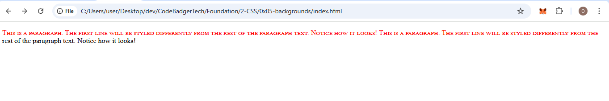
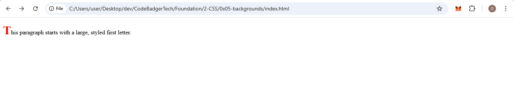
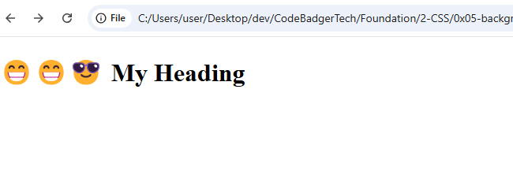
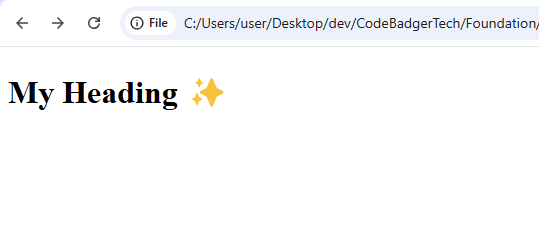
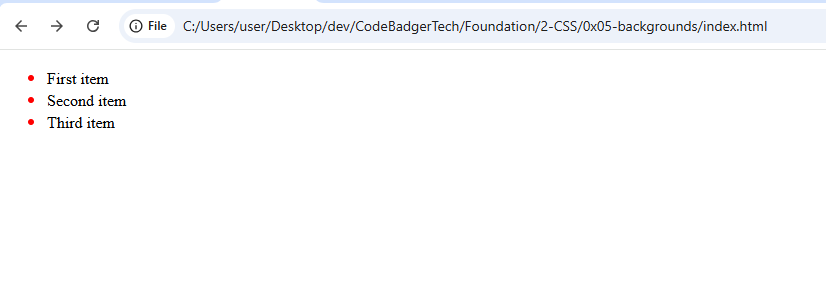
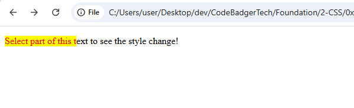

# 🎓 CSS Pseudo-elements Tutorial
---

## ✅ What is a CSS Pseudo-element?

A **CSS pseudo-element** is a special type of selector used to **style specific parts of an element** or to insert content before or after an element. Pseudo-elements are different from pseudo-classes, as they allow you to target specific parts or add content to an element that doesn’t already exist in the HTML structure.

### 🧠 Why Use Pseudo-elements?

CSS pseudo-elements are helpful for:
- Styling the first letter or line of an element.
- Inserting content before or after an element.
- Styling the markers (bullets) of list items.
- Customizing selected text.

In short, pseudo-elements allow you to make **dynamic, content-based styles** that wouldn't otherwise be achievable with regular HTML structure and CSS alone.

---

## 📌 Pseudo-element Syntax

```css
selector::pseudo-element {
  property: value;
}
```

Notice that pseudo-elements use **double colons** (`::`) instead of single colons (`:`). This is a recent change in CSS3 to differentiate between **pseudo-classes** and **pseudo-elements**, but for backward compatibility, some older browsers still accept the single-colon syntax.

---

## 🧩 1. `::first-line` – Style the First Line of a Text

### 📚 Explanation

The `::first-line` pseudo-element targets the **first line** of a block-level element (like a `<p>` or `<div>`). This is useful when you want to apply unique styles to the beginning of a text, such as changing its font or color.

### ✅ Example

#### 📄 index.html

```html
<!DOCTYPE html>
<html lang="en">
<head>
  <meta charset="UTF-8">
  <meta name="viewport" content="width=device-width, initial-scale=1.0">
  <title>First Line Example</title>
  <link rel="stylesheet" href="style.css">
</head>
<body>

  <p>This is a paragraph. The first line will be styled differently from the rest of the paragraph text. Notice how it looks!</p>

</body>
</html>
```

#### 🎨 style.css

```css
p::first-line {
  color: red;  /* First line will be red */
  font-variant: small-caps;  /* Makes the first line in small-caps */
}
```
### OUTPUT 


> 🧠 **Note**: The `::first-line` pseudo-element only works with block-level elements. It cannot be applied to inline elements like `<span>`.

---

## 🧠 2. `::first-letter` – Style the First Letter

### 📚 Explanation

The `::first-letter` pseudo-element allows you to target and style **the first letter** of a block-level element. This can be used to create a **drop-cap effect** (a large, decorative first letter) often seen in articles and books.

### ✅ Full Working Example

#### 📄 index.html

```html
<!DOCTYPE html>
<html lang="en">
<head>
  <meta charset="UTF-8">
  <meta name="viewport" content="width=device-width, initial-scale=1.0">
  <title>First Letter Example</title>
  <link rel="stylesheet" href="style.css">
</head>
<body>

  <p>This paragraph starts with a large, styled first letter.</p>

</body>
</html>
```

#### 🎨 style.css

```css
p::first-letter {
  color: #ff0000;  /* First letter will be red */
  font-size: xx-large;  /* Makes the first letter very large */
  font-weight: bold;  /* Makes the first letter bold */
}
```
### OUTPUT


> ⚠️ **Note**: Like `::first-line`, the `::first-letter` pseudo-element can only be applied to block-level elements.

---

## 🎁 3. `::before` – Insert Content Before an Element

### 📚 Explanation

The `::before` pseudo-element is used to insert **content before** an element’s actual content. This is commonly used for adding icons, decorations, or even text before the element content without modifying the HTML structure.

### ✅ Full Working Example

#### 📄 index.html

```html
<!DOCTYPE html>
<html lang="en">
<head>
  <meta charset="UTF-8">
  <meta name="viewport" content="width=device-width, initial-scale=1.0">
  <title>Before Example</title>
  <link rel="stylesheet" href="style.css">
</head>
<body>

  <h1>My Heading</h1>

</body>
</html>
```

#### 🎨 style.css

```css
h1::before {
    content: '😁😁😎';  /* Adds an image before the h1 text */
    margin-right: 10px;  /* Adds a little space after the icon */
  }
```
### OUTPUT 


> 🧠 **Note**: The `content` property is required when using `::before` and `::after` pseudo-elements. It can insert text, images, or other content.

---

## 🧩 4. `::after` – Insert Content After an Element

### 📚 Explanation

The `::after` pseudo-element inserts **content after** an element’s content. This is often used for adding visual effects like quotation marks, icons, or decorative elements after the main content.

### ✅ Full Working Example

#### 📄 index.html

```html
<!DOCTYPE html>
<html lang="en">
<head>
  <meta charset="UTF-8">
  <meta name="viewport" content="width=device-width, initial-scale=1.0">
  <title>After Example</title>
  <link rel="stylesheet" href="style.css">
</head>
<body>

  <h1>My Heading</h1>

</body>
</html>
```

#### 🎨 style.css

```css
h1::after {
  content: " ✨";  /* Adds a sparkle emoji after the text */
}
```

### OUTPUT


> ⚠️ **Note**: Just like `::before`, you need to use the `content` property to insert any content.

---

## 🧠 5. `::marker` – Style List Item Markers (Bullets)

### 📚 Explanation

The `::marker` pseudo-element targets **the markers** of list items. This is useful when you want to customize the style of the bullet points in an unordered list or the numbers in an ordered list.

### ✅ Full Working Example

#### 📄 index.html

```html
<!DOCTYPE html>
<html lang="en">
<head>
  <meta charset="UTF-8">
  <meta name="viewport" content="width=device-width, initial-scale=1.0">
  <title>Marker Example</title>
  <link rel="stylesheet" href="style.css">
</head>
<body>

  <ul>
    <li>First item</li>
    <li>Second item</li>
    <li>Third item</li>
  </ul>

</body>
</html>
```

#### 🎨 style.css

```css
::marker {
  color: red;  /* Makes the bullet red */
  font-size: 20px;  /* Increases the size of the bullet */
}
```
### OUTPUT


> 🔍 **Note**: The `::marker` pseudo-element only works with list items (`<li>` elements) and allows you to customize the marker’s color, size, and other properties.

---

## 🧩 6. `::selection` – Style Selected Text

### 📚 Explanation

The `::selection` pseudo-element applies styles to the portion of an element that a user selects (highlighted text). This is useful for changing the **highlight color**, making the selection more visible or customized.

### ✅ Full Working Example

#### 📄 index.html

```html
<!DOCTYPE html>
<html lang="en">
<head>
  <meta charset="UTF-8">
  <meta name="viewport" content="width=device-width, initial-scale=1.0">
  <title>Selection Example</title>
  <link rel="stylesheet" href="style.css">
</head>
<body>

  <p>Select part of this text to see the style change!</p>

</body>
</html>
```

#### 🎨 style.css

```css
::selection {
  color: red;  /* Changes the selected text color to red */
  background: yellow;  /* Changes the selection background to yellow */
}
```
### OUTPUT


> 💡 **Tip**: You can also change the cursor style when selecting text using `cursor` property inside `::selection`.

---

## 📦 Summary of CSS Pseudo-elements

| Pseudo-element | Description |
|----------------|-------------|
| `::first-letter` | Styles the first letter of a block-level element. |
| `::first-line` | Styles the first line of a block-level element. |
| `::before` | Inserts content before an element’s content. |
| `::after` | Inserts content after an element’s content. |
| `::marker` | Styles the markers (bullets or numbers) of list items. |
| `::selection` | Styles the portion of text selected by the user. |

---

## 🧪 Practice Time!

Try these challenges:
1. Create a drop-cap effect using `::first-letter`.
2. Use `::before` to insert an image before a heading.
3. Style the first line of a paragraph differently using `::first-line`.
4. Change the color of selected text using `::selection`.

---