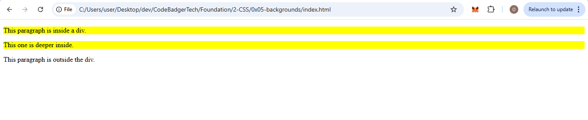
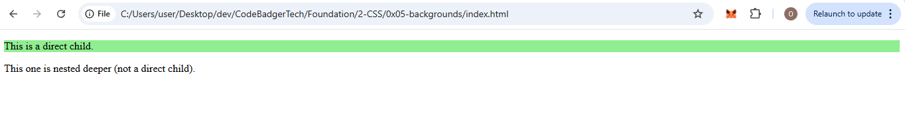
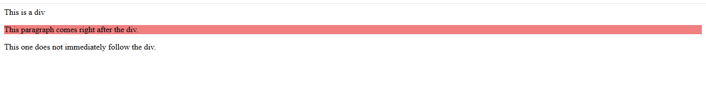
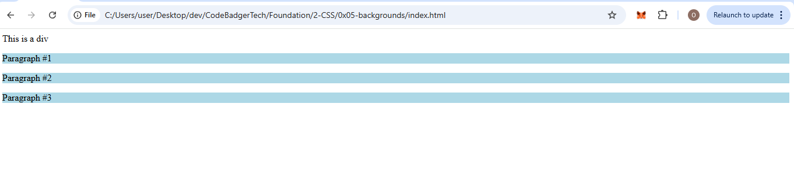

# 🎓 CSS Combinators

---

## ✅ What are CSS Combinators?

In CSS, **combinators** define relationships **between selectors**. They allow you to style elements **based on how they are nested or positioned** in your HTML.

---

## 📌 Types of Combinators

| Combinator | Symbol | Description |
|------------|--------|-------------|
| Descendant | (space) | Any nested level inside |
| Child | `>` | Direct children only |
| Adjacent Sibling | `+` | Immediately follows another element |
| General Sibling | `~` | Any sibling after another |

---

## 1️⃣ Descendant Combinator (` ` – Space)

### 📚 Explanation

Selects all elements that are **descendants** (nested inside) a specified parent element, at any level.

### 💡 Syntax
```css
A B {
  /* styles apply to all B inside A */
}
```

### ✅ Example

#### 📄 HTML
```html
<!DOCTYPE html>
<html>
<head>
  <link rel="stylesheet" href="style.css">
</head>
<body>
  <div>
    <p>This paragraph is inside a div.</p>
    <section>
      <p>This one is deeper inside.</p>
    </section>
  </div>

  <p>This paragraph is outside the div.</p>
</body>
</html>
```

#### 🎨 CSS (`style.css`)
```css
div p {
  background-color: yellow;
}
```
### OUTPUT 


✔️ This will style both `<p>` elements inside the `<div>`, even if deeply nested.

---

## 2️⃣ Child Combinator (`>`)

### 📚 Explanation

Selects elements that are **direct children only**, not nested further inside.

### 💡 Syntax
```css
A > B {
  /* styles B if it is a direct child of A */
}
```

### ✅ Example

#### 📄 HTML
```html
<!DOCTYPE html>
<html>
<head>
  <link rel="stylesheet" href="style.css">
</head>
<body>
  <div>
    <p>This is a direct child.</p>
    <section>
      <p>This one is nested deeper (not a direct child).</p>
    </section>
  </div>
</body>
</html>
```

#### 🎨 CSS (`style.css`)
```css
div > p {
  background-color: lightgreen;
}
```
### OUTPUT


✔️ Only the **first `<p>`** is styled.

---

## 3️⃣ Adjacent Sibling Combinator (`+`)

### 📚 Explanation

Selects an element that is **immediately after** a specific element, sharing the same parent.

### 💡 Syntax
```css
A + B {
  /* styles B if it comes right after A */
}
```

### ✅ Example

#### 📄 HTML
```html
<!DOCTYPE html>
<html>
<head>
  <link rel="stylesheet" href="style.css">
</head>
<body>
  <div>This is a div</div>
  <p>This paragraph comes right after the div.</p>
  <p>This one does not immediately follow the div.</p>
</body>
</html>
```

#### 🎨 CSS (`style.css`)
```css
div + p {
  background-color: lightcoral;
}
```
### OUTPUT


✔️ Only the **first `<p>`** is styled.

---

## 4️⃣ General Sibling Combinator (`~`)

### 📚 Explanation

Selects **all siblings** of a specified element that come **after it**, not just the next one.

### 💡 Syntax
```css
A ~ B {
  /* styles every B after A */
}
```

### ✅ Example

#### 📄 HTML
```html
<!DOCTYPE html>
<html>
<head>
  <link rel="stylesheet" href="style.css">
</head>
<body>
  <div>This is a div</div>
  <p>Paragraph #1</p>
  <p>Paragraph #2</p>
  <p>Paragraph #3</p>
</body>
</html>
```

#### 🎨 CSS (`style.css`)
```css
div ~ p {
  background-color: lightblue;
}
```
### OUTPUT

✔️ All `<p>` tags that follow the `<div>` get styled.

---

## 🧠 Visual Summary

```plaintext
div p       → all <p> inside <div> (any level)
div > p     → only direct child <p> inside <div>
div + p     → only the first <p> right after <div>
div ~ p     → all <p>s after <div> (same parent)
```

---

## 🧪 Practice Challenge

Use what you've learned to:
- Highlight menu items inside a `<nav>`
- Style all direct `<li>` items under a `<ul>`
- Apply different background colors to sections that follow a header
- Design blog layouts using parent-child relationships

---

## 🎁 Tip

Use combinators to reduce excessive class naming and make your CSS cleaner, DRY-er (Don't Repeat Yourself), and more semantic.

---