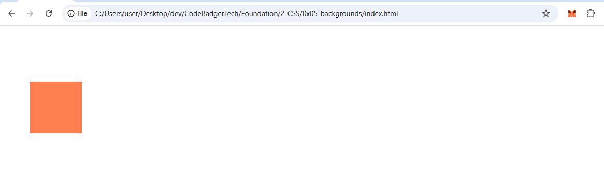
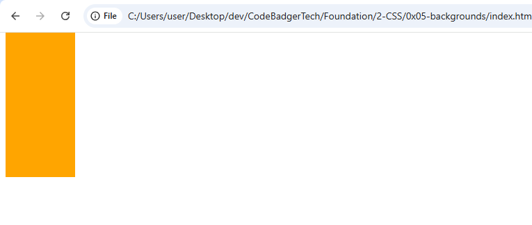
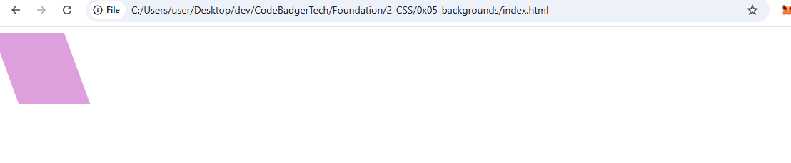

# 🎓 CSS 2D Transforms

---

## ✨ What Are CSS Transforms?

**CSS transforms** allow you to visually change the position, size, rotation, or shape of HTML elements using the `transform` property — all **without altering the actual layout** of the page.

This tutorial focuses on **2D transforms** — transformations that occur on the **X and Y axes** (i.e., flat, not 3D).

---

## 📌 Syntax

```css
/* In your CSS file */
selector {
  transform: function(value);
}
```

You apply transformations using functions like `translate()`, `rotate()`, `scale()`, etc.

---

## 🔧 2D Transform Functions Overview

| Function      | What It Does                            |
|---------------|------------------------------------------|
| `translate()` | Moves the element                        |
| `rotate()`    | Rotates the element                      |
| `scale()`     | Scales both width and height             |
| `scaleX()`    | Scales only the width                    |
| `scaleY()`    | Scales only the height                   |
| `skew()`      | Skews both axes                          |
| `skewX()`     | Skews along the X-axis                   |
| `skewY()`     | Skews along the Y-axis                   |
| `matrix()`    | Combines all of the above in one formula |

---

## 🚚 1. `translate(x, y)`

Moves the element relative to its original position.

### 📄 HTML: `translate.html`

```html
<!DOCTYPE html>
<html>
<head>
  <link rel="stylesheet" href="translate.css">
</head>
<body>
  <div class="box"></div>
</body>
</html>
```

### 🎨 CSS: `translate.css`

```css
.box {
  width: 100px;
  height: 100px;
  background-color: coral;
  transform: translate(50px, 100px);
}
```

### OUTPUT 


---

## 🔄 2. `rotate(deg)`

Rotates the element clockwise or counter-clockwise.

### 📄 HTML: `rotate.html`

```html
<!DOCTYPE html>
<html>
<head>
  <link rel="stylesheet" href="rotate.css">
</head>
<body>
  <div class="box"></div>
</body>
</html>
```

### 🎨 CSS: `rotate.css`

```css
.box {
  width: 100px;
  height: 100px;
  background-color: lightgreen;
  transform: rotate(20deg); /* Use -20deg for counter-clockwise */
}
```

### OUTPUT


---

## 🔍 3. `scale(x, y)`

Scales the width and height of the element.

### 📄 HTML: `scale.html`

```html
<!DOCTYPE html>
<html>
<head>
  <link rel="stylesheet" href="scale.css">
</head>
<body>
  <div class="box"></div>
</body>
</html>
```

### 🎨 CSS: `scale.css`

```css
.box {
  width: 50px;
  height: 50px;
  background-color: skyblue;
  transform: scale(2, 3); /* Scale width by 2, height by 3 */
}
```

### OUTPUT


---

## ➡️ 4. `scaleX(factor)`

Scales the width only.

### 📄 HTML: `scaleX.html`

```html
<!DOCTYPE html>
<html>
<head>
  <link rel="stylesheet" href="scaleX.css">
</head>
<body>
  <div class="box"></div>
</body>
</html>
```

### 🎨 CSS: `scaleX.css`

```css
.box {
  width: 100px;
  height: 100px;
  background-color: salmon;
  transform: scaleX(2); /* Doubles the width */
}
```

### OUTPUT


---

## ⬇️ 5. `scaleY(factor)`

Scales the height only.

### 📄 HTML: `scaleY.html`

```html
<!DOCTYPE html>
<html>
<head>
  <link rel="stylesheet" href="scaleY.css">
</head>
<body>
  <div class="box"></div>
</body>
</html>
```

### 🎨 CSS: `scaleY.css`

```css
.box {
  width: 100px;
  height: 100px;
  background-color: orange;
  transform: scaleY(3); /* Triples the height */
}
```

### OUTPUT


---

## 🪞 6. `skewX(angle)`

Skews the element horizontally.

### 📄 HTML: `skewX.html`

```html
<!DOCTYPE html>
<html>
<head>
  <link rel="stylesheet" href="skewX.css">
</head>
<body>
  <div class="box"></div>
</body>
</html>
```

### 🎨 CSS: `skewX.css`

```css
.box {
  width: 100px;
  height: 100px;
  background-color: plum;
  transform: skewX(20deg);
}
```

### OUTPUT


---

## 🏗️ 7. `skewY(angle)`

Skews the element vertically.

### 📄 CSS Snippet

```css
transform: skewY(20deg);
```

---

## 🧮 8. `skew(x, y)`

Applies skew on both axes.

### 📄 CSS Snippet

```css
transform: skew(20deg, 10deg);
/* or */
transform: skew(20deg); /* Same as skewX */
```

---

## ⚙️ 9. `matrix(a, b, c, d, e, f)`

Advanced method that combines **scale, skew, rotate, and translate**.

### 📄 HTML: `matrix.html`

```html
<!DOCTYPE html>
<html>
<head>
  <link rel="stylesheet" href="matrix.css">
</head>
<body>
  <div class="box"></div>
</body>
</html>
```

### 🎨 CSS: `matrix.css`

```css
.box {
  width: 100px;
  height: 100px;
  background-color: gold;
  transform: matrix(1, -0.3, 0, 1, 0, 0);
}
```

### OUTPUT


---

## 🧠 Quick Recap

| Function      | What It Does             |
|---------------|--------------------------|
| `translate()` | Move element             |
| `rotate()`    | Spin element             |
| `scale()`     | Resize element           |
| `skew()`      | Shear/skew element       |
| `matrix()`    | Combo of all above       |

---

## 🚀 Coming Up Next

Next lesson:  
**CSS Transitions**

➡️ **CSS 3D Transforms** — bring depth and perspective to your elements.

---