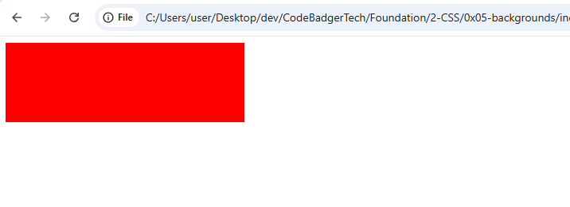
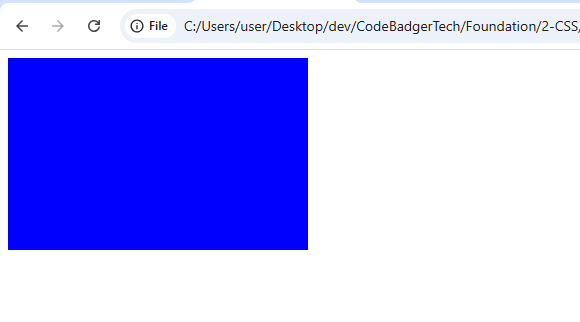

# 🎬 CSS Transitions

---

## ✨ What Are CSS Transitions?

CSS **transitions** let you change property values **smoothly over time**, rather than instantly. They bring polish to UI by animating changes in CSS values like `width`, `height`, `transform`, and more.

---

## 🔧 Basic Syntax

```css
selector {
  transition: property duration timing-function delay;
}
```

You don’t *have* to use all the values — you can start with just the **property** and **duration**.

---

## 🧪 1. Simple Width Transition

### 📄 HTML: `transition-basic.html`

```html
<!DOCTYPE html>
<html>
<head>
  <link rel="stylesheet" href="transition-basic.css">
</head>
<body>
  <div class="box"></div>
</body>
</html>
```

### 🎨 CSS: `transition-basic.css`

```css
.box {
  width: 100px;
  height: 100px;
  background: red;
  transition: width 2s;
}

.box:hover {
  width: 300px;
}
```

### OUTPUT
Mouse over the box to see the width expand over 2 seconds.


---

## 🧪 2. Multiple Properties

Transition `width` in 2 seconds and `height` in 4 seconds.

### 📄 HTML: `transition-multiple.html`

```html
<!DOCTYPE html>
<html>
<head>
  <link rel="stylesheet" href="transition-multiple.css">
</head>
<body>
  <div class="box"></div>
</body>
</html>
```

### 🎨 CSS: `transition-multiple.css`

```css
.box {
  width: 100px;
  height: 100px;
  background: blue;
  transition: width 2s, height 4s;
}

.box:hover {
  width: 300px;
  height: 200px;
}
```
### OUTPUT

---

## ⏱️ 3. Transition Delay

Add a **1 second delay** before the transition starts.

### 🎨 CSS Snippet

```css
.box {
  transition: width 2s ease 1s;
}
```

This means:
- `width` will take 2 seconds to change
- Start the change **after 1 second delay**
- Use `ease` for a smooth curve

---

## 🎢 4. Transition Timing Functions

| Function         | Behavior                         |
|------------------|----------------------------------|
| `ease`           | Slow start, fast middle, slow end *(default)* |
| `linear`         | Constant speed                   |
| `ease-in`        | Starts slow                      |
| `ease-out`       | Ends slow                        |
| `ease-in-out`    | Starts and ends slow             |
| `cubic-bezier()` | Custom speed curve               |

### 🎨 Example

```css
#div1 { transition: all 2s linear; }
#div2 { transition: all 2s ease; }
#div3 { transition: all 2s ease-in; }
#div4 { transition: all 2s ease-out; }
#div5 { transition: all 2s ease-in-out; }
```

---

## 🎭 5. Transition with `transform`

Works beautifully when paired with **2D or 3D transforms**.

### 📄 HTML: `transition-transform.html`

```html
<!DOCTYPE html>
<html>
<head>
  <link rel="stylesheet" href="transition-transform.css">
</head>
<body>
  <div class="box"></div>
</body>
</html>
```

### 🎨 CSS: `transition-transform.css`

```css
.box {
  width: 100px;
  height: 100px;
  background-color: teal;
  transition: transform 1s ease-in-out;
}

.box:hover {
  transform: rotate(45deg) scale(1.5);
}
```

---

## 🧠 Quick Recap

| Property                  | What It Does                                  |
|---------------------------|-----------------------------------------------|
| `transition-property`     | The CSS property to animate                   |
| `transition-duration`     | How long the transition takes                 |
| `transition-timing-function` | The speed curve of the animation           |
| `transition-delay`        | Wait time before the transition starts        |
| `transition`              | Shorthand for all the above                   |

---

## 🪄 Shorthand Syntax

Instead of writing them separately:

```css
transition-property: width;
transition-duration: 2s;
transition-timing-function: ease-in-out;
transition-delay: 1s;
```

You can do:

```css
transition: width 2s ease-in-out 1s;
```

---


---