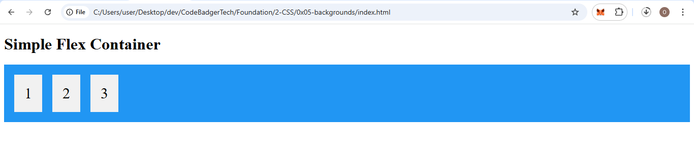

## 🧭 CSS Flexbox Tutorial — Part 1: Introduction to Flexbox

### 🔹 What is CSS Flexbox?

**Flexbox** is short for the **Flexible Box Layout Module**. It’s a powerful layout method designed to distribute space along a single axis — either as rows or columns.

### 🔸 Why Flexbox?

Before Flexbox, we relied on:

- **Block layout** – for page sections
- **Inline layout** – for text
- **Table layout** – for grid-like data
- **Positioned layout** – for precise placement

**Flexbox** simplifies layout challenges, especially for **responsive** designs. It eliminates the need for `float` and `position` in many cases.

### 🔄 Flexbox vs. Grid

| Feature        | Flexbox                  | Grid                    |
|----------------|--------------------------|--------------------------|
| Layout Type    | One-dimensional (row **or** column) | Two-dimensional (row **and** column) |
| Best For       | Linear layout (e.g., nav bars) | Full page or card layouts |

### 🧱 Flexbox Components

- **Flex Container**: The parent element, styled with `display: flex`.
- **Flex Items**: The children inside the container.

---

## 📦 Example: Flex Container with Three Items

Here’s how to create a simple flexbox container:

### ✅ `index.html`

```html
<!DOCTYPE html>
<html lang="en">
<head>
  <meta charset="UTF-8">
  <meta name="viewport" content="width=device-width, initial-scale=1.0">
  <title>Flexbox Example 1</title>
  <link rel="stylesheet" href="style.css">
</head>
<body>
  <h1>Simple Flex Container</h1>
  <div class="flex-container">
    <div>1</div>
    <div>2</div>
    <div>3</div>
  </div>
</body>
</html>
```

---

### 🎨 `style.css`

```css
.flex-container {
  display: flex;
  background-color: #2196F3;
  padding: 10px;
}

.flex-container > div {
  background-color: #f1f1f1;
  margin: 10px;
  padding: 20px;
  font-size: 30px;
  text-align: center;
}
```

### OUTPUT


---