## 🔹 CSS Flexbox Tutorial – Part 2: The Flex Container

### 📘 What is a Flex Container?

To use Flexbox, you first define a container that holds flex items. This container becomes a *flex container* when you set:

```css
display: flex;
```

Once this is done, you can control the direction, alignment, and spacing of its children using various properties.

---

## 🔧 Flex Container Properties (with full examples)

We’ll walk through:

1. `flex-direction`
2. `flex-wrap`
3. `flex-flow`
4. `justify-content`
5. `align-items`
6. `align-content`

---

### ✅ Example 1: Creating a Flex Container

#### ✨ What it does:
Turns a normal `<div>` into a flex container and arranges its children in a row by default.

#### `index.html`
```html
<!DOCTYPE html>
<html lang="en">
<head>
  <meta charset="UTF-8" />
  <meta name="viewport" content="width=device-width, initial-scale=1.0" />
  <title>Flex Container</title>
  <link rel="stylesheet" href="style.css" />
</head>
<body>
  <div class="flex-container">
    <div>1</div>
    <div>2</div>
    <div>3</div>
  </div>
</body>
</html>
```

#### `style.css`
```css
.flex-container {
  display: flex;
  background-color: lightblue;
  padding: 10px;
}

.flex-container div {
  background: steelblue;
  color: white;
  padding: 20px;
  margin: 10px;
  width: 30px;
}
```

✅ **Result:** Flex items appear in a horizontal row, evenly spaced.
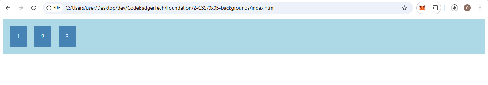

---

### 🔁 1. `flex-direction`

Controls the direction of items in the container.

#### `row` (default)
```css
.flex-container {
  display: flex;
  flex-direction: row;
}
```
📌 Items go left to right.

#### `column`
```css
.flex-container {
  display: flex;
  flex-direction: column;
}
```
### OUTPUT
📌 Items stack top to bottom.
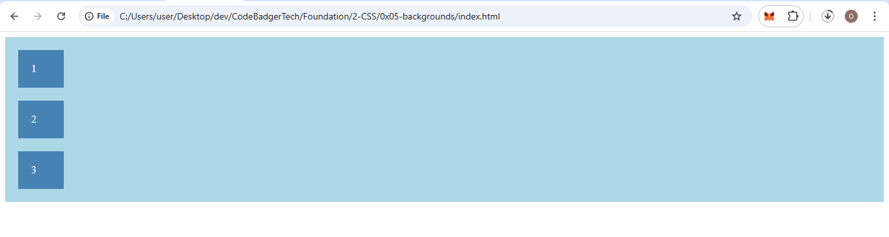

#### `row-reverse`
```css
.flex-container {
  display: flex;
  flex-direction: row-reverse;
}
```
📌 Items go right to left.
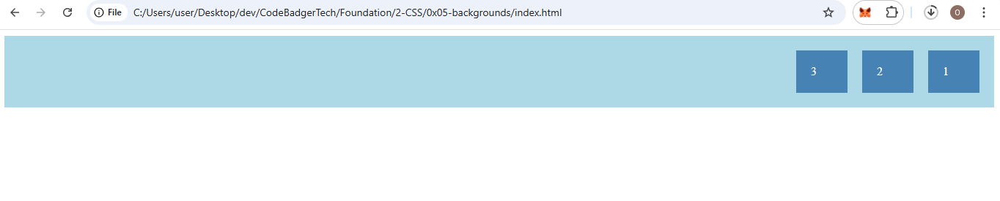

#### `column-reverse`
```css
.flex-container {
  display: flex;
  flex-direction: column-reverse;
}
```
📌 Items stack bottom to top.
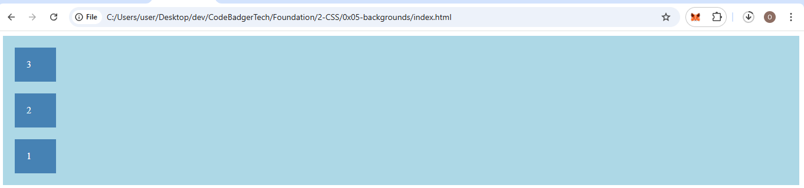

---

### 🔃 2. `flex-wrap`

Controls if items should wrap to the next line when space runs out.
#### note direction must be set to row to see the effect of wrap. 
#### when ever you see box number increase do the same in your html. i.e add more divs

#### `nowrap` (default)
```css
.flex-container {
  display: flex;
  flex-wrap: nowrap;
  flex-direction: row; /** you can remove this since its the default **/
}
```
📌 Items stay on one line, may overflow.
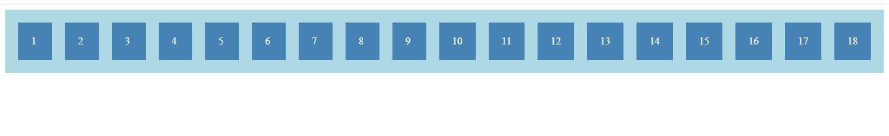

#### `wrap`
```css
.flex-container {
  display: flex;
  flex-wrap: wrap;
}
```
📌 Items wrap to next line if needed.
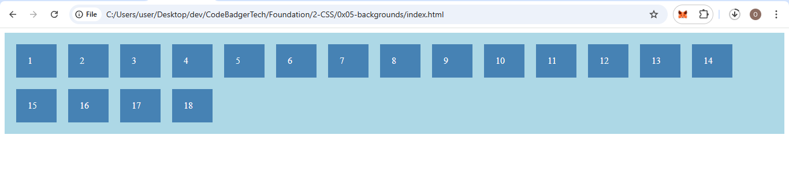

#### `wrap-reverse`
```css
.flex-container {
  display: flex;
  flex-wrap: wrap-reverse;
}
```
📌 Like wrap, but in reverse direction.
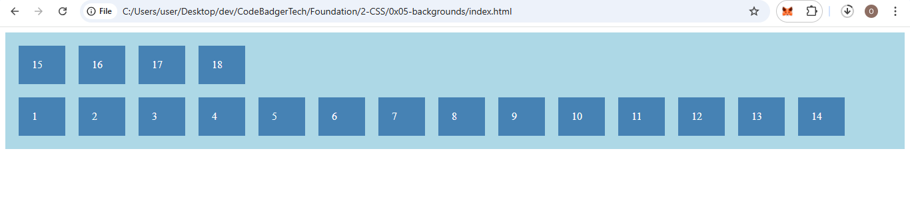

---

### 🔄 3. `flex-flow`

A shorthand for `flex-direction` and `flex-wrap`.

```css
.flex-container {
  display: flex;
  flex-flow: row wrap;
}
```
📌 Equivalent to:
```css
flex-direction: row;
flex-wrap: wrap;
```

---

### 📍 4. `justify-content`

Aligns items along the **main axis** (horizontal by default).
```css
.flex-container {
  display: flex;
  justify-content: center;   
  background-color: lightblue;
  padding: 10px;
}
```

#### Examples:
```css
justify-content: center;        /* Center items */
```
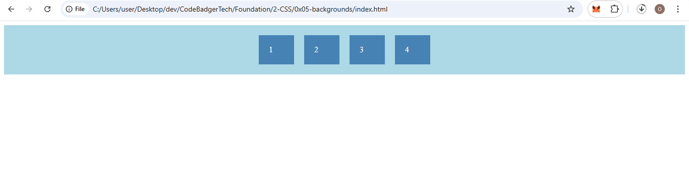
```css
justify-content: flex-start;    /* Align left (default) */
```
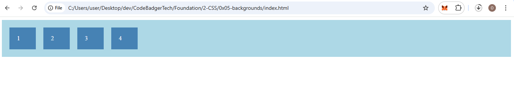
```css
justify-content: flex-end;      /* Align right */
```
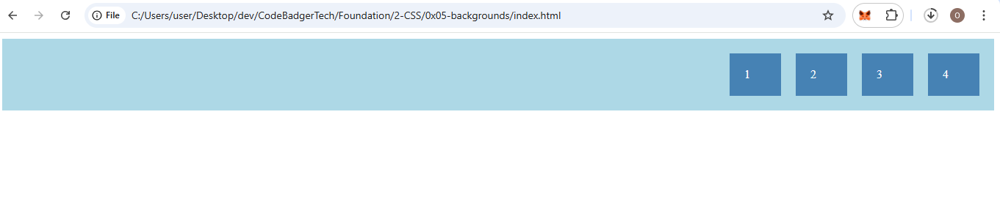
```css
justify-content: space-between; /* Even spacing, no gaps at edges */
```
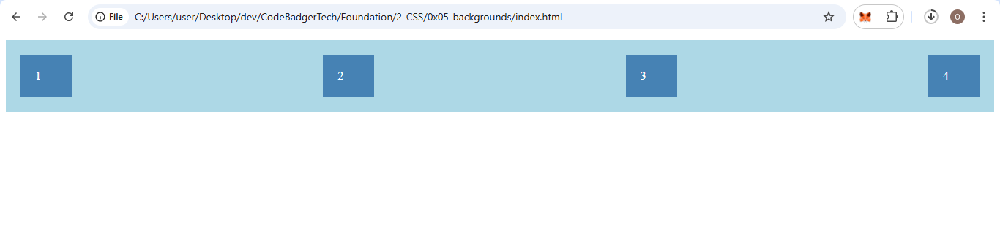
```css
justify-content: space-around;  /* Equal gaps around items */
```
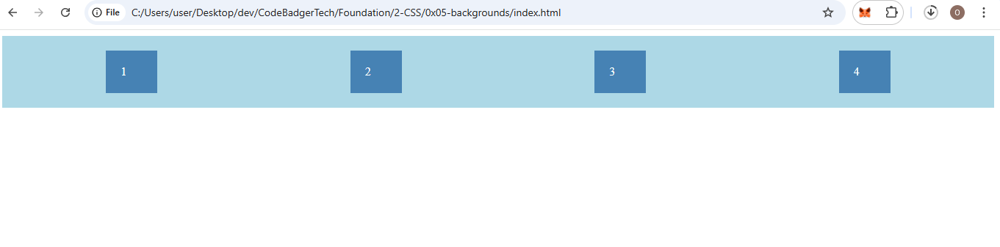
```css
justify-content: space-evenly;  /* Equal gaps everywhere */
```
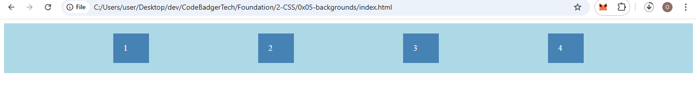

---

### 🎯 5. `align-items`

Aligns items along the **cross axis** (vertical by default).

Set container height to see effects.
```css
.flex-container {
  display: flex;
  background-color: lightblue;
  align-items: center;  
  padding: 10px;
  height: 300px;
}
```

#### Examples:
```css
align-items: center;       /* Center vertically */
```
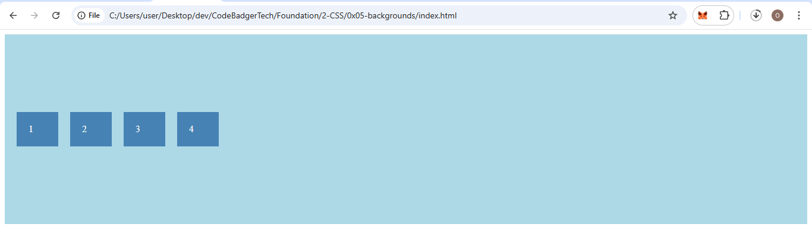
```css
align-items: flex-start;   /* Top of container */
```
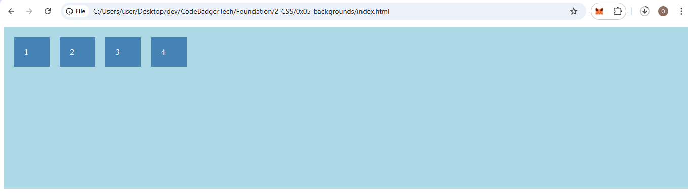
```css
align-items: flex-end;     /* Bottom of container */
```
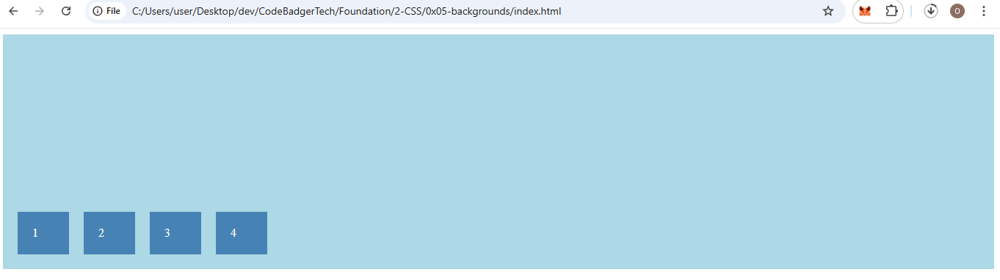
```css
align-items: stretch;      /* Stretch to fill (default) */
```
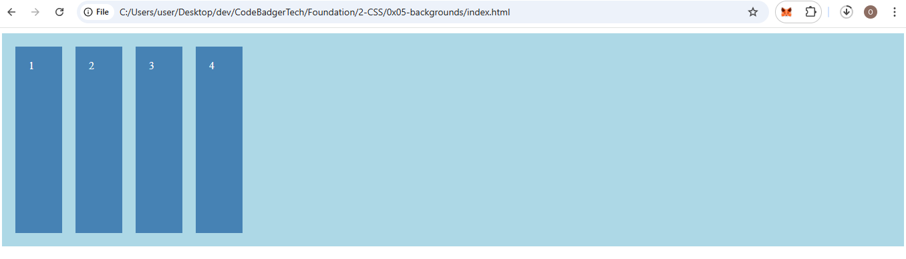
```css
align-items: baseline;     /* Align text baselines */
```
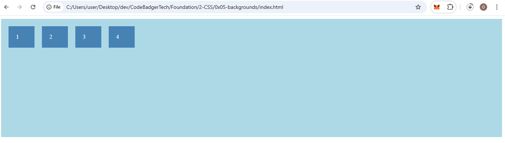

---

### 🎯 6. `align-content`

Aligns **rows** (not individual items). Only works with `flex-wrap: wrap`.

Container must have height.
```css
.flex-container {
  display: flex;
  flex-wrap: wrap;
  background-color: lightblue;
  align-content: center; 
  padding: 10px;
  height: 300px;
}
```

#### Examples:
```css
align-content: center;        /* All rows centered */
```
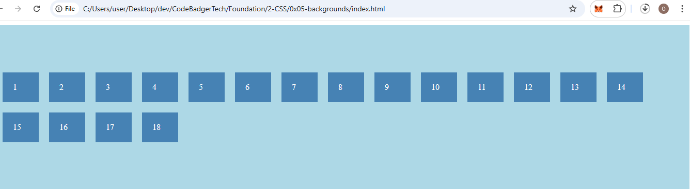
```css
align-content: flex-start;    /* Rows at top */
```
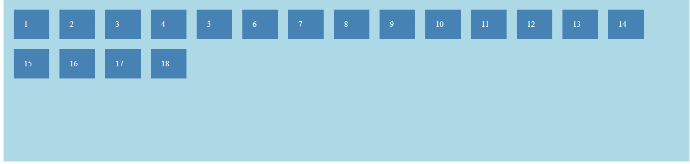
```css
align-content: flex-end;      /* Rows at bottom */
```
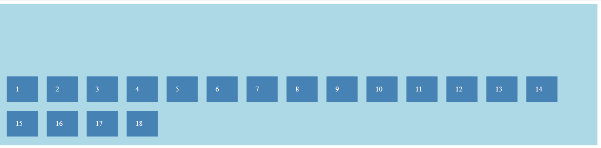
```css
align-content: space-between;/* Even space between rows */
```
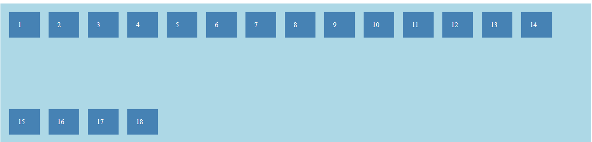
```css
align-content: space-around; /* Even space around rows */
```
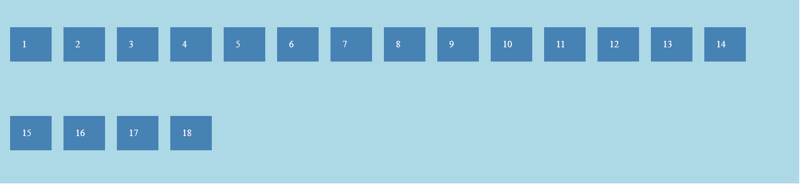
```css
align-content: space-evenly; /* Even space inside and outside */
```
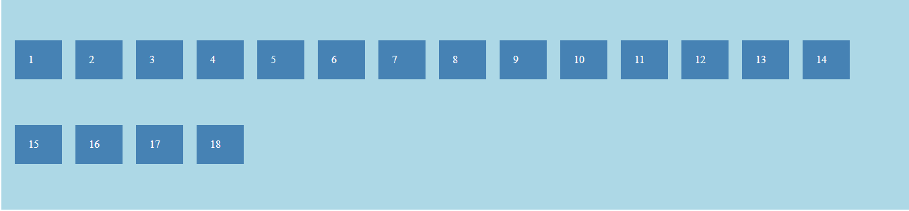

---

### 🎯 Bonus: Perfect Centering (both axes)

```css
.flex-container {
  display: flex;
  background-color: lightblue;
  justify-content: center;
  align-items: center;
  text-align: center;
  padding: 10px;
  height: 300px;
}
```
📌 The single item inside will be perfectly centered both vertically and horizontally.


---