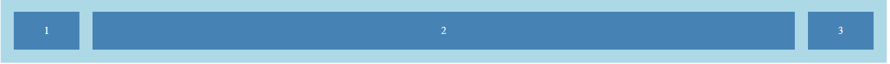
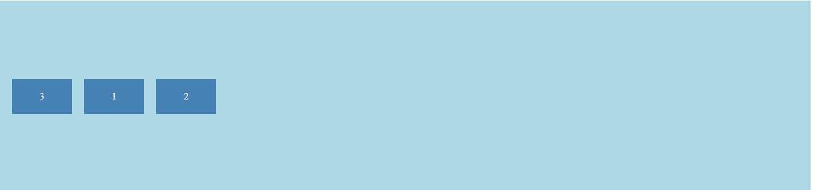
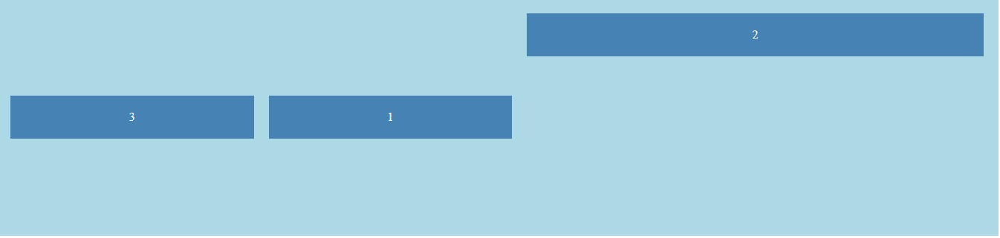

# 🔹 CSS Flexbox Tutorial – Part 3: The Flex Items

### 📘 What is a Flex Item?

Any direct child of a flex container automatically becomes a *flex item*.  
You can control how individual items grow, shrink, align, and appear using special flex item properties.

---

## 🔧 Flex Item Properties (with full examples)

We’ll walk through:

1. `flex-grow`
2. `flex-shrink`
3. `flex-basis`
4. `flex` (shorthand)
5. `align-self`
6. `order`

---

### ✅ Example 1: Basic Flex Items

#### ✨ What it does:
Creates a flex container with items ready to manipulate individually.

#### `index.html`
```html
<!DOCTYPE html>
<html lang="en">
<head>
  <meta charset="UTF-8" />
  <meta name="viewport" content="width=device-width, initial-scale=1.0" />
  <title>Flex Items</title>
  <link rel="stylesheet" href="style.css" />
</head>
<body>
  <div class="flex-container">
    <div class="item">1</div>
    <div class="item">2</div>
    <div class="item">3</div>
  </div>
</body>
</html>
```

#### `style.css`
```css
.flex-container {
  display: flex;
  background-color: lightblue;
  padding: 10px;
}

.item {
  background: steelblue;
  color: white;
  padding: 20px;
  margin: 10px;
  width: 60px;
  text-align: center;
}
```

✅ **Result:** Items appear in a row, evenly spaced.


---

### ➡️ 1. `flex-grow`

Defines **how much an item should grow** relative to others.

### add this to the css file
#### Example:
```css
.item:nth-child(2) {
  flex-grow: 1;
}
```
📌 The second item grows to fill extra space.


**Tip:**  
- Default is `0` (no grow).
- Higher number = more growing compared to others.

---

### ➡️ 2. `flex-shrink`

Defines **how much an item should shrink** when space is tight.

#### Example:
```css
.item {
  flex-shrink: 1; /* default */
}

.item:nth-child(2) {
  flex-shrink: 2; /* shrinks twice as fast */
}
```
📌 If the container is small, the second item will shrink more.


**Tip:**  
- Default is `1` (shrinks if needed).
- Set `0` to prevent shrinking.

---

### ➡️ 3. `flex-basis`

Defines the **initial size** of an item **before** growing or shrinking.

#### Example:
```css
.item:nth-child(1) {
  flex-basis: 100px;
}

.item:nth-child(2) {
  flex-basis: 200px;
}

.item:nth-child(3) {
  flex-basis: 150px;
}
```
📌 Items start with different widths based on basis.


**Tip:**  
- Acts like a **starting width**.
- Can be in `px`, `%`, `em`, etc.

---

### ➡️ 4. `flex` (shorthand)

**Shortcut** for setting `flex-grow`, `flex-shrink`, and `flex-basis` all at once.

#### Example:
```css
.item:nth-child(1) {
  flex: 1 1 100px; /* grow:1, shrink:1, basis:100px */
}

.item:nth-child(2) {
  flex: 2 1 100px; /* grow:2, shrink:1, basis:100px */
}

.item:nth-child(3) {
  flex: 1 1 100px;
}
```
📌 The second item grows twice as much.


**Shortcut rule:**  
If you only write one value like `flex: 1;`, it means:
```css
flex-grow: 1;
flex-shrink: 1;
flex-basis: 0%;
```

---

### ⬆️ 5. `align-self`

Overrides the `align-items` setting **for a specific item**.

#### Example:
```css
.flex-container {
  display: flex;
  background-color: lightblue;
  padding: 10px;
  align-items: center;
  height: 300px;
}

.item {
  background: steelblue;
  color: white;
  padding: 20px;
  margin: 10px;
  width: 60px;
  text-align: center;
}

.item:nth-child(2) {
  align-self: flex-end;
}
```
📌 Second item moves to the bottom, others stay centered.


**Tip:**  
- Accepts: `auto` (default), `flex-start`, `flex-end`, `center`, `baseline`, `stretch`.

---

### 🔢 6. `order`

Changes the **visual order** of flex items **without changing HTML**.

#### Example:
```css
.item:nth-child(1) {
  order: 2;
}

.item:nth-child(2) {
  order: 3;
}

.item:nth-child(3) {
  order: 1;
}
```
📌 Third item appears first, then first, then second.


**Tip:**  
- Default order is `0`.
- Smaller order values appear first.

---

### 🎯 Bonus: Flex Magic Example (Grow, Shrink, Center, Order)

```html
<!DOCTYPE html>
<html lang="en">
<head>
  <meta charset="UTF-8" />
  <meta name="viewport" content="width=device-width, initial-scale=1.0" />
  <title>Flex Items</title>
  <link rel="stylesheet" href="styles.css" />
</head>
<body>
  <div class="flex-container">
    <div class="item">1</div>
    <div class="item">2</div>
    <div class="item">3</div>
  </div>
</body>
</html>
```

```css
.flex-container {
  display: flex;
  background-color: lightblue;
  padding: 10px;
  align-items: center;
  height: 300px;
  justify-content: center;
}

.item {
  background: steelblue;
  color: white;
  padding: 20px;
  margin: 10px;
  width: 60px;
  text-align: center;
}

.item:nth-child(1) {
  flex: 1;
}

.item:nth-child(2) {
  flex: 2;
  align-self: flex-start;
}

.item:nth-child(3) {
  flex: 1;
  order: -1;
}
```
📌 Combines everything you learned: growth, alignment, and reordering!


---

# ✅ Congratulations!
You now know how to control each flex item individually using Flexbox.  

---