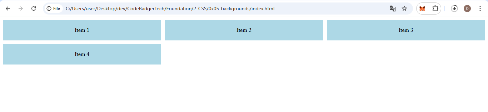
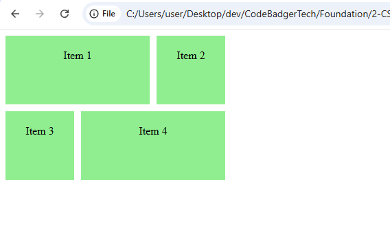
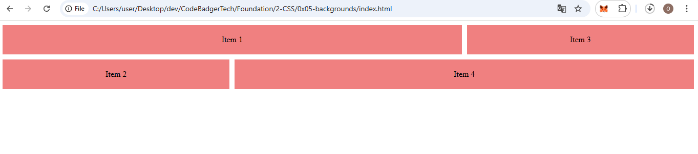
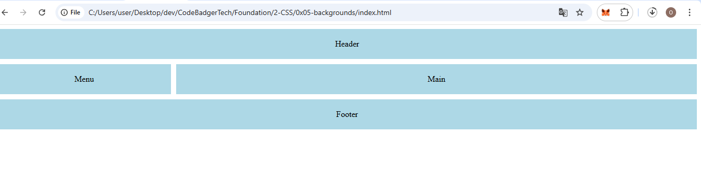
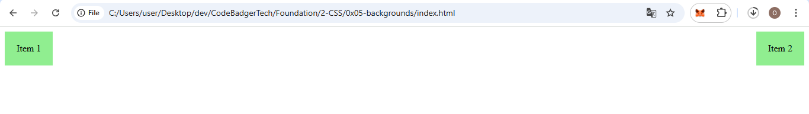
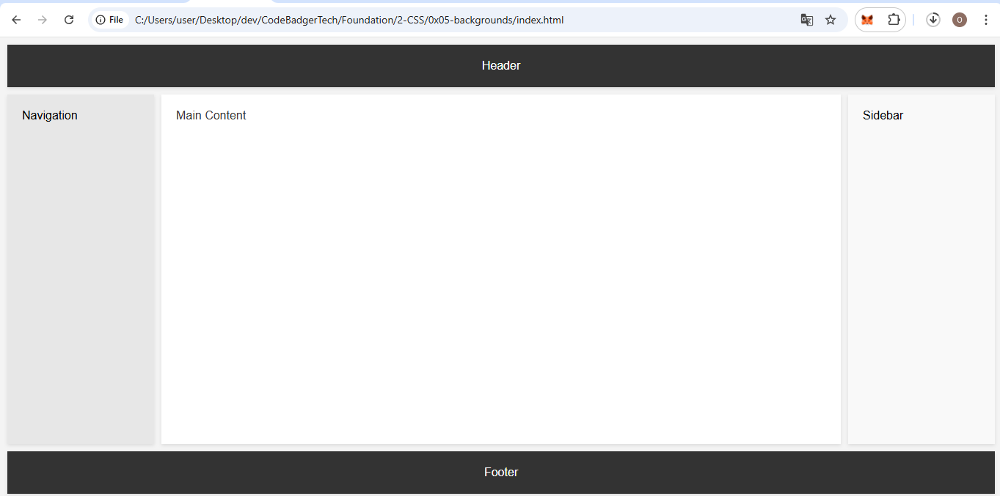

## **Part 1: Introduction to CSS Grid**

### **Overview:**
CSS Grid is a powerful layout system that allows you to create complex, responsive web designs with ease. It enables the division of a container into rows and columns, where you can place grid items in specific areas.

- **Grid vs Flexbox**: While both CSS Grid and Flexbox are used for layouts, the key difference is that Grid is two-dimensional (both rows and columns), while Flexbox is one-dimensional (either rows or columns). CSS Grid is better for large-scale layouts, while Flexbox is great for simpler, linear designs.

### **Key Properties:**
1. **`display: grid;`** — This property turns an element into a grid container, enabling the grid layout system inside it.
2. **`grid-template-columns` & `grid-template-rows`** — These properties define the number of columns and rows in the grid, respectively.

### **HTML & CSS Example:**
```html
<!DOCTYPE html>
<html lang="en">
<head>
    <meta charset="UTF-8">
    <meta name="viewport" content="width=device-width, initial-scale=1.0">
    <title>CSS Grid Tutorial</title>
    <link rel="stylesheet" href="styles.css">
</head>
<body>
    <div class="grid-container">
        <div class="grid-item">Item 1</div>
        <div class="grid-item">Item 2</div>
        <div class="grid-item">Item 3</div>
        <div class="grid-item">Item 4</div>
    </div>
</body>
</html>
```

```css
.grid-container {
    display: grid;
    grid-template-columns: 1fr 1fr 1fr;  /* Defines 3 equal columns */
    grid-template-rows: auto;  /* Rows will automatically adjust to content height */
    gap: 10px;  /* Sets space between items */
}

.grid-item {
    background-color: lightblue;
    padding: 20px;
    text-align: center;
}
```
### OUTPUT


#### **Explanation**:
- `display: grid;` sets up the grid container.
- `grid-template-columns: 1fr 1fr 1fr;` divides the container into three equal-width columns using the `fr` (fraction) unit.
- `gap: 10px;` adds space between the grid items.

---

## **Part 2: Grid Lines, Grid Tracks, and Placement**

### **Overview:**
In CSS Grid, the grid is divided into **grid lines** and **grid tracks** (the space between lines). The **grid lines** help you place items in specific locations using numerical values.

### **Key Properties:**
1. **`grid-column-start`, `grid-column-end`, `grid-row-start`, `grid-row-end`** — These properties define where a grid item starts and ends in terms of columns and rows.
2. **`grid-column`, `grid-row`** — These shorthand properties combine the start and end properties for columns and rows.

### **HTML & CSS Example:**
```html
<!DOCTYPE html>
<html lang="en">
<head>
    <meta charset="UTF-8">
    <meta name="viewport" content="width=device-width, initial-scale=1.0">
    <title>Grid Lines Placement</title>
    <link rel="stylesheet" href="styles.css">
</head>
<body>
    <div class="grid-container">
        <div class="grid-item item1">Item 1</div>
        <div class="grid-item item2">Item 2</div>
        <div class="grid-item item3">Item 3</div>
        <div class="grid-item item4">Item 4</div>
    </div>
</body>
</html>
```

```css
.grid-container {
    display: grid;
    grid-template-columns: 100px 100px 100px;
    grid-template-rows: 100px 100px;
    gap: 10px;
}

.grid-item {
    background-color: lightgreen;
    padding: 20px;
    text-align: center;
}

.item1 {
    grid-column: 1 / 3;  /* Spans columns 1 to 3 */
    grid-row: 1 / 2;  /* Spans row 1 to 2 */
}

.item2 {
    grid-column: 3 / 4;  /* Positioned in the third column */
    grid-row: 1 / 2;
}

.item3 {
    grid-column: 1 / 2;
    grid-row: 2 / 3;
}

.item4 {
    grid-column: 2 / 4;
    grid-row: 2 / 3;
}
```

### OUTPUT


#### **Explanation**:
- Each item is placed based on **grid lines**.
- `grid-column: 1 / 3;` tells the item to span from column 1 to column 3.
- `grid-row: 1 / 2;` tells the item to span from row 1 to row 2.

---

## **Part 3: Advanced Placement with `grid-area`**

### **Overview:**
The `grid-area` shorthand combines `grid-column-start`, `grid-column-end`, `grid-row-start`, and `grid-row-end` into a single property for easier placement.

### **Key Properties:**
- **`grid-area`** — Defines the placement of a grid item using shorthand notation (row-start / column-start / row-end / column-end).

### **HTML & CSS Example:**
```html
<!DOCTYPE html>
<html lang="en">
<head>
    <meta charset="UTF-8">
    <meta name="viewport" content="width=device-width, initial-scale=1.0">
    <title>Advanced Grid Placement</title>
    <link rel="stylesheet" href="styles.css">
</head>
<body>
    <div class="grid-container">
        <div class="grid-item item1">Item 1</div>
        <div class="grid-item item2">Item 2</div>
        <div class="grid-item item3">Item 3</div>
        <div class="grid-item item4">Item 4</div>
    </div>
</body>
</html>
```

```css
.grid-container {
    display: grid;
    grid-template-columns: 1fr 1fr 1fr;
    grid-template-rows: 1fr 1fr;
    gap: 10px;
}

.grid-item {
    background-color: lightcoral;
    padding: 20px;
    text-align: center;
}

.item1 {
    grid-area: 1 / 1 / 2 / 3;  /* Spans from row 1 to 2, and columns 1 to 3 */
}

.item2 {
    grid-area: 2 / 1 / 3 / 2;
}

.item3 {
    grid-area: 1 / 3 / 2 / 4;
}

.item4 {
    grid-area: 2 / 2 / 3 / 4;
}
```
### OUTPUT


#### **Explanation**:
- `grid-area: 1 / 1 / 2 / 3;` tells the item to start at row 1, column 1, and end at row 2, column 3. This simplifies the layout.

---

## **Part 4: Naming Grid Areas with `grid-template-areas`**

### **Overview:**
You can name specific areas of the grid using `grid-template-areas`. This allows you to visually map out your layout and place grid items by name, which makes your CSS more readable.

### **Key Properties:**
- **`grid-template-areas`** — Defines named areas for grid placement.
- **`grid-area`** — Assigns each item to a specific named area.

### **HTML & CSS Example:**
```html
<!DOCTYPE html>
<html lang="en">
<head>
    <meta charset="UTF-8">
    <meta name="viewport" content="width=device-width, initial-scale=1.0">
    <title>Named Grid Areas</title>
    <link rel="stylesheet" href="styles.css">
</head>
<body>
    <div class="grid-container">
        <div class="grid-item item1">Header</div>
        <div class="grid-item item2">Menu</div>
        <div class="grid-item item3">Main</div>
        <div class="grid-item item4">Footer</div>
    </div>
</body>
</html>
```

```css
.grid-container {
    display: grid;
    grid-template-columns: 1fr 3fr;
    grid-template-areas:
        "header header"
        "menu main"
        "footer footer";
    gap: 10px;
}

.grid-item {
    background-color: lightblue;
    padding: 20px;
    text-align: center;
}

.item1 {
    grid-area: header;
}

.item2 {
    grid-area: menu;
}

.item3 {
    grid-area: main;
}

.item4 {
    grid-area: footer;
}
```
### OUTPUT


#### **Explanation**:
- `grid-template-areas` assigns names to different regions of the grid.
- `grid-area: header;` places the item into the corresponding area (`header`).

---

## **Part 5: Aligning Items with `justify-self` and `align-self`**

### **Overview:**
These properties allow you to align individual grid items along the row axis (`justify-self`) and the column axis (`align-self`).

### **Key Properties:**
- **`justify-self`** — Aligns an item horizontally (row axis).
- **`align-self`** — Aligns an item vertically (column axis).

### **HTML & CSS Example:**
```html
<!DOCTYPE html>
<html lang="en">
<head>
    <meta charset="UTF-8">
    <meta name="viewport" content="width=device-width, initial-scale=1.0">
    <title>Aligning Grid Items</title>
    <link rel="stylesheet" href="styles.css">
</head>
<body>
    <div class="grid-container">
        <div class="grid-item item1">Item 1</div>
        <div class="grid-item item2">Item 2</div>
    </div>
</body>
</html>
```

```css
.grid-container {
    display: grid;
    grid-template-columns: 1fr 1fr;
    gap: 10px;
}

.grid-item {
    background-color: lightgreen;
    padding: 20px;
    text-align: center;
}

.item1 {
    justify-self: start;  /* Aligns to the left */
    align-self: end;  /* Aligns to the bottom */
}

.item2 {
    justify-self: end;  /* Aligns to the right */
    align-self: start;  /* Aligns to the top */
}
```

### OUTPUT


#### **Explanation**:
- `justify-self: start;` places the item at the start of its column.
- `align-self: end;` places the item at the end of its row.

---

### NOW Lets Look at a full website template made with grid

## **HTML & CSS Grid Layout (Fixed Structure)**

### **HTML Structure:**
```html
<!DOCTYPE html>
<html lang="en">
<head>
    <meta charset="UTF-8">
    <meta name="viewport" content="width=device-width, initial-scale=1.0">
    <title>CSS Grid Layout Example</title>
    <link rel="stylesheet" href="styles.css">
</head>
<body>
    <div class="grid-container">
        <header class="header">Header</header>
        <nav class="nav">Navigation</nav>
        <main class="main-content">Main Content</main>
        <aside class="sidebar">Sidebar</aside>
        <footer class="footer">Footer</footer>
    </div>
</body>
</html>
```

### **CSS Styling:**
```css
* {
    margin: 0;
    padding: 0;
    box-sizing: border-box;
}

body {
    font-family: Arial, sans-serif;
    background-color: #f4f4f4;
    height: 100%;
}

.grid-container {
    display: grid;
    grid-template-columns: 200px 1fr 200px; /* Defines the layout of three columns */
    grid-template-rows: auto 1fr auto; /* Defines the rows with auto height for header and footer */
    grid-template-areas:
        "header header header" /* The header spans all columns */
        "nav main-content sidebar" /* The main content is larger, sidebar and nav are fixed size */
        "footer footer footer"; /* Footer spans all columns */
    gap: 10px;
    min-height: 100vh; /* Ensures the grid takes at least the full height of the viewport */
    padding: 10px;
}

header, nav, main, aside, footer {
    background-color: #fff;
    padding: 20px;
    box-shadow: 0 2px 5px rgba(0, 0, 0, 0.1);
}

header {
    grid-area: header;
    background-color: #333;
    color: white;
    text-align: center;
}

nav {
    grid-area: nav;
    background-color: #e7e7e7;
}

main {
    grid-area: main-content;
    background-color: #fff;
    color: #333;
}

aside {
    grid-area: sidebar;
    background-color: #f9f9f9;
}

footer {
    grid-area: footer;
    background-color: #333;
    color: white;
    text-align: center;
}
```
### OUTPUT

---

### **Explanation:**

#### **HTML Structure:**
- The HTML contains a `grid-container` that holds five main sections: `header`, `nav` (navigation), `main-content`, `aside` (sidebar), and `footer`.
- These sections are each given class names corresponding to their roles and will be styled using CSS Grid.

#### **CSS Grid Layout:**
1. **Grid Container:**
   - `display: grid;` — This sets the container to use CSS Grid.
   - `grid-template-columns: 200px 1fr 200px;` — This defines three columns in the grid: the first and third columns (for the sidebar and navigation) are fixed at 200px, while the middle column (for the main content) will take up the remaining available space (`1fr`).
   - `grid-template-rows: auto 1fr auto;` — The header and footer rows will automatically adjust to their content (`auto`), while the main content area will take up the remaining vertical space (`1fr`).
   - `grid-template-areas:` defines the layout of the sections. This creates named areas within the grid:
     - `"header header header"` — The header spans all three columns.
     - `"nav main-content sidebar"` — The main content takes up the middle column, with the navigation and sidebar occupying the first and third columns.
     - `"footer footer footer"` — The footer spans all three columns.

2. **Individual Sections:**
   - Each section (`header`, `nav`, `main`, `aside`, and `footer`) is assigned a background color, padding, and box shadow for styling.
   - The `grid-area` property is used to specify where each section will be placed according to the `grid-template-areas` layout.

#### **Final Layout:**
- **Header**: Spans the full width at the top.
- **Navigation**: Occupies the left column.
- **Main Content**: Occupies the central, largest area.
- **Sidebar**: Occupies the right column.
- **Footer**: Spans the full width at the bottom.

---

### **Visual Overview:**

```
|-----------------------------------------|
|              Header (Full Width)        |
|-----------------------------------------|
|   Navigation  |  Main Content  | Sidebar |
|   (Fixed)    |   (Largest)    | (Fixed) |
|-----------------------------------------|
|               Footer (Full Width)       |
|-----------------------------------------|
```

This layout provides a structured grid where the **main content** area is the most prominent and the **sidebar** and **navigation** areas are smaller but still visible. Both the **header** and **footer** span the full width of the layout, ensuring a clean, organized look for the page.

---

This structure works for a wide range of website types, especially for sites where the main content should take precedence over sidebars and navigation, like blogs, news sites, or informational pages. If you want to customize the layout further (e.g., changing the size of the sidebar or adjusting padding), it's all easy to do by modifying the grid-template properties.

## **Conclusion**:
In this tutorial, we've explored the fundamental properties of CSS Grid, from basic setup to advanced item placement. We've also introduced useful properties for aligning items and creating visually appealing grid layouts. Keep experimenting with grid designs and enjoy the flexibility CSS Grid offers!