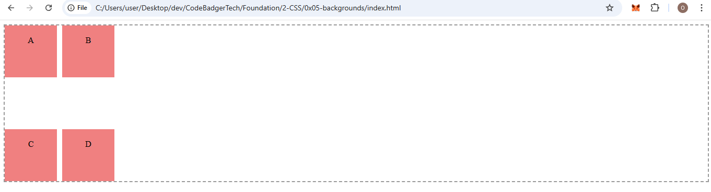
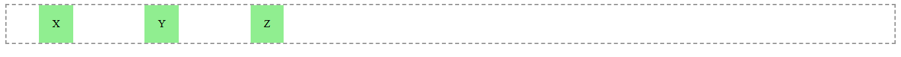
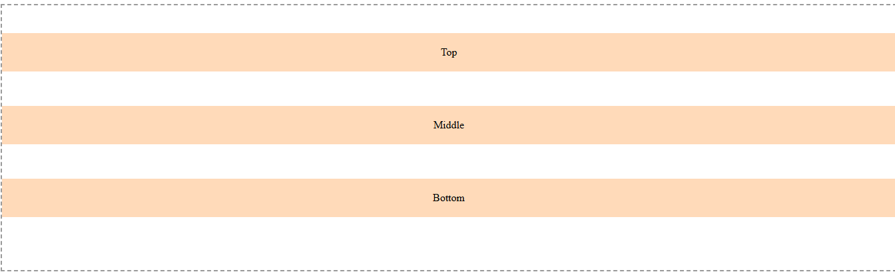

## 📐 Alignment in CSS Grid

CSS Grid lets you align the entire grid or individual items along the **row (horizontal)** and **column (vertical)** axes.

There are two types of alignment:

* **Grid-level**: `justify-content`, `align-content`
* **Item-level**: `justify-items`, `align-items`

Each of these properties supports several alignment values depending on whether you're positioning the grid as a whole or the individual items.

---

### 🧭 `justify-content`

**Aligns the entire grid horizontally (row axis).**

📄 **HTML:**

```html
<!DOCTYPE html>
<html>
<head>
  <link rel="stylesheet" href="justify-content.css">
</head>
<body>
  <div class="grid-container">
    <div class="item">1</div>
    <div class="item">2</div>
    <div class="item">3</div>
  </div>
</body>
</html>
```

🎨 **CSS (justify-content.css):**

```css
.grid-container {
  display: grid;
  grid-template-columns: repeat(3, 100px);
  justify-content: center;
  gap: 10px;
  border: 2px dashed #999;
}

.item {
  background-color: lightblue;
  text-align: center;
  padding: 20px;
}
```

📘 **Supported values:**

* `start`: align to the left
* `end`: align to the right
* `center`: center the grid
* `stretch`: stretch to fill container (rarely useful here)
* `space-between`, `space-around`, `space-evenly`: distribute space between grid tracks

### OUTPUT


---

### 🧭 `align-content`

**Aligns the entire grid vertically (column axis) when there's extra height.**

📄 **HTML:**

```html
<!DOCTYPE html>
<html>
<head>
  <link rel="stylesheet" href="align-content.css">
</head>
<body>
  <div class="grid-container">
    <div class="item">A</div>
    <div class="item">B</div>
    <div class="item">C</div>
    <div class="item">D</div>
  </div>
</body>
</html>
```

🎨 **CSS (align-content.css):**

```css
.grid-container {
  display: grid;
  grid-template-rows: repeat(2, 100px);
  grid-template-columns: repeat(2, 100px);
  height: 300px;
  align-content: space-between;
  gap: 10px;
  border: 2px dashed #999;
}

.item {
  background-color: lightcoral;
  text-align: center;
  padding: 20px;
}
```

📘 **Supported values:**

* `start`: top-align
* `end`: bottom-align
* `center`: vertically center the grid
* `stretch`: fill the vertical space
* `space-between`, `space-around`, `space-evenly`: distribute rows with spacing

### OUTPUT



---

### 🎯 `justify-items`

**Aligns individual items horizontally (inside their cell).**

📄 **HTML:**

```html
<!DOCTYPE html>
<html>
<head>
  <link rel="stylesheet" href="justify-items.css">
</head>
<body>
  <div class="grid-container">
    <div class="item">X</div>
    <div class="item">Y</div>
    <div class="item">Z</div>
  </div>
</body>
</html>
```

🎨 **CSS (justify-items.css):**

```css
.grid-container {
  display: grid;
  grid-template-columns: repeat(3, 150px);
  justify-items: center;
  gap: 10px;
  border: 2px dashed #999;
}

.item {
  background-color: lightgreen;
  padding: 20px;
}
```

📘 **Supported values:**

* `start`: align left inside cell
* `end`: align right inside cell
* `center`: center inside cell
* `stretch`: fill the cell horizontally (default)

### OUTPUT



---

### 🎯 `align-items`

**Aligns individual items vertically (inside their cell).**

📄 **HTML:**

```html
<!DOCTYPE html>
<html>
<head>
  <link rel="stylesheet" href="align-items.css">
</head>
<body>
  <div class="grid-container">
    <div class="item">Top</div>
    <div class="item">Middle</div>
    <div class="item">Bottom</div>
  </div>
</body>
</html>
```

🎨 **CSS (align-items.css):**

```css
.grid-container {
  display: grid;
  grid-template-rows: repeat(3, 100px);
  height: 400px;
  align-items: end;
  gap: 10px;
  border: 2px dashed #999;
}

.item {
  background-color: peachpuff;
  text-align: center;
  padding: 20px;
}
```

📘 **Supported values:**

* `start`: align to the top inside the cell
* `end`: align to the bottom
* `center`: vertically center the item
* `stretch`: fill the cell vertically (default)

### OUTPUT



---
