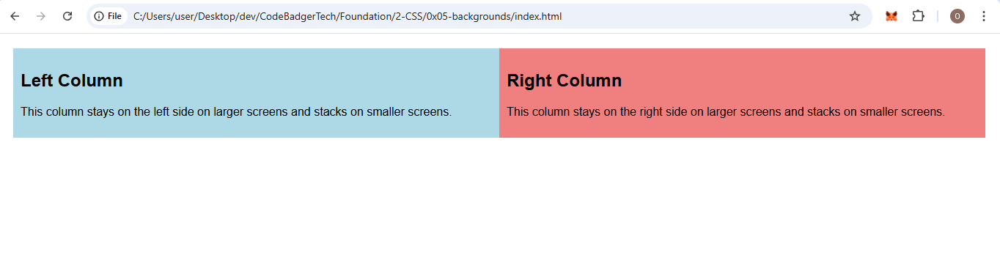
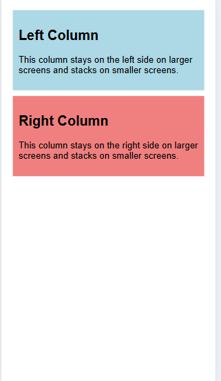
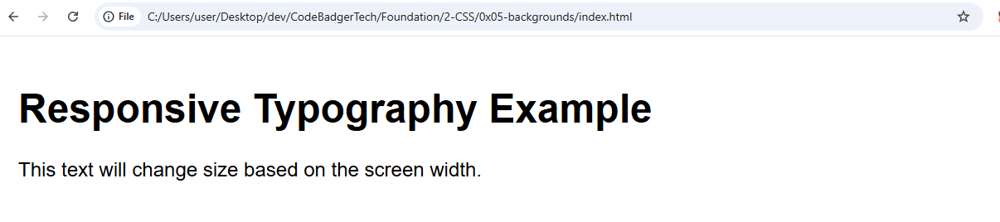
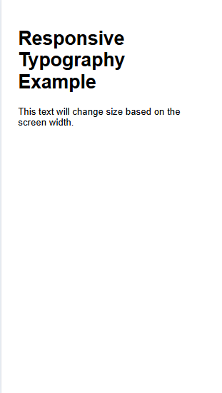

## **Responsive Web Design with Media Queries: A Deep Dive**

### **Table of Contents:**
1. **What Are Media Queries and Why Do We Need Them?**
2. **The Basics of Media Queries**
3. **How Media Queries Help Us Achieve Responsiveness**
4. **Using Media Queries with Specific Conditions**
5. **Practical Example 1: A Simple Responsive Layout**
6. **Practical Example 2: Adaptive Typography**
7. **Practical Example 3: Multi-Column Layout with Media Queries**
8. **Best Practices for Using Media Queries**

---

### **1. What Are Media Queries and Why Do We Need Them?**

In the past, websites were designed to look great on desktop computers. However, with the **explosion of mobile devices** (smartphones, tablets, and laptops of varying sizes), the need for websites to **adjust and adapt** to different screen sizes became critical. **Responsive design** solves this problem by ensuring a website provides a **good user experience** across all devices, from a tiny mobile phone to a large desktop monitor.

**Media Queries** are a CSS feature that allows you to apply different styles to different screen sizes, devices, or orientations. They let us change the layout, font sizes, colors, and much more based on the **environment** in which the website is being viewed. This is key to **responsive web design**, which makes your website look great on **any device**.

### **Why Do We Need Media Queries?**
Without media queries, a website would look exactly the same on all devices, which could lead to poor user experiences on smaller screens (e.g., text being too small, or layout elements being cut off). Media queries allow us to **fine-tune our website’s appearance and layout** based on the actual screen size or other device properties.

---

### **2. The Basics of Media Queries**

A **media query** allows you to define **different sets of CSS rules** based on the **conditions** (such as the screen width) of the device or browser window.

**Basic syntax:**
```css
@media (condition) {
  /* Styles to apply when the condition is met */
}
```

### **How Media Queries Work:**
Media queries use **logical conditions** to check the **environment** (like screen width, orientation, or resolution). If the condition is **true**, the CSS rules inside the query are applied.

For example:
```css
@media (max-width: 600px) {
  body {
    background-color: lightblue;
  }
}
```
In this case, the background color changes to `lightblue` **only** when the screen width is **600px or less**.

**Common conditions in media queries:**
- **max-width**: Apply styles if the screen width is **less than or equal** to a specific value.
- **min-width**: Apply styles if the screen width is **greater than or equal** to a specific value.
- **orientation**: Apply styles based on the device’s **orientation** (landscape or portrait).
- **resolution**: Apply styles based on the **screen resolution** (useful for high-DPI screens like Retina displays).

---

### **3. How Media Queries Help Us Achieve Responsiveness**

Let’s break down why **media queries** are essential for responsive web design:

- **Adapt to Screen Size:** Without media queries, the layout would **look the same** regardless of the device. Media queries help adjust the layout to **fit different screen sizes**. For example, on larger screens (like desktops), you might want two columns side by side, but on smaller screens (like phones), you may want those columns to stack on top of each other.

- **Optimize Layout for Touch Devices:** A touch device requires **larger buttons** or **more spacious layouts** to be usable. Media queries allow you to adjust elements like buttons, navigation menus, and forms to **be touch-friendly** on smaller devices.

- **Improve Typography:** Font sizes can look too small on large screens or too big on small screens. By using media queries, you can **dynamically adjust text sizes**, ensuring readability on all devices.

- **Change Layouts for Different Orientations:** Some devices can switch between **landscape** and **portrait** orientations (like tablets). Media queries let you change the layout based on orientation, ensuring content is displayed in the best possible way.

---

### **4. Using Media Queries with Specific Conditions**

Now, let’s look at **common conditions** you’ll use in media queries:

#### **1. `max-width` and `min-width`:**

These are the most commonly used conditions. They apply styles when the screen reaches a specific width.

- **`max-width`:** Targets screen sizes **smaller than or equal** to the value specified.
  ```css
  @media (max-width: 768px) {
    /* Styles for screens smaller than or equal to 768px */
  }
  ```

- **`min-width`:** Targets screen sizes **larger than or equal** to the value specified.
  ```css
  @media (min-width: 1024px) {
    /* Styles for screens larger than or equal to 1024px */
  }
  ```

#### **2. Orientation:**

Media queries also let you target the orientation of a device, ensuring that the layout adjusts for both **portrait** and **landscape** modes.

- **Portrait**: When the height is greater than the width (common for mobile phones).
- **Landscape**: When the width is greater than the height (common for tablets and larger screens).

```css
@media (orientation: portrait) {
  /* Styles for portrait orientation */
}

@media (orientation: landscape) {
  /* Styles for landscape orientation */
}
```

#### **3. Resolution (for high-DPI displays):**

For **retina displays** (high-DPI), use the `min-resolution` or `max-resolution` to adjust the layout for higher-resolution screens.

```css
@media (min-resolution: 2dppx) {
  /* Styles for high-resolution displays */
}
```

---

### **5. Practical Example 1: A Simple Responsive Layout**

Let’s walk through a **simple responsive layout** that switches from two columns to a single column based on screen width.

#### **HTML (index.html):**
```html
<!DOCTYPE html>
<html lang="en">
<head>
  <meta charset="UTF-8">
  <meta name="viewport" content="width=device-width, initial-scale=1.0">
  <title>Responsive Layout</title>
  <link rel="stylesheet" href="styles.css">
</head>
<body>
  <div class="container">
    <div class="left">
      <h2>Left Column</h2>
      <p>This column stays on the left side on larger screens and stacks on smaller screens.</p>
    </div>
    <div class="right">
      <h2>Right Column</h2>
      <p>This column stays on the right side on larger screens and stacks on smaller screens.</p>
    </div>
  </div>
</body>
</html>
```

#### **CSS (styles.css):**
```css
/* Global styles */
body {
  font-family: Arial, sans-serif;
  margin: 0;
  padding: 0;
}

/* Container setup */
.container {
  display: flex;
  padding: 20px;
}

/* Left column */
.left {
  flex: 1;
  padding: 10px;
  background-color: lightblue;
}

/* Right column */
.right {
  flex: 1;
  padding: 10px;
  background-color: lightcoral;
}

/* Media Query for smaller screens */
@media (max-width: 768px) {
  .container {
    flex-direction: column; /* Stack columns vertically */
  }

  .left, .right {
    flex: 100%; /* Take up full width */
    margin-bottom: 10px;
  }
}
```

#### **What Happens Here:**
- On **larger screens** (greater than 768px), the two columns are displayed **side by side** using Flexbox.

- On **smaller screens** (less than or equal to 768px), the layout switches to a **single-column layout**, making it more readable and user-friendly on phones and small devices.


---

### **6. Practical Example 2: Adaptive Typography**

In this example, we will adjust the font size based on the screen width to ensure the text remains readable on all devices.

#### **HTML (index.html):**
```html
<!DOCTYPE html>
<html lang="en">
<head>
  <meta charset="UTF-8">
  <meta name="viewport" content="width=device-width, initial-scale=1.0">
  <title>Responsive Typography</title>
  <link rel="stylesheet" href="styles.css">
</head>
<body>
  <h1>Responsive Typography Example</h1>
  <p>This text will change size based on the screen width.</p>
</body>
</html>
```

#### **CSS (styles.css):**
```css
body {
  font-family: Arial, sans-serif;
  padding: 20px;
}

/* Default font size */
h1 {
  font-size: 3rem;
}

p {
  font-size: 1.5rem;
}

/* Media Query for smaller screens */
@media (max-width: 600px) {
  h1 {
    font-size: 2rem; /* Smaller font for smaller screens */
  }

  p {
    font-size: 1rem; /* Adjust paragraph font size */
  }
}
```

#### **What Happens Here:**
- On **larger screens**, the text is large and readable.

- On **smaller screens**, the text size is reduced to make it fit better and remain readable on smaller devices.



---

### **7. Best Practices for Using Media Queries**

- **Mobile-first approach:** Start designing for the smallest screen first. Use `min-width` media queries to scale up for larger screens. This approach ensures a more efficient, scalable design.
- **Avoid fixed widths:** Use flexible units like percentages (`%`) or viewport units (`vw`, `vh`) for widths, so elements scale according to the screen size.
- **Test on multiple devices:** Testing across different screen sizes is essential. Use emulators or actual devices to ensure your media queries work as expected.
- **Combine multiple conditions:** You can combine `max-width`, `min-width`, and other conditions to target specific devices or screen sizes more precisely.

---

## Beast Example
Here’s a beautiful, fully-responsive website layout with a **nav bar**, **hero section**, **about section**, **services section**, and **footer**. We’ll use **Flexbox** for responsiveness, and I’ll explain the entire code afterward.

---

### File 1: HTML (`index.html`)

```html
<!DOCTYPE html>
<html lang="en">
<head>
    <meta charset="UTF-8">
    <meta name="viewport" content="width=device-width, initial-scale=1.0">
    <title>Responsive Website</title>
    <link rel="stylesheet" href="styles.css">
</head>
<body>
    <!-- Navigation Bar -->
    <nav class="navbar">
        <ul class="nav-links">
            <li><a href="#home">Home</a></li>
            <li><a href="#about">About</a></li>
            <li><a href="#services">Services</a></li>
            <li><a href="#contact">Contact</a></li>
        </ul>
        <div class="hamburger">☰</div>
    </nav>

    <!-- Hero Section -->
    <section class="hero" id="home">
        <div class="hero-content">
            <h1>Welcome to Our Website</h1>
            <p>Discover innovative digital solutions tailored to elevate your business. From cutting-edge web development to strategic SEO, we empower your brand to thrive in the digital landscape.</p>
            <a href="#services"><button>Explore Our Services</button></a>
        </div>
    </section>

    <!-- About Section -->
    <section class="about" id="about">
        <h2>About Us</h2>
        <p>Founded in 2010, our company is a leader in digital innovation, committed to delivering exceptional solutions that drive success. Our team of experts specializes in creating user-centric websites, mobile applications, and SEO strategies that help businesses grow. With a focus on quality, creativity, and customer satisfaction, we partner with clients worldwide to transform their digital presence.</p>
        <p class="mission">"Our mission is to empower businesses with technology that inspires and delivers measurable results."</p>
    </section>

    <!-- Services Section -->
    <section class="services" id="services">
        <h2>Our Services</h2>
        <div class="service-cards">
            <div class="service-card">
                <div class="icon">🌐</div>
                <h3>Web Development</h3>
                <p>We craft responsive, high-performance websites using the latest technologies like HTML5, CSS3, and JavaScript frameworks. Our custom solutions are designed to engage users and boost your brand's online visibility.</p>
            </div>
            <div class="service-card">
                <div class="icon">📱</div>
                <h3>App Development</h3>
                <p>Our team builds native and cross-platform mobile applications for iOS and Android, ensuring seamless functionality and intuitive user experiences that keep your customers engaged.</p>
            </div>
            <div class="service-card">
                <div class="icon">🔍</div>
                <h3>SEO Optimization</h3>
                <p>Maximize your website's reach with our data-driven SEO strategies. We optimize content, improve site performance, and leverage analytics to rank higher on search engines like Google.</p>
            </div>
        </div>
    </section>

    <!-- Footer -->
    <footer class="footer" id="contact">
        <div class="footer-column">
            <h3>Quick Links</h3>
            <ul>
                <li><a href="#home">Home</a></li>
                <li><a href="#about">About</a></li>
                <li><a href="#services">Services</a></li>
                <li><a href="#contact">Contact</a></li>
            </ul>
        </div>
        <div class="footer-column">
            <h3>Connect With Us</h3>
            <ul>
                <li><a href="https://facebook.com">Facebook</a></li>
                <li><a href="https://twitter.com">Twitter</a></li>
                <li><a href="https://instagram.com">Instagram</a></li>
                <li><a href="https://linkedin.com">LinkedIn</a></li>
            </ul>
        </div>
        <div class="footer-column">
            <h3>Contact Info</h3>
            <p class="contact-info">
                Email: info@ourcompany.com<br>
                Phone: +1 (555) 123-4567<br>
                Address: 123 Innovation Drive, Tech City, TC 12345
            </p>
        </div>
        <div class="footer-column">
            <h3>Subscribe to Our Newsletter</h3>
            <input type="email" placeholder="Enter your email">
            <button>Subscribe</button>
        </div>
    </footer>

    <script>
        // OOps, we're sneaking in a bit of JavaScript here! 😄 Don't feel lost—this is just a tiny trick to make the hamburger menu work. We'll dive into JS fun in our next topic!
        const hamburger = document.querySelector('.hamburger');
        const navLinks = document.querySelector('.nav-links');

        hamburger.addEventListener('click', () => {
            navLinks.classList.toggle('active');
        });
    </script>
</body>
</html>
```

---

### File 2: CSS (`styles.css`)

```css
* {
    margin: 0;
    padding: 0;
    box-sizing: border-box;
    font-family: 'Segoe UI', Tahoma, Geneva, Verdana, sans-serif;
}

/* Navigation Bar */
.navbar {
    background-color: #2c3e50;
    padding: 20px;
    display: flex;
    justify-content: space-between;
    align-items: center;
    position: sticky;
    top: 0;
    z-index: 1000;
}

.nav-links {
    display: flex;
    list-style: none;
}

.nav-links li {
    margin: 0 20px;
}

.nav-links a {
    color: #ecf0f1;
    text-decoration: none;
    font-size: 18px;
    font-weight: 500;
    transition: color 0.3s;
}

.nav-links a:hover {
    color: #3498db;
}

.hamburger {
    display: none;
    font-size: 28px;
    color: #ecf0f1;
    cursor: pointer;
}

/* Hero Section */
.hero {
    height: 100vh;
    background-image: url('https://images.unsplash.com/photo-1507525428034-b723cf961d3e');
    background-size: cover;
    background-position: center;
    background-attachment: fixed;
    display: flex;
    flex-direction: column;
    justify-content: center;
    align-items: center;
    text-align: center;
    color: #fff;
    padding: 20px;
    position: relative;
}

.hero::before {
    content: '';
    position: absolute;
    top: 0;
    left: 0;
    width: 100%;
    height: 100%;
    background: rgba(0, 0, 0, 0.5);
}

.hero-content {
    position: relative;
    z-index: 1;
}

.hero h1 {
    font-size: 56px;
    margin-bottom: 25px;
    text-shadow: 2px 2px 4px rgba(0, 0, 0, 0.5);
}

.hero p {
    font-size: 22px;
    margin-bottom: 40px;
    max-width: 700px;
    line-height: 1.6;
}

.hero button {
    padding: 15px 30px;
    font-size: 18px;
    background-color: #3498db;
    color: #fff;
    border: none;
    border-radius: 5px;
    cursor: pointer;
    transition: background-color 0.3s;
}

.hero button:hover {
    background-color: #2980b9;
}

/* About Section */
.about {
    padding: 80px 20px;
    text-align: center;
    background-color: #f5f6fa;
}

.about h2 {
    font-size: 40px;
    margin-bottom: 30px;
    color: #2c3e50;
}

.about p {
    font-size: 18px;
    max-width: 900px;
    margin: 0 auto;
    line-height: 1.8;
    color: #34495e;
}

.about .mission {
    margin-top: 30px;
    font-style: italic;
    color: #3498db;
}

/* Services Section */
.services {
    padding: 80px 20px;
    text-align: center;
    background-color: #fff;
}

.services h2 {
    font-size: 40px;
    margin-bottom: 50px;
    color: #2c3e50;
}

.service-cards {
    display: flex;
    justify-content: center;
    gap: 30px;
    flex-wrap: wrap;
}

.service-card {
    background-color: #fff;
    border: 1px solid #e0e0e0;
    border-radius: 10px;
    padding: 30px;
    width: 320px;
    box-shadow: 0 4px 10px rgba(0,0,0,0.1);
    transition: transform 0.3s;
}

.service-card:hover {
    transform: translateY(-5px);
}

.service-card h3 {
    font-size: 26px;
    margin-bottom: 20px;
    color: #2c3e50;
}

.service-card p {
    font-size: 16px;
    color: #34495e;
    line-height: 1.6;
}

.service-card .icon {
    font-size: 40px;
    color: #3498db;
    margin-bottom: 20px;
}

/* Footer */
.footer {
    background-color: #2c3e50;
    color: #ecf0f1;
    padding: 60px 20px;
    display: flex;
    justify-content: space-between;
    flex-wrap: wrap;
}

.footer-column {
    flex: 1;
    margin: 20px;
    min-width: 220px;
}

.footer-column h3 {
    font-size: 22px;
    margin-bottom: 20px;
    color: #3498db;
}

.footer-column ul {
    list-style: none;
}

.footer-column ul li {
    margin-bottom: 12px;
}

.footer-column a {
    color: #ecf0f1;
    text-decoration: none;
    font-size: 16px;
}

.footer-column a:hover {
    color: #3498db;
}

.footer-column .contact-info {
    font-size: 16px;
    line-height: 1.8;
}

.footer-column input[type="email"] {
    padding: 12px;
    width: 100%;
    margin-bottom: 15px;
    border: none;
    border-radius: 5px;
    font-size: 16px;
}

.footer-column button {
    padding: 12px 20px;
    background-color: #3498db;
    color: #fff;
    border: none;
    border-radius: 5px;
    cursor: pointer;
    font-size: 16px;
}

.footer-column button:hover {
    background-color: #2980b9;
}

/* Responsive Design */
@media (max-width: 768px) {
    .nav-links {
        display: none;
        flex-direction: column;
        position: absolute;
        top: 70px;
        left: 0;
        width: 100%;
        background-color: #2c3e50;
        padding: 20px;
    }

    .nav-links.active {
        display: flex;
    }

    .nav-links li {
        margin: 15px 0;
    }

    .hamburger {
        display: block;
    }

    .hero h1 {
        font-size: 36px;
    }

    .hero p {
        font-size: 18px;
    }

    .hero button {
        padding: 12px 24px;
        font-size: 16px;
    }

    .about h2, .services h2 {
        font-size: 32px;
    }

    .service-cards {
        flex-direction: column;
        align-items: center;
    }

    .footer {
        flex-direction: column;
        align-items: flex-start;
    }

    .footer-column {
        width: 100%;
    }
}
```

---

### Beginner-Friendly Explanation of the Website

#### 1. **What’s in the Website?**
This website is like a business card for a company that offers digital services. It has five main parts:
- **Navigation Bar**: A menu at the top to jump to different sections (Home, About, Services, Contact).
- **Hero Section**: A big, eye-catching welcome area with a picture, a headline, and a button.
- **About Section**: A section that tells visitors about the company and its mission.
- **Services Section**: A showcase of three services (Web Development, App Development, SEO Optimization) in cool card-like boxes.
- **Footer**: The bottom part with links, contact info, social media, and a newsletter signup.

The website is **responsive**, which means it looks great on both big screens (like your laptop) and small screens (like your phone). On phones, the menu turns into a hamburger icon (☰), and everything stacks neatly.

#### 2. **How It’s Built: The Two Files**
We’ve split the website into two files to keep things organized:
- **`index.html`**: This is the structure of the house. It’s like the walls, floors, and furniture. It uses HTML (HyperText Markup Language) to create things like headings (`<h1>`), paragraphs (`<p>`), and buttons (`<button>`).
- **`styles.css`**: This is the decoration. It uses CSS (Cascading Style Sheets) to add colors, sizes, and layouts. For example, it makes the navigation bar dark blue and the buttons round.

The HTML file links to the CSS file using this line in the `<head>`:
```html
<link rel="stylesheet" href="styles.css">
```
This tells the browser, “Hey, go grab the styles from `styles.css` to make this page look pretty!”

#### 3. **Breaking Down Each Section**

- **Navigation Bar**:
  - The navigation bar is like a map at the top of the page. It has links to “Home,” “About,” “Services,” and “Contact.”
  - On big screens, the links are side-by-side. On small screens (like phones), they hide, and you see a hamburger icon (☰). Click it, and the links drop down.
  - We use **Flexbox** (a CSS tool) to arrange the links neatly. Flexbox is like a magic box that helps you line things up easily.
  - There’s a tiny bit of JavaScript (don’t worry, it’s simple!) to make the hamburger menu open and close. We’ll talk more about that later!

- **Hero Section**:
  - This is the big welcome sign when you visit the site. It has a beach background image, a bold headline (“Welcome to Our Website”), a short paragraph, and a blue button that says “Explore Our Services.”
  - The background image is darkened with a semi-transparent overlay (using CSS `::before`) so the white text is easy to read.
  - Flexbox makes sure the text and button stay centered, no matter the screen size.

- **About Section**:
  - This section tells the story of the company. It has a heading (“About Us”), a paragraph about the company’s history, and a fancy italicized mission statement.
  - It’s centered with lots of padding (empty space) to feel clean and open. The background is light gray to stand out from other sections.
  - On phones, the text shrinks a bit so it’s easier to read.

- **Services Section**:
  - This is where the company shows off what it does: Web Development, App Development, and SEO Optimization.
  - Each service is in a “card” (a box with a border and shadow). Each card has an emoji icon (like 🌐 for web), a title, and a description.
  - On big screens, the cards sit side-by-side in a row (thanks to Flexbox). On small screens, they stack vertically so they’re easy to scroll through.
  - When you hover over a card with your mouse, it lifts up slightly (a cool CSS effect called `transform`).

- **Footer**:
  - The footer is like the basement of the house—it’s packed with useful stuff! It has four columns:
    1. **Quick Links**: Links to Home, About, Services, and Contact.
    2. **Connect With Us**: Links to social media (Facebook, Twitter, Instagram, LinkedIn).
    3. **Contact Info**: Email, phone, and address.
    4. **Newsletter**: A box to type your email and a “Subscribe” button.
  - On big screens, the columns are side-by-side. On small screens, they stack and align to the left.
  - Flexbox keeps everything organized, and the dark blue background matches the navigation bar for a unified look.

#### 4. **What’s This Hamburger Menu Thing?**
```javascript
// OOps, we're sneaking in a bit of JavaScript here! 😄 Don't feel lost—this is just a tiny trick to make the hamburger menu work. We'll dive into JS fun in our next topic!
```
The hamburger menu (☰) appears on small screens (like your phone). When you click it, the navigation links pop out in a dropdown. This saves space and makes the site easy to use on small screens.

We use a tiny bit of JavaScript to make this work. Don’t panic! The code just says, “When someone clicks the hamburger, show or hide the links.” 
JavaScript is like giving your website a brain to do interactive things. We’ll learn more about it later, and it’s super cool!

#### 5. **How Does It Look Good on All Screens?**
The website is **responsive**, which means it changes its layout based on the screen size. This is done using **media queries** in the CSS file. Think of media queries as instructions that say, “If the screen is smaller than 768 pixels, do this instead.”

For example:
- On phones, the navigation links hide behind the hamburger icon.
- The hero section’s text gets smaller so it fits.
- The service cards stack vertically instead of being in a row.
- The footer columns stack instead of being side-by-side.

This makes the website user-friendly whether you’re on a big desktop or a tiny phone.

#### 6. **Why Flexbox?**
Flexbox is a CSS tool we use to arrange things (like the navigation links, service cards, and footer columns). It’s like a super-smart organizer that makes sure everything lines up perfectly. For example:
- In the navigation bar, Flexbox puts the links side-by-side.
- In the services section, it arranges the cards in a row (or a column on small screens).
- In the footer, it spaces out the columns evenly.

Flexbox is beginner-friendly because it’s easier than older CSS methods like floating elements.

#### 7. **How to Try It Out**
To see this website in action:
1. Save the `index.html` code in a file named `index.html`.
2. Save the `styles.css` code in a file named `styles.css` in the same folder.
3. Open `index.html` in a web browser (like Chrome or Firefox) by double-clicking it.
4. Try resizing the browser window or opening it on your phone to see the responsive design!

### OUTPUT
<video controls src="./images/website.mp4" title="Title"></video>

#### 8. **What’s Next?**
You’ve just built a real website! 🎉 Here are some fun things to try next:
- **Change Colors**: In `styles.css`, try changing `#2c3e50` (the dark blue) to something like `#ff6347` (tomato red) and see what happens.
- **Add More Services**: In `index.html`, copy one of the `service-card` divs and add a new service, like “Graphic Design.”

- **Explore CSS**: Try adding animations or new fonts to make the site even cooler.


